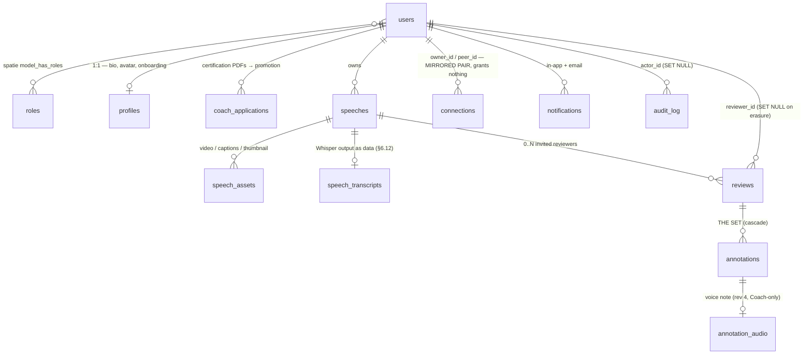
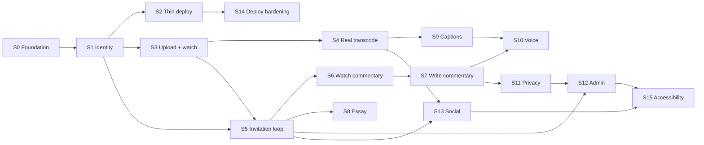

# Speech Coaching Platform — Modernization & Completion Plan

**Repository:** `Instruction-Speeches-Library` (originally `ToastmasterLibrary`)
**Plan date:** 2026-08-05 · **Revision 5**
**Constraints:** zero recurring cost · self-hosted · architected for later scale · PHP + React + Redux · **containerized, as a learning goal**
**Legacy status:** non-executable on any supported PHP runtime
**Approach:** greenfield rebuild; legacy tree retained as a specification artifact
**Build order:** sixteen vertical slices — see **[STEPS.md](STEPS.md)** for the work orders

> **Revision 5 changes — four, all at your instruction:**
> **Delivery restructured into sixteen vertical slices** (§12). Fifteen of the sixteen end with something you can open in a browser; the first arrives in **week 3–3.5** instead of week 13–16.5. Front end is built alongside backend in every segment.
> **Voice annotation is in scope** (§8.7), built as an **interjection** — pause, speak, resume. That model deletes the two blockers the overlay version could not solve, and costs 2 weeks rather than 4.5.
> **PostgreSQL replaces MySQL** (§5.8a). It removes a generated-column workaround used in four places, including the one §12.1 identifies as the riskiest DDL in the plan.
> **Docker is designed for explicitly** (§21) — hand-written Compose rather than Sail, one container per segment.
> **Speech versioning built** (§6.11) — a speech can supersede an earlier attempt, which is what turns feedback *delivery* into a feedback *loop*. Deferred through revisions 3 and 4; the reviewer-isolation objection resolved into a design whose default tier discloses nothing.
>
> **Revision 4 changes:** peer review (`coach_id` → `reviewer_id`) · onboarding and profiles · rich-text essays · a social layer · admin-gated coach certification · notifications · **no open-call pool** (every review starts with a named invitation) · **admins moderate but never author**.
>
> **Stakeholder decisions recorded:** exactly **one** reviewer's commentary plays at a time (§7.3, §8.5) — the schema supports more, the UI deliberately does not.

---

## Table of contents

1. [Executive summary](#1-executive-summary)
2. [What this codebase is](#2-what-this-codebase-is)
3. [Why rebuild rather than migrate](#3-why-rebuild-rather-than-migrate)
4. [Target architecture and stack](#4-target-architecture-and-stack)
5. [Stack decisions that need justifying](#5-stack-decisions-that-need-justifying)
6. [Domain model and database schema](#6-domain-model-and-database-schema)
7. [Roles, access and authorization](#7-roles-access-and-authorization)
8. [The annotation engine](#8-the-annotation-engine)
9. [Media pipeline: upload, transcode, delivery](#9-media-pipeline-upload-transcode-delivery)
10. [Concurrency and correctness](#10-concurrency-and-correctness)
11. [Privacy, erasure and moderation](#11-privacy-erasure-and-moderation)
12. [Delivery plan](#12-delivery-plan)
13. [Risk register](#13-risk-register)
14. [Observability and audit](#14-observability-and-audit)
15. [Cost model](#15-cost-model)
16. [Security remediation register](#16-security-remediation-register)
17. [What to salvage, what to delete](#17-what-to-salvage-what-to-delete)
18. [Legacy data migration (contingent)](#18-legacy-data-migration-contingent)
19. [Testing and CI](#19-testing-and-ci)
20. [Open questions](#20-open-questions)
21. [Development environment and containers](#21-development-environment-and-containers)
22. [Appendix A — legacy defect register](#appendix-a--legacy-defect-register)
23. [Appendix B — file disposition](#appendix-b--file-disposition)

---

## 1. Executive summary

This repository holds a 2013–2014 PHP 5 learning project — 6,800 lines of PHP, 734 of JavaScript, 75 files, flat, no framework, no dependency manager, no tests, no schema. Abandoned 2014-10-30 mid-refactor.

**Three findings determine the approach.** The application **cannot run** (`mysql_*` in 33 files, removed in PHP 7.0; three files are parse errors; `legacy/login.php` fatals on an include absent from all 16 commits). The repository is a **fragment** — only the `includes/` subdirectory of the original app, so every stylesheet, library, image and video is missing. And the product was **never finishable**, because the `notes` table has no author column: timestamped commentary exists, attribution never did, and four of the stated requirements depend on it.

**Recommendation: greenfield rebuild** on Laravel 13 + React 19, keeping the legacy tree in git as the specification document it effectively is.

### What the product does

A speaker uploads a video of a speech and **invites specific people to review it** — any user or Coach, named individually. There is no public pool and no way to volunteer: **nothing about a speech is visible to anyone until its owner asks them personally.** Accepting an invitation grants access to that one speech and nothing else. Each reviewer watches it and types feedback anchored to moments in the video — building **their own annotation set** — and writes an **essay** underneath the player summarizing what they thought. Coaches may additionally leave **voice annotations**.

Coaches can also **speak** their feedback: pause the video, record a spoken note, and on playback the video stops at that moment, plays the note, and resumes.

The speaker then replays the speech, picks **one** reviewer's track, and each note fades in at its timestamp and fades out after its duration, with that reviewer's essay alongside. Multiple reviewers can work on the same speech independently, and **no reviewer ever sees another's commentary.**

Around that loop sits a **social layer**: your connections are the people you have reviewed and who have reviewed you, and their profile shows a timeline of their speeches with the commentary *you* left — never anyone else's.

**Roles:** everyone starts as a **Member**. An **Admin** promotes a Member to **Coach** after reviewing certification PDFs they uploaded — the only route to the role. Coaches get voice annotation, a verified badge, and discoverability. **Admins moderate but never participate** — they can read and remove anything, and can annotate or write essays on nothing.

### Effort

| Milestone | One experienced full-stack developer |
|---|---|
| Working annotation loop — upload, request, accept, annotate, play back with fades | **11.5–14.5 weeks** |
| Feature-complete against the brief (incl. admin portal) | **14.5–18 weeks** |
| **Production-ready: deployed, styled, compliant, moderatable, monitored** | **22–27 weeks** |

Zero-cost is not a separate line item — it is why the media segments (S3–S4) are four-to-five weeks instead of one-to-two. You now own the transcode pipeline, its retries, its disk pressure and its failure alerting. Adopting Filament for the admin portal (§5.8) recovers about 1.5 weeks.

> **Worth stating plainly:** at this scale, build cost exceeds a decade of hosting. Going self-hosted saves perhaps $40/month and costs 1–2 weeks of your time. That is a reasonable trade if you want to own the stack and learn it — which is a legitimate goal for this project — but it is not a cost optimization.

---

## 2. What this codebase is

| Fact | Evidence |
|---|---|
| Original name / location | `ToastmasterLibrary` at `/Applications/XAMPP/xamppfiles/htdocs/ToastmasterLibrary` (`legacy/TMLibrary.sublime-project`) |
| This repo is | only the `includes/` subdirectory (`legacy/TMLibrary.sublime-workspace` buffer paths) |
| First / last commit | 2013-03-06 / **2014-10-30** · 16 commits · dormant ~11.7 years |

```
PHP        6,800 LOC / 75 files      JavaScript  734 LOC / 3 files
CSS            9 LOC (135 bytes — the real stylesheet is missing)
Tests, migrations, CI, Dockerfile, composer.json, package.json:  none
```

The domain is Toastmasters: a Manual → Category curriculum, speeches filed under categories, Clubs whose shared password gates registration. **None of that is part of the target product.**

**The 2014 work-in-progress.** The last five commits pulled duplicated form validation into `legacy/validator.js` and stopped halfway — `legacy/uploadUser.php` still carries ~130 lines duplicated verbatim, both topic forms and both note forms were never migrated, and `blur()` handlers across 13 files (~503 lines) duplicate the same rules a third time. The refactor also introduced three live bugs (`legacy/validator.js:310` serializes the wrong form; `legacy/editClub.php:146` calls the create-mode collector; `legacy/editTopic.php:243` calls an undefined function). The last work done on this project made it less correct — normal for an unfinished refactor, and an argument for restarting rather than resuming.

---

## 3. Why rebuild rather than migrate

**There is no running system to migrate from.** `ext/mysql` was removed in PHP 7.0, so every data-layer call is undefined. `legacy/DatabaseObject2.php`, `legacy/DatabaseObjectX.php` and `legacy/sampleClass.php` are parse errors under PHP 8.5. Thirteen call sites invoke instance methods statically. `legacy/editTopic.php:300` calls a 13-parameter function with 9 arguments. And `DatabaseObject::create()` puts `id` in every `INSERT` column list, sending `id=''` — which fails under MySQL 5.7+ `STRICT_TRANS_TABLES`, so **every create fails on any modern MySQL.**

**The assets are gone.** `legacy/styles.css` is 9 lines of z-index rules; the real stylesheet and all seven vendored libraries lived in sibling directories not under version control.

**Every dependency is end-of-life** — jQuery 1.9.0, jQuery UI 1.10.0 (EOL 2024-08-05), Bootstrap 2, bootstrap-timepicker (deprecated), and **Popcorn.js, archived read-only since 2018-06-29**, which the core feature depends on.

**The security posture requires rewriting every request path** — zero prepared statements, zero output encoding (`grep "echo htmlspecialchars"` → 0 hits), zero CSRF protection, three mutually incompatible password schemes, and club passwords printed into the unauthenticated login page.

**The auth architecture is unfixable in place.** One primitive, `$SESS->userRoleId != ADMIN_USER`, copy-pasted into **28 files**. On the six pages that require `legacy/Post.php` — a *model file* that emits `<!DOCTYPE>` at line 7 — output starts before the guard runs, so `header("Location:")` is silently dropped unless `output_buffering` happens to be on. **And there is no ownership check anywhere**: any authenticated user can enumerate `viewTopicVideo.php?topId=1,2,3…` and watch every private speech in the system.

---

## 4. Target architecture and stack

```
┌──────────────────────────────┐        ┌────────────────────────────────┐
│ app.example.com              │        │ api.example.com                │
│ React 19 SPA (Vite, static)  │◄──────►│ Laravel 13 (API + Filament)    │
│  • RTK + RTK Query           │cookies │  • Fortify (headless auth)     │
│  • listenerMiddleware        │ CORS   │  • Sanctum (stateful SPA)      │
│  • React Router 8 (data mode)│creds:on│  • spatie/laravel-permission   │
│  • Video.js 8 + TextTrack    │        │  • Policies (record ownership) │
└──────────────────────────────┘        └────────────────────────────────┘
        │ presigned PUT (multipart)              │ queue
        ▼                                         ▼
┌────────────────────────┐          ┌──────────────────────────────────┐
│ SeaweedFS (S3 API)     │◄─────────│ FFmpeg + Whisper worker          │
│  originals / media     │          │  probe → remux or transcode      │
└────────────────────────┘          │  → MP4 +faststart, → captions.vtt│
        │ presigned GET + HTTP Range └──────────────────────────────────┘
        ▼
    browser <video>
```

Video bytes never transit PHP. Laravel signs, records and authorizes.

### Stack — everything below is free and self-hostable

| Layer | Choice | Version (2026-08-04) | Licence |
|---|---|---|---|
| Runtime | PHP | **8.4** | — |
| Framework | `laravel/framework` | **13.24.0** | MIT |
| SPA auth | `laravel/sanctum` | **4.3.3** | MIT |
| Auth backend | `laravel/fortify` (headless) | **1.37.3** | MIT |
| Permissions | `spatie/laravel-permission` | **8.3.0** | MIT |
| Admin portal | `filament/filament` | **4.x** | MIT |
| Query parsing | `spatie/laravel-query-builder` | **7.3.1** | MIT |
| **Object storage** | **SeaweedFS** (S3 gateway; `mini` mode in dev) | **4.40** | **Apache-2.0** |
| Storage adapter | `league/flysystem-aws-s3-v3` | **3.35.2** | MIT |
| **Transcode** | `pbmedia/laravel-ffmpeg` + FFmpeg | **8.9.0** / **8.1.1** | MIT / LGPL-2.1+ (see §5.6) |
| **Captions** | `faster-whisper` or `whisper.cpp` | current | **MIT** |
| Queue backend | **Valkey** (Redis fork, Linux Foundation) | 8.x | **BSD-3-Clause** |
| Queue UI | `laravel/horizon` | current | MIT |
| Database | **PostgreSQL** (§5.8a) | **18** | PostgreSQL Licence (permissive) |
| UI runtime | `react` / `react-dom` | **19.2.8** | MIT |
| Build | `vite` / `@vitejs/plugin-react` | **8.2.0** / **6.0.5** | MIT |
| Language | `typescript` | **7.0.2** | Apache-2.0 |
| Store | `@reduxjs/toolkit` / `react-redux` | **2.12.0** / **9.3.0** | MIT |
| Server cache | RTK Query (in RTK) | 2.12.0 | MIT |
| Reactive logic | RTK `listenerMiddleware` | 2.12.0 | MIT |
| ~~Orchestration~~ | ~~`redux-saga`~~ | **removed** | — |
| Routing | `react-router` (data mode) | **8.3.0** | MIT |
| Forms | `react-hook-form` / `zod` / `@hookform/resolvers` | **7.84.0** / **4.4.3** / **5.7.1** | MIT |
| Styling | Tailwind CSS / shadcn (copy-in) / `lucide-react` | **4.3.3** / — / **1.28.0** | MIT |
| Player | `video.js` | **8.23.9** | Apache-2.0 |
| **Annotation engine** | native `TextTrack` + a pure `computeActive` reconciler | browser API | — |
| **Rich-text editor** *(rev 4)* | ⚠️ **TipTap** *or* **Lexical** — **unverified, see §6.6** | — | MIT core ⚠️ TipTap "Pro" extensions are **paid** — check before adopting |
| **HTML sanitizer (server)** *(rev 4)* | ⚠️ `symfony/html-sanitizer` — unverified | — | MIT |
| **Image processing** *(rev 4)* | ⚠️ `intervention/image` v3 — unverified | — | MIT |
| **Notifications** *(rev 4)* | Laravel Notifications (`database` + `mail`) | in framework | MIT |
| **PDF renderer** *(rev 4)* | **not built** — `EssayRenderer` seam only (§6.6). ☠️ **Never `wkhtmltopdf`** (archived) | — | — |
| **Voice recording** *(rev 5, S10)* | native `MediaRecorder` + `wavesurfer.js` | **7.12.11** | BSD-3 |
| **AV scanning** *(rev 4)* | ClamAV — certification PDFs only (§6.8) | current | GPL-2.0 (separate process, not linked) |
| Fade | CSS `transition` on `opacity`/`transform` | — | — |
| Upload | `@uppy/core` / `@uppy/react` / `@uppy/dashboard` / `@uppy/aws-s3` | **5.2.0** / **5.2.0** / **5.1.1** / **5.1.0** | MIT |
| **Dev env** | **hand-written Docker Compose** (§21) — *not* Sail | Compose spec | — |
| Error tracking | **GlitchTip** (Sentry-wire-compatible) | current | **MIT** |
| Uptime | **Uptime Kuma** | **2.5.0** | MIT |
| Mail (dev) | **Mailpit** | **v1.30.6** | MIT |
| Format / analysis | `laravel/pint` / `larastan/larastan` | **1.30.3** / **3.10.0** | MIT |
| Tests | `pestphp/pest` / `vitest` / `@testing-library/react` / `msw` | **5.0.3** / **4.1.10** / **16.3.2** / **2.15.0** | MIT |
| E2E (later) | `@playwright/test` / `@axe-core/playwright` | **1.62.1** / **4.12.1** | Apache-2.0 / MPL |
| Lint | `eslint` / `typescript-eslint` | **10.8.0** / **8.66.0** | MIT |

Do not install `immer` or `reselect` directly — both are RTK transitive dependencies, and pinning them separately invites a duplicate-instance bug.

> **On Valkey rather than Redis.** Redis left BSD-3 in March 2024 for dual RSALv2/SSPLv1, and Redis 8 added AGPLv3. Self-hosting Redis inside your own service is permitted under RSALv2 — but SSPL and RSAL are precisely the licences the "possible future commercial product" question is about, and they do not belong in a stack chosen for being unencumbered. **Valkey** is the Linux Foundation fork, BSD-3-Clause, protocol- and client-compatible; Laravel's `redis` driver and Horizon work against it unchanged. If you prefer Redis, nothing breaks today — just make it a deliberate choice rather than an accident.
>
> Two smaller licence notes: `lucide-react` is **ISC**, not MIT. And for Whisper, the **model weights** carry their own terms separate from the library — `faster-whisper` and `whisper.cpp` are MIT, the weights are what to check before commercialising.

> **Provenance, stated precisely — and it is uneven. Read this before trusting any single claim.**
>
> **Legacy claims** carry `file:line` citations and have been independently fact-checked against the tree. **High confidence.**
>
> **Ecosystem claims** (versions, licences, maintenance status) were gathered from npm, Packagist, GitHub and vendor documentation on 2026-08-04/05. Perishable regardless — re-verify anything load-bearing at install time.
>
> **Revisions 4 and 5 were researched by parallel agents, and five of eight were terminated by platform session limits.** That is the dominant fact about this document's reliability and it is stated first, not buried. The consequence is that this revision's sections are *not uniformly verified*, and the difference is material:
>
> | Area | § | Status |
> |---|---|---|
> | **Authentication** (JWT vs Sanctum) | 5.9 | ✅ **Verified.** Versions checked against Packagist/npm; Sanctum, Fortify and Laravel 13 middleware read at source. Four config traps found this way. |
> | **Voice annotation** | 8.7 | ✅ **Verified.** Browser support, codec licensing and library maintenance checked against primary sources; five dead packages identified by release date. |
> | **Social graph, timeline, thumbnails** | 6.7, 9.5 | ✅ **Verified** for schema and query shape; the reference screenshot arrived mid-draft and §6.7.4 is written against it. |
> | **Essay editor, sanitizer, PDF renderer** | 6.6 | ⚠️ **NOT verified.** The assigned agent died before reporting. Library recommendations are reasoned, not checked — and one of them (TipTap's Pro extensions) is a **licence-cost risk against §15**. Verify before adopting. |
> | **Onboarding, avatars, coach certification** | 6.5, 6.8 | ⚠️ **NOT verified.** Same failure. The security guidance is standard practice, but specific package versions and maintenance status are unchecked. |
> | **Delivery slices** | 12 | ✅ **Verified** as a restructure — dependency reasoning worked through against the schema, and one arithmetic error in its own first pass was caught and corrected in writing. |
> | **PostgreSQL** | 5.8a | ⚠️ **PARTIALLY verified.** The agent died mid-task, returning exactly one finding — a **correction** to this plan (appending a MySQL `ENUM` value is INSTANT, not a rebuild). The recommendation is reasoned from established engine behaviour, **not freshly checked.** §5.8a names the three claims to confirm at S0; the load-bearing one is whether a partial index preserves ordering for a trailing `ORDER BY … DESC`, which is one `EXPLAIN`. |
> | **Docker / containers** | 21 | ⚠️ **NOT verified.** The agent died before reporting. Standard practice throughout, but Docker Desktop licensing thresholds, per-image arm64 status and current VirtioFS behaviour are **unchecked and perishable.** |
>
> **Web-standards claims** in §8.2 (the `activeCues` snapshot semantics, the show-poster-flag gate) and §9.3 (SigV4 signing only `host`) remain the load-bearing technical assertions in this document and are **unverified by a second pass**. §12 S0's spike wall exists to test exactly these before anything is built on them.
>
> Where a claim is unverified this document says so at the point of use rather than only here. **Nothing marked ⚠️ should be adopted without checking it first** — this project has already been burned twice by dependencies that were dead (Popcorn.js, archived 2018) or relicensed (MinIO, archived 2026; Redis, 2024).

---

## 5. Stack decisions that need justifying

### 5.1 Redux without Saga

You released the Redux-Saga requirement, and it should be taken: **`listenerMiddleware` covers every case saga was justified by.** `listenerApi.fork()` returns a cancellable `ForkedTask` and `listenerApi.signal` is a real `AbortSignal` — that *is* the `fork`/`cancel` unwind. Sagas would add generator syntax, indirection and weak TypeScript inference (the Redux team's own stated objection) for no capability gain.

**Redux itself is untouched.** RTK, RTK Query and listener middleware *are* Redux. Only Redux-Saga leaves.

**The partition rule:**

| Store | Owns | Test |
|---|---|---|
| **RTK Query** | Anything the server is authoritative on | "If I hard-refresh, does the server tell me again?" |
| **`createSlice`** | Client UI state surviving unmount or read by middleware | "Is this meaningless to the server?" |
| **`listenerMiddleware`** | Debounce, cancellation, cross-cutting reactions | "Is this a *when X, then Y* rule no component owns?" |
| **React state / context / refs** | Anything at frame rate | "Would this dispatch >5×/sec?" |

```
store
├── api          RTK Query — one createApi, injectEndpoints per feature
├── session      { status, redirectTo }
├── player       { speechId, selectedReviewId, paused, duration, captionsOn }
│                 ^ rev 4: was selectedCoachId, and that was already the wrong key —
│                   §7.3's playback endpoint takes a *review* id. The rename deletes a lookup.
├── authoring    { draft, editingId, saveState, pendingDeleteId }
├── upload       { [localId]: { name, progress, phase, error } }
└── ui           { toasts, dialogs }
```

Three rules that prevent real bugs:

- **`video.currentTime` never enters Redux.** A 30 fps playhead is 30 actions/second through every middleware and every `useSelector`, with DevTools serializing each. The playhead flows through a `PlayerContext` subscribe callback; only coarse events (`seeked`, `durationKnown`) reach the store.
- **Drafts are not RTK Query state.** A half-typed annotation is client-owned; putting it in the query cache races `updateQueryData` patches against refetches on the same entry. It lives in the `authoring` slice with a **synchronous `localStorage` mirror** — a 750 ms network debounce still loses the last keystrokes on a hard crash; a local write does not.
- **419 is not 401.** Laravel returns **419** for CSRF mismatch. Conflating them produces a logout loop every time the XSRF cookie expires while the session is alive. Retry a 419 exactly once after re-bootstrapping the cookie (deduplicated — five parallel queries must not fire five bootstraps); let 401 fall through to the redirect listener.

### 5.2 Decoupled SPA rather than Inertia

Inertia is Laravel's blessed path and more productive for CRUD, but it **removes the client-side store and client-side routing**, re-rendering pages from server props. The central screen here is a long-lived stateful surface — playing video, live cue index, autosaving draft, upload progress. That is Inertia's worst workload and it would leave almost nothing for Redux to manage.

**Settle at S2, by observation:** Sanctum cookie auth requires the SPA and API to share a registrable domain. `app.example.com` + `api.example.com` works. Note the dev trap — `localhost:5173` and `localhost:8000` share the registrable domain `localhost`, so **cookie auth works locally even when the production layout is wrong**, and you find out at deploy.

### 5.3 Player: Video.js 8, engine is the browser

The player landscape consolidated in March 2026 — Video.js, Plyr, Vidstack and Media Chrome merged into Video.js v10, still at `10.0.0-beta.26` with GA slipped. Vidstack's `latest` npm tag is stuck at a 2024 build (a supply-chain footgun); Plyr and react-player are quiet.

**Use Video.js 8.23.9 for chrome only.** The annotation engine binds to the native `HTMLMediaElement` TextTrack API (§8), so a later swap touches one adapter file — `shared/media/videojs-adapter.ts`, the only place that ever calls `player.tech({ IWillNotUseThisInPlugins: true })`.

### 5.4 The fade: CSS, and why the hook returns a Set

```css
.annotation-overlay {
  opacity: 0; transform: translateY(6px);
  transition: opacity var(--annotation-fade, 600ms) ease-out,
              transform var(--annotation-fade, 600ms) ease-out;
  will-change: opacity, transform;
  pointer-events: none;
  max-width: min(48ch, 90cqw);
  background: color-mix(in oklab, var(--surface) 92%, transparent);
}
.annotation-overlay[data-visible='true'] { opacity: 1; transform: none; }
@media (prefers-reduced-motion: reduce) {
  .annotation-overlay { transition-duration: 1ms; transform: none; }
}
```

600 ms because the brief asks for commentary *"slowly appearing"*. An **opaque scrim** rather than translucency: contrast against a moving video is unmeasurable.

**A CSS transition needs the element to stay in the render tree.** React removes a node synchronously when a render stops returning it, so an exit transition never gets a frame. Hence the hook returns a **Set of active IDs** and the consumer renders every annotation, toggling `data-visible`. Checked against the 2026 alternatives: React 19.2's `<Activity>` hides via `display:none` and unmounts effects; `@starting-style` handles entry but not React unmount; `motion` works at ~30 kB and a JS loop over a decoding video.

**The same trap reappears at delete.** An optimistic delete removes the row and unmounts its node, killing the fade. A `useDeferredRemoval` hook keeps "ghosts" mounted for the exit duration; ghosts never appear in the active set, so they fade and then unmount.

### 5.5 Styling: Tailwind 4 + shadcn/ui

Most of the sixteen segments build UI, across three role-gated areas plus an admin portal, and the decision has multi-week consequences. shadcn's copy-in Radix primitives give correct keyboard and focus handling, which materially de-risks the accessibility work in §12 S15 — the `AlertDialog` used for set deletion is the concrete example. Establish design tokens in S0 so nothing is retrofitted. Any equivalent choice is fine; **making no choice is not.**

### 5.6 Media: transcode is mandatory, HLS is not

**Transcoding is required, not optional.** Since iOS 11 the iPhone camera defaults to **HEVC in a `.MOV` container**, which Chrome, Firefox and Edge will not decode. Serving source files unmodified breaks a large share of uploads on day one.

**But HLS is not required, and dropping it deletes an entire problem class.** HLS was in the earlier plan only because a paid vendor emitted it. Self-hosted, its real cost in a *private-video* app is that a manifest fans out to hundreds of segment requests **each needing authorization** — which means signed cookies or a token-rewriting proxy. A progressive MP4 is **one object, one signature**, and transcodes at 1× rather than 3–5×.

```
ffmpeg -nostdin -i IN -c:v libx264 -preset veryfast -crf 23 \
  -vf "scale='min(1280,iw)':-2" -c:a aac -b:a 128k -movflags +faststart OUT.mp4
```

**Make it additive:** give `speech_assets` `format` (`mp4|hls`) and `rendition` columns now, so adding HLS later *inserts rows* rather than rewriting the table.

**Probe first — most uploads need no transcode at all.** `ffprobe` is the authority; never the client MIME.

| Probe result | Action | Cost |
|---|---|---|
| h264 + aac, ≤1080p, ≤High profile | **remux:** `-c copy -movflags +faststart` | **seconds** — covers the compliant majority |
| hevc + aac (iPhone default) | `-c:v libx264 -c:a copy` | full transcode |
| **10-bit HEVC / HDR** (iPhone HDR is on by default) | re-encode **+ tonemap**, or output looks washed out | +~20% |
| >1080p (iPhone shoots 4K) | downscale in the same pass | cheaper than source |

Realistic for an 8-minute 1080p speech: **remux 2–10 s**; H.264 re-encode ~2.7 min on a desktop, 8–16 min on a small ARM VPS; HEVC source adds 30–50% because software HEVC *decode* is the hidden cost. Design the queue against 0.5×–3× realtime.

> **Captions are not free in time, only in money.** Whisper on CPU adds minutes to *every* upload, including the remux path where the advertised case is seconds. On the concurrency-1 worker of §9.2 that is serial, so a two-second remux becomes a multi-minute wait. **Put captions on a separate queue from transcode**, so playback becomes available as soon as the video is ready and captions arrive after — or make them opt-in per speech. Also budget what they add to the container: a Python/CTranslate2 runtime plus hundreds of megabytes of model weights, on a box already running PostgreSQL, Valkey, PHP-FPM, SeaweedFS and FFmpeg.

**FFmpeg licensing, practically.** Core is LGPL-2.1+; `--enable-gpl` (needed for libx264) makes the build GPL; `--enable-nonfree` makes it undistributable — never use it. **GPL obligations trigger on distributing the binary, not on running it**, and `php-ffmpeg` shells out to the executable rather than linking, so your PHP is not a derivative work. Risk appears only if you publish the Docker image, ship on-prem, or sell a VM image. **Keep FFmpeg in its own container from a distro package and don't publish the image** — costs nothing. If you will ever ship the image, build LGPL with `--disable-gpl --enable-libopenh264`, accepting worse quality-per-bitrate and no CRF mode.

**Hardware acceleration: skip it, and you can't have it anyway.** Docker Desktop on macOS cannot pass through VideoToolbox, so your dev machine is software-encoding by construction. Make the encoder a config value (`TRANSCODE_VIDEO_CODEC`) so a later move to `h264_nvenc` is one env var.

### 5.7 Storage: SeaweedFS, not MinIO

**MinIO was archived by its owner on 2026-04-25** — README states it is no longer maintained, the community edition is source-only with no prebuilt binaries, and the admin console was stripped in June 2025. It was also AGPL-3.0.

**SeaweedFS 4.40** (Apache-2.0, commits landing this week) is the replacement: S3 API including multipart and presigning, a real admin UI, `mini` mode for a single dev container. Apache-2.0 also removes an argument you don't want to have — AGPL §13 covers users interacting over a network, and presigning URLs so browsers hit the store **directly** weakens the "separate service" defence.

**The S3 API is the seam.** Swapping to real S3 or R2 later is `AWS_ENDPOINT`, `AWS_USE_PATH_STYLE_ENDPOINT` and credentials. Zero application code. Keep two buckets: `originals` (never presigned to users) and `media` (derived outputs).

### 5.8 Filament for the admin portal

Your brief invited alternative frameworks that finish the project efficiently. **S12's** entire admin scope — user lists with role filters, pagination, search, role assignment, all-speeches browsing, the coaching-activity join, moderation actions — is Filament's native use case, and it is Laravel-native PHP.

**Trade-off, stated honestly:** the admin portal becomes server-rendered Livewire rather than part of the React SPA. Two UI paradigms in one product is a real maintenance cost. It buys ~1.5 weeks and a large amount of accessible, tested table/filter/form machinery.

**Recommendation: adopt Filament**, mounted behind the `admin` role. Build it in React only if you want one unified SPA and accept the extra time (§20 Q9).

### 5.8a PostgreSQL, not MySQL

> "You also stated that mysql was used because it was a holdover from the legacy system. If it makes more sense and adds to the efficiency of the project, please utilize postgres instead."

**One correction first: the plan never argued for MySQL.** It appears once in the §4 stack table and once as *"MySQL 8, InnoDB, `utf8mb4_0900_ai_ci`"* in §6.3, with no justification anywhere. That is weaker than a holdover — it was an **unexamined default**, inherited from a 2013 project the plan otherwise refuses to inherit anything from.

**Recommendation: switch to PostgreSQL 18.** Not on general preference — on four specific things this schema does.

#### 1. It deletes a hack this document uses four times

The schema emulates **partial unique indexes** with a stored generated column and a composite `UNIQUE`, exploiting the fact that MySQL does not enforce uniqueness across `NULL`s:

```php
// MySQL — "one primary asset per speech per kind"
$t->unsignedTinyInteger('primary_flag')->nullable()
  ->storedAs('CASE WHEN is_primary = 1 THEN 1 ELSE NULL END');
$t->unique(['speech_id', 'kind', 'primary_flag']);
```

```sql
-- PostgreSQL — the same rule, said directly
CREATE UNIQUE INDEX uq_assets_primary ON speech_assets (speech_id, kind) WHERE is_primary;
```

The same substitution applies to `annotations`' live-row idempotency key and `coach_applications.open_slot`. Three columns disappear, and with them the need to explain the NULL trick to whoever maintains this — the MySQL version is **correct but cryptic**, and §6.3 has to spend a paragraph defending it.

#### 2. It removes the riskiest DDL in the plan

`reviews.is_granting` is not a uniqueness constraint. It exists because `WHERE status IN (3 values) ORDER BY last_transition_at DESC` makes MySQL merge three range scans and then **filesort**, destroying the index's ordering. Collapsing the predicate into one indexable equality restores it.

Postgres does not need the column at all:

```sql
CREATE INDEX ix_reviews_timeline
  ON reviews (reviewer_id, speech_owner_id, last_transition_at DESC, id DESC)
  WHERE status IN ('accepted','in_progress','published') AND revoked_at IS NULL;
```

A partial index keeps its ordering for rows matching the predicate, so the cursor tuple is still pushed down and there is still no filesort.

**This matters more than it looks.** §12.1 singles out `is_granting` as the one column that genuinely wants to be built late, because *"changing a stored generated column's expression is a table rebuild, and it encodes a state machine that does not exist until S5 — writing it in week 3 is writing a guess into DDL."* **On Postgres that risk does not exist**: the predicate lives in an index, and changing an index is a `DROP`/`CREATE`, not a table rebuild. The most dangerous piece of DDL in the document stops being dangerous.

#### 3. The admin-roster lock gets shorter and safer

§7.4's last-admin guard needs `GET_LOCK`, a `finally` with `RELEASE_LOCK`, and a warning that **PDO may return `"1"` as a string, so a strict `=== 1` makes every deletion 503.** That is a documented trap in a safety-critical path.

```php
// PostgreSQL — transaction-scoped, released automatically on commit,
// rollback, exception OR connection loss. No finally. No cast trap.
DB::transaction(function () use ($target) {
    DB::statement('SELECT pg_advisory_xact_lock(hashtext(?))', ['admin_roster']);
    // ... the same remaining-admins count and guard
});
```

The MySQL version leaks the lock if the process dies between `GET_LOCK` and `RELEASE_LOCK`. The Postgres version cannot.

#### 4. Practical wins, smaller but real

- **`jsonb`** for `users.preferences` — indexable with GIN, unlike MySQL's `json`.
- **`tsvector`** for the `essay_text` search §6.6 anticipates — meaningfully better than MySQL FULLTEXT.
- **`ON CONFLICT … DO UPDATE`** accepts a `WHERE`, which suits §6.7.2's connections upsert (the one whose `CASE` must never resurrect a `blocked` row) more cleanly than `ON DUPLICATE KEY UPDATE`.
- **`docker compose` on Apple Silicon.** ⚠️ *Unverified at time of writing* — but `postgres:*-alpine` has long had first-class multi-arch images, while MySQL's official arm64 story has historically been the rougher one, and this stack runs on a Mac (§21). Check before committing.

#### What it costs — stated honestly

| | Impact |
|---|---|
| **⚠️ Case- and accent-insensitive usernames** | **The one place MySQL was doing real work for free.** `utf8mb4_0900_ai_ci` makes `MarsCheung`, `marscheung` and `märscheung` collide on the unique index — which §6.5 relies on to block impersonation. **Postgres is case-sensitive by default.** The fix: keep §6.5's lowercase-on-write normalization (which handles case), and **also normalize accents on write** — or declare a non-deterministic ICU collation. Either works; neither is free. Budget half a day at S1 and make the collision an acceptance test, which §12 S1 already specifies. |
| No unsigned integers | `bigint unsigned` → `bigint`. 9.2 quintillion instead of 18.4 — irrelevant. Counter columns become `smallint`/`integer` with `CHECK (… >= 0)`. |
| `mediumText` | Just `text`. Postgres has no practical length tiers, so §6.6's truncation worry disappears. |
| Enum handling | ⚠️ Postgres native enums have a real gotcha: a value added by `ALTER TYPE … ADD VALUE` cannot be used in the same transaction, which fights Laravel migrations. **Use `varchar` + `CHECK` instead** — which is what Laravel's Postgres grammar generates for `->enum()` anyway. *Verify that last claim at S0.* |
| Your familiarity | This was a PHP/MySQL project; you know MySQL. That is a genuine cost and the strongest argument against. It is outweighed here because **no code exists yet**, and because §21's Docker work means you are learning new infrastructure regardless — one more unfamiliar service alongside a container runtime you are deliberately learning is a smaller marginal step than it would be on its own. |
| Hosting ubiquity | Real for shared cPanel hosting, **irrelevant here** — you are self-hosting in containers, where both are one image. |

#### When to decide

**Now, and only now.** §18 establishes there is no production data (the configured database is literally named `test`), and no application code exists. **Switching today is a find-and-replace in a document.** After S3 it is a migration rewrite plus re-testing every `EXPLAIN` contract; after S13 it is that plus the timeline indexes, and the `is_granting` column would already have been built.

> **⚠️ Verification status.** The research agent assigned to this comparison **terminated on a platform session limit before reporting** — the second such failure in this project. It did return one finding before dying, and it is a **correction to this document**: **appending a value to a MySQL `ENUM` is an INSTANT metadata-only operation, not a table rebuild.** §12.1 already states this correctly.
>
> Everything above is reasoned from established behaviour of both engines rather than freshly verified. The load-bearing claims to confirm at S0, in order of consequence: **(1)** that a Postgres partial index preserves ordering for a trailing `ORDER BY … DESC` with a pushed-down cursor tuple — this is the whole of point 2 and it is testable with one `EXPLAIN` in an afternoon; **(2)** Laravel's Postgres grammar emitting `varchar` + `CHECK` for `->enum()`; **(3)** current arm64 image quality for both engines.

### 5.9 Authentication: why not JWT

> "I believe that Authentication would be served through the use of JWT tokens? If not, please suggest a solid alternative and why."

**Recommendation: keep Sanctum stateful cookie auth. Do not adopt JWT.** And the reason is not the one usually given.

The usual argument is "cookies are safer than `localStorage`." That is true but weak, and it invites the counter-argument "then I'll put the JWT in an httpOnly cookie" — which is the **worst** of the three options, because you take on the session's CSRF exposure without gaining the session's revocability.

The real argument is structural:

> **Every sensitive operation in this product is a revocation.** Suspend a user. Demote a coach. Revoke a reviewer's access. Erase an account under GDPR. JWT's one genuine advantage — verifying a caller *without touching a datastore* — is precisely the property that makes revocation impossible.

#### The number that decides it

A presigned media URL is minted *by an authenticated request*, so post-revocation exposure compounds: `remaining credential lifetime + media URL TTL`.

```
JWT (15-min TTL)  +  presigned GET (10-min TTL, §9.3)
  T+00:00   admin suspends the coach
  T+14:59   the still-valid JWT mints a fresh presigned URL
            ← the API cannot refuse: refusing requires a database check,
              which is exactly the session lookup JWT exists to avoid
  T+24:59   that URL finally expires
  ─────────────────────────────────────────────────────────
  Worst case: 24 min 59 s of continued access

Sanctum session  +  presigned GET (10-min TTL)
  T+00:00   admin suspends → DELETE FROM sessions WHERE user_id = ?
  T+00:ε    next request → 401. No new URLs can ever be minted.
  T+09:59   the last pre-revocation URL expires
  ─────────────────────────────────────────────────────────
  Worst case: ≤ 9 min 59 s
```

**Fifteen minutes of difference, attributable entirely to the auth choice** — and the asymmetry compounds the wrong way. Tightening the media TTL to 2 minutes takes the session figure to ~2 minutes but only takes JWT to ~17, because the token TTL dominates and you cannot shorten it without building a refresh-token subsystem.

§11 opens by observing that the core artifact is *video of an identifiable person's face and voice*. A 25-minute post-suspension access window to that is a data-protection incident, not a UX rough edge.

#### Where the difference is smaller than people claim

Stated plainly, because overstating the case would weaken it: **§10.1 already forbids caching "can X see Y" anywhere.** Because that rule is in force, *record-level* access is re-read from the database on every request under either scheme. So **revoking a reviewer's access to one speech is identical under JWT and sessions** — the very next request is denied either way. JWT costs nothing there.

The gap is entirely at the **identity** level, which is exactly what a JWT would carry as claims:

| Operation | Session | JWT (15-min TTL) |
|---|---|---|
| Suspend a user | **0 s** — delete the rows | ≤ 15 min of full access |
| Demote a coach | **0 s** — next request re-reads `model_has_roles` | ≤ 15 min still a coach |
| Erase account (GDPR) | **0 s** — §11.2 step 1 | token still verifies for a user who no longer exists |
| Password change | **0 s, and free** — see below | needs a denylist you must remember to write |
| Revoke access to one speech | 0 s | 0 s — **no difference** |

#### Revision 4 made this nearly decisive

Your new requirement — *"Only admins can create a 'coach' profile… before promoting a user to Coach"* — is a direct statement that **authorization state is mutable and must take effect promptly.**

Under Sanctum, promotion is a row insert and the next request sees it; `spatie/laravel-permission` caches role *definitions*, not per-user assignments. Under JWT the role is a claim, so a freshly promoted coach keeps getting 403s from the coach dashboard until their token expires, with no way to explain why. The mitigations are all bad: shorten the TTL (you have re-created per-request state at lower frequency), force re-auth (you have no handle on their token unless you kept a registry — which is a session table), or read the role from the database (which deletes the reason for JWT).

The same argument applies to the other two new requirements: **email verification** (`verified` middleware reads the model, so clicking the link in another tab works immediately) and **onboarding completion** (a row update, reflected on the next request).

#### A thing Sanctum gives you free that JWT charges for

Sanctum 4.3.3 installs `AuthenticateSession` in the stateful middleware stack **by default**. It stores a hash of the password in the session and compares it on every request, so **a password reset immediately invalidates every other session on every device, with no code from you.** For a product where "someone else got into my account" is a realistic ticket and the content is video of the user's face, that matters. Under JWT you would build it: a `password_changed_at` column compared against `iat` on every request — i.e. the per-request user read you adopted JWT to avoid.

> ⚠️ **Do not remove `AuthenticateSession` as unused.** It has no obvious call site and looks like boilerplate. It is the mechanism above.

#### "But I'll need tokens someday" — you will, and Sanctum already does them

This is likely the real intuition behind the question, and it is correct. It just does not imply JWT.

**Sanctum is one package with two modes.** The `auth:sanctum` guard checks the session cookie first and falls back to `Authorization: Bearer`. Choosing cookie auth today costs *nothing* if tokens are needed tomorrow — `HasApiTokens` is already on the model, `personal_access_tokens` already exists, the guard is already on every route. **There is no migration.**

| Future need | Answer |
|---|---|
| **Mobile app** | Sanctum **personal access token**, stored in the OS keychain — real secure storage, which is why bearer tokens are right there and wrong in a browser. Revocable per device. |
| **Third-party API consumer** | Sanctum PAT + **abilities**. Abilities gate the token; policies (§7.2) still gate the record. Both run. |
| **Playwright E2E** | **Cookies, via `storageState`** — not tokens. A bearer token skips the CSRF dance, the cookie domain and the 419 retry, which are the three most deploy-fragile things in the stack. Testing a path production never takes is worse than not testing. |
| **Inbound webhook** | Neither — a signed route or an HMAC of the body. A webhook has no user, so a user-scoped credential is the wrong object. |
| **Filament admin (§5.8)** | **Already covered** — Livewire on the `web` guard, same session. Note this cuts the other way: **JWT would make §5.8 more expensive**, because Filament would need a second, session-based auth stack. Two auth systems in one product. |

#### The falsifier, so this is not just an opinion

> **Switch to JWT if and only if a second independently-deployed component must make an authorization decision without being able to reach your database.**

Name one. If you can — an external OIDC provider, a multi-region active-active deployment, or a custom media gateway doing its own per-range authorization — revisit this. If you cannot, JWT is buying nothing and costing revocation. §10.5 explicitly declines the architecture that would produce any of them.

Two near-misses worth naming, because they look like counter-examples and are not:

- **"The SPA must live on a different registrable domain."** This genuinely *does* kill Sanctum SPA mode — `EnsureFrontendRequestsAreStateful` hard-sets `session.same_site => 'lax'` at runtime regardless of your config, so a cross-*site* XHR will never carry the cookie. But the answer is a **Sanctum PAT**, not JWT: still revocable, still database-backed, same package, same guard. **This makes §20 Q5 the actual auth decision**, and it is answerable this week.
- **"We might build a mobile app."** Covered above. Not a reason.

#### ⚠️ Four Laravel 13 / Fortify traps found while verifying this

These are live regardless of the JWT question and two of them contradict claims made elsewhere in this plan.

1. **`fortify.limiters.login` ships as `null` in the config stub.** With `null`, Fortify's routes attach *no* throttle, and the `RateLimiter::for('login')` you define in a service provider is **inert**. §16 item 21 and §12 S1 both claim auth rate limiting ships — **it does not ship by default.** Set `'login' => 'login'` explicitly and assert it in a test.
2. **`VerifyCsrfToken` was renamed to `PreventRequestForgery`** (High-impact upgrade note) and now also checks `Sec-Fetch-Site`. Two traps: `originOnly: true` stops the `XSRF-TOKEN` cookie being issued *at all*, breaking the SPA completely; `allowSameSite: true` lets **any** subdomain post without a CSRF token. Keep both defaults (`false`). Sanctum 4.3.3's published config still names the deprecated alias — update it.
3. **Laravel 13 changed the generated session cookie name** (`app_name_session` → `app-name-session`). **Pin `SESSION_COOKIE`** or a framework upgrade logs out every user at once.
4. **Fortify's `email/verify/{id}/{hash}` route carries `auth` middleware.** Register on desktop, open the link on a phone, and without a `login` *named route* you get a 500 rather than a redirect. Revision 4's email-verification requirement makes this live — make it an S1 acceptance test.

> The full configuration — `config/sanctum.php`, `config/cors.php`, the `.env` session block, the RTK Query `baseQuery` with its XSRF handling and single-flight 419 retry, and the exact login sequence with Fortify's XHR status codes — is specified in the auth memo produced for this revision. Two `cors.php` defaults are wrong out of the box and are the usual cause of "Sanctum doesn't work": `supports_credentials` ships `false`, and `allowed_origins` must name the origin because the CORS spec forbids `*` on a credentialed request.

---

## 6. Domain model and database schema

### 6.1 The central modelling decision

> **`coaching_engagements` and "a reviewer's annotation set" are the same object.** Both are keyed `(speech, reviewer)`; both have a status lifecycle; both are created on acceptance; both are deleted as a unit.

Revision 2 modelled them as separate tables with **no constraint tying them together** — nothing prevented an annotation whose `(speech, author)` had no engagement, which is exactly the rule the plan stated in prose. Revision 3 merges them into **`reviews`**, one row meaning *"reviewer R's body of work on speech S, and R's right to be there."* It is simultaneously the invitation, the access grant, the annotation set, the essay, and the playback track.

Annotations then hang off **`review_id NOT NULL`**, which makes an unattributed annotation *structurally impossible* — strictly stronger than a nullable `author_id`.

#### The revision-4 generalization: the reviewer is not necessarily a coach

> "Users can request reviews/annotations from **other users**. A user can view the speeches of other users by that same request but may not view the commentary of other users."

This requirement arrived after the merge, and it is worth noting how little it costs: **it is a rename.** `reviews.coach_id` becomes **`reviews.reviewer_id`**, and every rule already written holds unchanged —

- *"can view the speeches of other users by that same request"* is §7.3's **the review is the grant**, verbatim.
- *"may not view the commentary of other users"* is `readAnnotations`'s final `return false`, verbatim. It now covers more cases, which is the point.
- `UNIQUE(speech_id, reviewer_id)` is as correct for a peer as it was for a coach: one set per person per speech.

A requirement that generalizes a model by renaming one column is evidence the model was cut along the right joint. Had revision 2's split survived — `coaching_engagements` keyed on a *coach*, separate from an annotation set keyed on an *author* — peer review would have meant reconciling two tables that disagreed about who the actor was.

**What the merge now owns**, all four keyed on the same row: the access grant, the annotation set, the **essay** (§6.6), and the playback track.

**Consequence for the Coach role.** If any user can review, the role needs a job. It has one, and you named it yourself in the same message: Coach is a **verified credential that unlocks capability** — voice annotation (§8.7), the verified badge, and discoverability in the reviewer directory. *Anyone can be asked; only the credentialed can be found.*

### 6.2 Legacy → target

| Legacy | Target | Disposition |
|---|---|---|
| `User` | `User` | Roles become a pivot — a coach is also a speaker |
| `UserRole` (free text) | Spatie `roles` | `ADMIN_USER = 1` was the only role constant in the codebase |
| `Topic` | `Speech` | **Topic is the Speech** — owns `topic_creator`, the video columns, a "Date of Speech" field |
| `Note` | `Annotation` (timing half) | Has `begin_time`/`end_time`. **No author.** |
| `Post` | `Comment` (authorship half) | Has `post_creator`, labelled "Speech Commentary" — but no timestamp |
| — | **`Review`** | **New.** The merge above — now keyed on `reviewer_id`, not `coach_id`. |
| — | ~~`CoachingRequest`~~ | **Proposed in rev 1–3, dropped in rev 4** — invitation-only reviewing makes the request and the review the same object (§6.3). |
| `Video` (table) | — | **Drop** — write-only orphan; `topics.video_id` never written or queried |
| `Club`, `Manual`, `Category` | — | Toastmasters taxonomy; not part of the product (§20 Q2) |
| — | **`CoachApplication`** | **New (rev 4).** Certification PDFs + the admin promotion decision (§6.8) |
| — | **essay columns on `Review`** | **New (rev 4).** Replaces `reviews.summary` (§6.6) |
| — | **`Connection`** (read-model) | **New (rev 4).** Derived from `reviews` — no table (§6.7) |
| — | **`notifications`** | **New (rev 4).** Laravel's own migration; email + in-app (§6.9) |
| `Post` (again) | — | Worth restating: the legacy `posts` table was *"Speech Commentary"* with an author and no timestamp. Revision 4's **essay** is that idea finished — the thing the 2013 schema was reaching for. |

### 6.3 Schema

**PostgreSQL 18** (§5.8a), UTF-8, `bigint` PKs generated as identity, ULID public identifiers.



> **`connections` touches only `users`, and that is the whole security story.** It has no edge to `speeches`, `reviews` or `annotations` — deliberately, and §6.7.1 makes it a snapshot-tested invariant. A connection is a *routing* fact (whose profile is reachable, who may be invited), never an access fact. If a future diagram grows an arrow from `connections` to anything on the content side, that is the moment the access model broke.

**Roles** — use Spatie's own migrations verbatim (`roles`, `permissions`, `model_has_roles`, …). **Do not hand-write a `role_user` pivot**; the package will not use it. Seed four roles: `super_admin`, `admin`, `coach`, `member`.

**`users`** — `id`, `first_name`, `last_name`, `username` UNIQUE, `email` UNIQUE, `password` (bcrypt), `email_verified_at`, `two_factor_*`, `remember_token`, `preferences` json, `storage_bytes_used`, `quota_bytes`, `uploads_in_flight`, `suspended_at`, `suspended_by_id`, `anonymized_at`, timestamps, `deleted_at`.

**`speeches`** — `id`, `ulid` UNIQUE (public identifier), `user_id` FK restrict **+ INDEX**, `title`, `description`, `delivered_on` date NULL, `is_example` bool default false, `duration_seconds` decimal(10,3) NULL, `playback_key` uuid, **`supersedes_id` FK speeches nullable SET NULL** (§6.11), **`change_note` varchar(1000) NULL** (§6.11), `poster_time_seconds` decimal(10,3) NULL, timestamps, `deleted_at`.

> **No `visibility` column in v1.** An earlier draft carried `enum('private','link','public')`, and both non-private values were mistakes. `public` would have granted *every* coach access with no review and no grant — a hole straight through your stated rule that coaches see only speeches they've been granted. `link` appeared nowhere else in the document: no token, no mechanism, no policy branch. **Every speech is private**, and access comes only from ownership, an access-granting review, or admin. `is_example` is retained but is **not** a visibility switch — it flags exemplars for the instructional-only viewing mode (§17), which still requires normal access.

> The index on `user_id` is not optional — the legacy app has no `find_by_creator` at all, which is why "my speeches" was impossible. `delivered_on` is real this time: the legacy `topic_date` captured the datepicker value and then wrote `now()`. `ulid` exists because the legacy `topId=1,2,3…` enumeration was a *security* defect — but **keep bigint PKs**; a UUID PK causes InnoDB clustered-index page splits. `playback_key` is rotatable, which is how a leaked signed URL is revoked instantly (§9.3). **Deliberately no `UNIQUE(user_id, title)`** — re-delivering a speech after coaching is the product's central loop and naturally repeats titles.

**`speech_assets`** — `id`, `speech_id` FK cascade INDEX, `kind` enum(`source`,`video`,`captions`), `format` enum(`mp4`,`hls`,`vtt`), `rendition` varchar(16), `disk`, `path`, `original_filename`, `mime_type`, `byte_size`, `duration_seconds`, `status` enum(`uploading`,`processing`,`ready`,`failed`), `failure_code`, `failure_detail` (admin-only), `is_primary` bool, timestamps.

```sql
-- "At most one primary asset per speech PER KIND."
CREATE UNIQUE INDEX uq_assets_primary
  ON speech_assets (speech_id, kind) WHERE is_primary;
```

> **`kind` is in the key deliberately.** Without it, one speech could have only one primary asset in total — and since captions are mandatory (§8.6), a speech needs a primary `video` **and** a primary `captions` row. The narrower key would have failed on the first caption insert. Add `CHECK` constraints tying `kind` to `format` (`video`→`mp4|hls`, `captions`→`vtt`, `poster`/`sprite`→`jpeg|webp`, `voice_note`→`m4a`), which is otherwise an unconstrained cross-product.

> **This is one of four places PostgreSQL replaced a workaround (§5.8a).** On MySQL the same rule required a stored generated column (`CASE WHEN is_primary = 1 THEN 1 ELSE NULL END`) plus a three-column `UNIQUE`, working only *because* MySQL does not enforce uniqueness across `NULL`s — correct, but cryptic enough to need a paragraph of defence. A partial index says the thing itself. The other three: `annotations`' live-row idempotency key, `coach_applications.open_slot`, and `reviews.is_granting`.

### ⛔ `coaching_requests` — **dropped. There is no open pool.**

> **"No speech can be viewed, annotated or an essay written about without explicit request from an individual."**

That instruction removes the open-call pool entirely, and with it the table that existed to model it. Every review now begins the same way: **the speaker names one person and invites them.**

Revisions 1–3 carried a `coaching_requests` table because a request could be *broadcast* — one row representing "I'd like feedback", which many coaches could see and any of them could claim. That row had to exist separately from the reviews it spawned, because one request produced N acceptances.

**With invitation-only, that relationship collapses to 1:1**, and §6.1's own merge argument applies verbatim:

> A directed invitation and the review it creates are **keyed the same way** `(speech, reviewer)`, **created together**, **transitioned together**, and **deleted together.** They are one object.

So the invitation *is* the `reviews` row, at `status = 'invited'`. Three columns move across and the table disappears:

| Was on `coaching_requests` | Now |
|---|---|
| `message` | **`reviews.invitation_message`** varchar(1000) NULL — per-invitation, which is better; the speaker can say something different to each person |
| `allow_preview` | **`reviews.allow_preview`** bool default false — per-invitation, same reason |
| `requester_id` | **redundant** — it is always `speeches.user_id`, which `reviews.speech_owner_id` already denormalizes (§6.7.3) |
| `status` enum(`open`,`fulfilled`,`withdrawn`) | **gone** — `reviews.status` already has `invited`/`declined`/`abandoned` |
| `open_slot` generated column + UNIQUE | **gone**, and good riddance — see below |
| `audience` enum | **gone.** There is no audience. There is one named person. |

**What this deletes, beyond a table.** The whole class of bugs the old design had to defend against evaporates:

- **The "acceptance must not set `fulfilled`" trap** (revision 3's most dangerous single line — closing the request on first acceptance would have silently killed multi-reviewer commentary) is **gone**, because there is no shared request object to close.
- **The `open_slot` unique constraint** — *"one open request per speech"* — is **gone**, and it was actively wrong for this product: a speaker should be able to invite three people at once, which is the flagship feature. It only existed to stop duplicate broadcasts.
- **The anti-join** on the reviewer dashboard (open pool minus my own reviews) is **gone**; the dashboard reads one table.
- **`accepted_count`** is gone — a counter cache with nothing to count.

**And the security property becomes structural rather than enforced.** Revision 4's earlier draft restricted the open pool to verified Coaches so that no stranger could self-grant access. That was a *rule*. Now there is no pool at all, so **there is nothing to restrict**: the only way a `reviews` row comes into existence is a speaker naming someone. Self-granting is not blocked — it is unrepresentable.

> **One consequence to design for.** Discovery now rests entirely on the **reviewer directory** (§12 S5) and on connections (§6.7). A speaker with no connections and no idea who to ask has no path to feedback — where previously they could post to the pool and wait. **This is the real cost of the change**, and it is a product problem rather than a security one: the directory needs to be browsable, filterable by credential, and good enough to pick a stranger from. Budget for it as a feature, not a list.

**`reviews`** — the core table:

| Column | Type | Note |
|---|---|---|
| `id` | bigint unsigned PK | |
| `speech_id` | FK **cascade** | |
| `reviewer_id` | FK users, **nullable, SET NULL** | nullable for erasure (§11.2) |
| `speech_owner_id` | FK users, restrict | denormalized, immutable — the inviter (§6.7.3) |
| `invited_by_id` | FK users, **nullable, SET NULL** | normally = `speech_owner_id`; separate so an admin-assisted invite is attributable |
| **`invitation_message`** | varchar(1000) NULL | **rev 4** — absorbed from the dropped `coaching_requests` |
| **`allow_preview`** | bool default false | **rev 4** — absorbed; per-invitation, not per-speech |
| `status` | enum(`invited`,`declined`,`accepted`,`in_progress`,`published`,`abandoned`) | |
| `invited_at`, `responded_at`, `first_published_at`, `last_published_at` | timestamp NULL | |
| **`last_transition_at`** | timestamp NOT NULL | **rev 4** — one sort key for every dashboard section (§7.5) |
| `revoked_at`, `revoked_by_id`, `revocation_reason` | | access revocation |
| `annotations_count`, `published_annotations_count` | smallint unsigned | counter caches |
| ~~`summary`~~ | — | **dropped in rev 4** — superseded by the essay columns (§6.6) |
| | timestamps | **no `deleted_at`** — see the warning below |
| | **UNIQUE(`speech_id`, `reviewer_id`)** | one set per reviewer per speech; also the accept-race guard |
| | INDEX(`reviewer_id`, `status`, `last_transition_at`) | **rev 4** — every dashboard section, one index (§7.5) |
| | INDEX(`speech_id`, `status`) | track selector; admin activity view |
| | INDEX(`reviewer_id`, `speech_id`) | **rev 4** — the connection read-model (§6.7) |
| | CHECK `published_annotations_count <= annotations_count` | |

> **The `coaching_request_id` foreign key is gone**, and with it the most dangerous line in revision 2. That column was `CASCADE` on a table holding no content — survivable then. Once the review owned the annotations, a cascade from a deleted request would have **destroyed every reviewer's work**, so revision 3 changed it to `SET NULL` with a warning. Revision 4 deletes the column entirely: no parent table, no cascade to get wrong. A hazard removed by construction beats a hazard documented.

**Access-granting states are `accepted`, `in_progress`, `published`.** Row existence is *not* sufficient — `invited`, `declined` and `abandoned` grant nothing.

> ### The access rule, now structural
>
> > **"No speech can be viewed, annotated or an essay written about without explicit request from an individual."**
>
> This is enforceable as a single sentence about the schema, which is the strongest form it can take:
>
> **A `reviews` row can only be created by the speech's owner naming one person.** There is no other constructor. No pool to claim from, no self-service acceptance, no admin path (§7.1), no side effect of connecting (§6.7.1). The reviewer's own action is limited to *responding* to a row that already exists.
>
> Everything downstream inherits it. Viewing requires an access-granting review (§7.3). Annotating requires `review_id NOT NULL` (§6.3). Writing an essay requires the same row (§6.6). **All three of your named actions are gated by the same object, and that object has exactly one origin.**

> ### ⚠️ Self-review must be forbidden — a hole peer review opened
>
> `UNIQUE(speech_id, reviewer_id)` survives the rename intact, but it does not close a case that only became reachable in revision 4: **`reviewer_id` equal to the speech's own owner.** Under the coach model that was odd but hard to reach. Under peer review it is one click — open a request on your own speech and accept it yourself.
>
> Two things then degenerate. `readAnnotations` fires the *author* branch and the *speaker* branch simultaneously, so the speaker sees their own drafts — harmless in itself, but it invalidates §8.5's test that *"a draft written after publication is not visible to the speaker"* if that test is ever seeded with a self-review. And the profile timeline (§6.7.3) would surface your own speeches on your own profile through the review path, which is a second, undesigned way for a speech to appear.
>
> **No `CHECK` can express this** — both MySQL and PostgreSQL forbid subqueries in `CHECK`, and the owner lives in another table. A `BEFORE INSERT` trigger would work; take the app-layer invariant instead, for the reason §7.4 already gives: *"Policies are advisory… every rule must also exist as an invariant in the service."*
>
> ```php
> // app/Services/ReviewService.php
> private function assertNotSelfReview(Speech $speech, int $reviewerId): void
> {
>     throw_if($speech->user_id === $reviewerId,
>         SelfReviewNotPermittedException::class,
>         'A speaker cannot hold a review on their own speech.');
> }
> ```
>
> Re-permitting it later is additive — a `kind enum('peer','self')` column with its own draft semantics. **Not in v1.**

**Legal transitions**, because six states with no stated machine is how invalid rows appear:

```
invited ──accept──► accepted ──first annotation──► in_progress ──publish──► published
   │                    │                              │                        │
   └──decline──► declined                              └──────abandon──────────►abandoned
        │                                                                        ▲
        └──re-invite──► invited        (row is REUSED — the unique key forces it) │
                                        published ──publish additions──► published┘
```

`accepted → in_progress` fires on the first annotation. `abandoned` is a coach action. **`declined → invited` must be legal**, because `UNIQUE(speech_id, reviewer_id)` makes a second row impossible, so a re-invitation has to reuse the existing one. Assert the machine in a test; do not leave it implied.

> **⚠️ No `deleted_at` on `reviews`.** Soft delete plus a unique key is a permanent lockout: a soft-deleted review still holds `(speech_id, reviewer_id)`, so re-inviting that person throws a duplicate-key 500 and the UI cannot explain why. `declined` and `abandoned` are the states that mean "gone"; use them.

**`annotations`** —

| Column | Type | Note |
|---|---|---|
| `id` | bigint unsigned PK | |
| **`review_id`** | **NOT NULL FK reviews cascade** | attribution is structural |
| `client_uuid` | uuid | **idempotency key**, `UNIQUE(review_id, client_uuid)` |
| `body` | text | |
| `start_seconds` | decimal(10,3) | not `TIME` |
| `duration_seconds` | decimal(6,3) default 6.000 | |
| `kind` | enum(`praise`,`correction`,`observation`) default `observation` | §6.10 |
| `topic` | varchar(32) NULL | delivery / structure / vocal / body / content |
| `published_at` | timestamp NULL | NULL = draft |
| `lock_version` | int unsigned default 0 | optimistic locking (§10.2) |
| | timestamps, **`deleted_at`** | soft delete — required by the Undo affordance (§8.4) |
| | INDEX(`review_id`, `start_seconds`) | playback + linear list; filter and sort in one index |
| | INDEX(`review_id`, `published_at`) | published fetch |
| | CHECK `start_seconds >= 0 AND duration_seconds > 0 AND duration_seconds <= 120` | |

> **Soft delete on `annotations` has three consequences that must be handled together, or the Undo toast in §8.4 is unbuildable.** The idempotency key must be `UNIQUE(review_id, client_uuid)` scoped to live rows only — on PostgreSQL that is a partial index — `CREATE UNIQUE INDEX ON annotations (review_id, client_uuid) WHERE deleted_at IS NULL` — where MySQL needed a `live_flag` generated column (§5.8a). Without it, recreating an undone annotation collides. Both counter caches and their `CHECK` must count only live rows. And every playback and list query gains `deleted_at IS NULL`, which the two indexes above must therefore lead with `review_id` — as they do.

> **Why fractional seconds, not `TIME`.** `TIME` caps at 24 h, has no sub-second precision, and must be parsed before use — the legacy code does `explode(':')` arithmetic in PHP (`legacy/viewTopicVideo.php:79-82`) and compares times by *lexicographic string comparison* (`legacy/uploadNotes.php:112`), which works only while the widget happens to zero-pad.
>
> **Why duration, not an end column.** The brief says commentary fades "after a few seconds". A per-annotation duration gives the coach control of dwell time — better than asked, and an idea the legacy schema already had via `begin_time`/`end_time`.
>
> **Ordering is derived, never stored.** `ORDER BY start_seconds, id` — the `id` tie-break is **not optional**: two annotations at the same second is common, and without it the row order is unspecified and the list jitters between requests. A stored `position` would lose on every axis: every timestamp edit would resequence the whole set against a 750 ms autosave, and it would **diverge from the TextTrack cue index**, which sorts by time internally.

**`comments`** — **cut from v1.** An earlier draft carried a discussion-thread table inherited from the legacy `posts`. Nothing in either of your messages asks for one; it had no policy, no phase, no capability rows, and a nullable `review_id` that would have let a speech-level thread leak commentary between coaches — the exact thing requirement 4 forbids. Untimed discussion is a reasonable future feature, but it is scope you did not ask for, and half-specified scope is how the legacy app ended up unfinishable. **If it returns, it returns `review_id NOT NULL`**, scoping every thread to (speaker, one coach, admin), with its own policy and its own phase.

**`audit_log`** — §14. Append-only, `actor_id` SET NULL.

### 6.4 Constraints that must move from JavaScript to the database

Every uniqueness rule in the legacy app lives **only in client-side JavaScript**, checked against arrays PHP injected into the page. Carry forward as real constraints: `users.username`, `users.email`, `roles.name` (Spatie's), `reviews(speech_id, reviewer_id)`, `annotations(review_id, client_uuid)`, and — new in revision 4 — `profiles.user_id`.

---

### 6.5 Identity: profiles and onboarding

> "An onboarding process should be available for new users. Username, last name, first name, a profile description and a profile picture should be made available for the user to upload."

`users` already carries `first_name`, `last_name` and `username UNIQUE` from revision 3. Revision 4 adds the presentational half.

**A separate `profiles` table, 1:1 with `users`, not more columns on `users`.** The reason is not tidiness — it is that these two tables have opposite access patterns and opposite lifetimes:

| | `users` | `profiles` |
|---|---|---|
| Read on | every authenticated request | profile and timeline views |
| Contains | credentials, role anchors, quota counters, suspension state | free text and an image reference |
| On erasure (§11.2) | anonymized, row survives to hold FK targets | **hard-deleted** |
| Width | narrow, hot | wide, cold |

Keeping a `bio` blob in the row loaded on every request pollutes the buffer pool with text nobody reads — the same argument §5.7 makes about video, one order of magnitude down. And erasure gets simpler: `DELETE FROM profiles` removes every free-text field a user ever wrote about themselves in one statement, with no column-by-column nulling to get wrong.

**`profiles`** — `id`, `user_id` FK **unique** cascade, `display_name` varchar(60) NULL, `bio` varchar(1000) NULL, `pronouns` varchar(32) NULL, `location` varchar(80) NULL, `timezone` varchar(64), `locale` varchar(10), `avatar_asset_id` FK nullable SET NULL, `onboarding_completed_at` timestamp NULL, timestamps.

> **`bio` is `varchar(1000)`, not `text`.** A bounded column is a bounded abuse surface, it renders predictably in a fixed-height card (§6.7), and it is one fewer off-page overflow read. If it must grow later, widening is an online DDL; narrowing is a data-loss migration.
>
> **`bio` is plain text and is escaped on output — no HTML, no Markdown, no links.** A bio that renders links is a spam vector on any platform with public profiles, and it arrives the week you get your first bot signup. The essay editor (§6.6) is where rich text belongs, because it is scoped to a review the author had to be granted.

**Username rules**, all enforced server-side and mirrored in Zod:

- `^[a-z0-9](?:[a-z0-9_.-]{1,28}[a-z0-9])$` — 3–30 chars, lowercase-normalized on write, no leading/trailing punctuation, no consecutive separators.
- **A reserved list** — `admin`, `api`, `root`, `support`, `help`, `settings`, `login`, `me`, `new`, `static`, `assets`, plus every top-level SPA route. Check it in a `FormRequest` rule, and seed it as data rather than a constant so it can grow without a deploy.
- **⚠️ The collation trap.** §6.3 specifies `utf8mb4_0900_ai_ci` — *accent-insensitive, case-insensitive*. Under it, `MarsCheung`, `marscheung` and `märscheung` **collide on the UNIQUE index**. That is very likely what you want for usernames (it blocks the classic impersonation trick), but it is a surprise if unnoticed, and it means the reserved list is matched case-insensitively for free. Store a `username` column normalized to lowercase anyway, so what is displayed and what is compared cannot drift.
- **Mutability: allow one change per 30 days, and keep the ULID as the durable identifier.** Profile URLs use `/u/{username}`, so a rename breaks inbound links — resolve old usernames through a small `username_history` table (`username`, `user_id`, `released_at`) that also stops someone from immediately claiming a freed handle to impersonate its previous owner. Squatting protection is the real reason for the table; link preservation is the bonus.

**The onboarding flow, and where the gates are:**

```
register ──► verify email ──► complete profile ──► first upload
   │              │                  │
   │              │                  └─ names + username required; bio/avatar skippable
   │              └─ REQUIRED before any write beyond one's own profile
   └─ password rules, rate limited (§16)
```

**Recommended gating**, which is a judgement call and worth stating as one:

| Action | Requires |
|---|---|
| Browse own (empty) dashboard, edit own profile | account only |
| **Upload a speech, request a review, accept an invitation** | **verified email** |
| **Be invited by name, appear in search** | **completed profile** |

Verified email gates *writes that other people see*, because an unverified account is an unowned account and everything in this product is addressed to a person. Completed profile gates *being findable*, because an invitation to `user4817` with no name and no picture is an invitation nobody accepts. Neither gate blocks looking around, which is what kills activation.

**Resumability is a real requirement, not a nicety.** Profile completion writes to `profiles` on each step rather than accumulating client-side state — a user who abandons at step 2 and returns tomorrow resumes at step 2. `onboarding_completed_at` is the flag the router checks; a null value with a partially populated row is the normal, expected state.

> **On sharing validation schemas between Zod and Laravel — don't.** It is the obvious DRY instinct and it is a trap here: the two validate different things. Zod validates *shape and immediacy* (is this well-formed, tell me before I submit); Laravel validates *truth and authority* (is this username actually free, is this file actually a JPEG, does this user actually own that speech). A generated shared schema would either drag database lookups into the client or reduce the server to shape-checking. **Duplicate the field rules deliberately, and let the server own every rule that requires the database.** The one thing to share is the *error contract* — a single `422` shape that `react-hook-form`'s `setError` consumes directly, so server-discovered errors land on the right field without bespoke mapping per form.

### 6.6 The essay — a written response below the player

> "Users and coaches are able to write a summary of what they thought about a speech. Have the ability for the user/coach/admin to write an essay, with some kind of good word processor below the video player… Whomever owns the speech should be able to select the person who annotated the speech, view the video of whomever annotated and read whatever commentary in the form of an essay that this person wrote."

Read the shape of that last sentence: **select the person → view → read their essay.** That is §8.5's track selector, unchanged. The essay is simply a *fourth* thing a review owns.

**So the essay is columns on `reviews`, not a new table.** This preserves §6.1's central merge rather than eroding it, and every access rule already written applies to essays with no new code — including *"reviewers may not read each other's commentary"*, which must now cover essays too.

```php
// Added to the reviews migration (§6.3). `summary` is dropped; this replaces it.
$t->mediumText('essay_html')->nullable();        // sanitized, canonical
$t->mediumText('essay_text')->nullable();        // plain-text projection: search, excerpts, PDF fallback
$t->timestamp('essay_published_at')->nullable(); // NULL = draft, exactly like annotations
$t->timestamp('essay_updated_at')->nullable();
$t->unsignedInteger('essay_words')->default(0);
$t->unsignedInteger('essay_lock_version')->default(0);   // §10.2, separate from the review's own
```

> **On MySQL this had to be `mediumText`; on PostgreSQL `text` is simply unbounded (§5.8a).** MySQL's `text` caps at 64 KB. That is roughly 10,000 words of *plain* prose but far less once every paragraph carries markup — and a column labelled "word processor" that silently truncates a long review is a data-loss bug that will surface as "the site ate my feedback." `mediumText` is 16 MB and costs nothing extra; MySQL stores both off-page.
>
> **A separate `essay_lock_version` from the review's own.** The essay autosaves every few seconds while annotations are being created in the same screen. Sharing one counter means every annotation write invalidates the essay editor's version and vice versa, producing spurious conflict dialogs on a screen where the user is doing both at once.

**Storage format: sanitized HTML as canonical, plus a plain-text projection.**

The competing option is editor JSON (ProseMirror/Lexical document trees). JSON is genuinely safer at rest — it cannot *be* an XSS payload, only describe one — but it loses on the requirement that is actually stated:

> "Later down the line, I'd like to be able to output PDF's of speech essays… **I'd like this coded with this feature in mind though.**"

A server-side PDF renderer must not depend on booting the JavaScript editor to interpret a proprietary document tree. HTML → PDF is the best-supported path in PHP by a wide margin. JSON → PDF means writing and maintaining a second renderer that must agree with the first, forever.

**Therefore: sanitize on write, store HTML, and sanitize again on read.** The second pass is not redundancy theatre — when a sanitizer bypass is disclosed (and they are, periodically), read-time sanitization fixes *already-stored* rows without a data migration. Store a strict allowlist: `p, br, strong, em, u, s, h2, h3, blockquote, ul, ol, li, code, pre, a[href]` and nothing else. No `style`, no `class`, no `id`, no `img` in v1, and `a[href]` restricted to `http`/`https`/`mailto` with `rel="noopener noreferrer nofollow"` forced on output.

`essay_text` is derived on write, and earns its column three times: full-text search later, the card excerpt in §6.7's timeline, and a guaranteed-renderable fallback if the PDF path ever chokes on markup.

**The PDF seam to build now**, which is the whole of "coded with this feature in mind":

```php
interface EssayRenderer
{
    /** @return string  Raw bytes of the rendered document. */
    public function render(Review $review, EssayRenderOptions $options): string;
}
```

Bind it to a `NullEssayRenderer` that throws `NotImplemented` in v1. What that one interface buys is that the *expensive* decisions get made now, while they are free:

- The essay is addressable as a **document with a stable identity** (`review_id`) rather than a fragment of a page.
- Everything the document needs — speaker, reviewer, speech title, delivered date, publication date — is on or one join from `reviews`. **Nothing needs a schema change to render.**
- `essay_text` exists, so a fallback path exists.
- A `Mailable` that attaches a rendered document is a queued job against this interface, not a redesign.

What would be expensive to retrofit and is therefore worth avoiding now: making the essay depend on live editor state, or on any data that only exists client-side.

> **⚠️ Verification status.** The editor and sanitizer libraries below were **not** independently verified for this revision — the research agent assigned to them terminated on a platform session limit before reporting (see §4's provenance note). Treat this as a *reasoned recommendation, not a checked one*, and confirm at install time:
>
> - **Editor:** TipTap (ProseMirror-based, React 19 bindings) is the leading candidate, **but its "Pro" extensions are commercially licensed** — verify which of collaboration, comments, drag-handle and table extensions are free before designing around any of them. Lexical (Meta, MIT) is the strongest fully-permissive alternative. **This choice is a hard constraint against §15's zero-cost rule**, so it must be checked, not assumed.
> - **Server sanitizer:** `symfony/html-sanitizer` is the current, actively-maintained choice; `mews/purifier` wraps `ezyang/htmlpurifier`, which is venerable but slower-moving. Verify maintenance status.
> - **PDF renderer, when the time comes:** `spatie/laravel-pdf` + Browsershot (headless Chrome) gives the best fidelity but is a heavyweight dependency; `dompdf` and `mpdf` are pure PHP with weaker CSS support. **Note `wkhtmltopdf` is deprecated/archived — do not adopt it.**

**Who may write one, and who may read it** — no new policy, by construction. Authoring requires an access-granting review (§7.3), so a Member invited by name may write an essay and a stranger may not. Reading follows `readAnnotations` exactly: the author always; the speaker only once `essay_published_at` is set; an admin always (audited); **everyone else never.** Extend the existing policy rather than adding a parallel one, or the two will drift.

> **Note the quoted requirement above says "user/coach/admin".** That was superseded: admins **cannot author** essays or annotations (§7.3) — they read everything and remove anything, and write nothing. The word processor is a reviewer's tool, and an admin is never a reviewer.

### 6.7 Connections and the social surface

> "Users and coaches should have a 'social media' section. They should be able to see who they are connected to by request… Clicking on a profile should bring a user to a page with a timeline of… the speech given, a thumbnail photo, the title, and a link that takes the user to see the speech AND the commentary the logged in user had left."

#### 6.7.1 A connection grants nothing. This is the section that must not be softened

§6.3 killed the `visibility` column because `public` *"would have granted every coach access with no review and no grant — a hole straight through your stated rule."* **A connection that confers viewing is that same hole with a friendlier name** — and worse, because it feels consensual.

> **`connections` is a routing table, not an ACL.** It decides whose profile page is reachable and who may be addressed directly. It never appears in a `WHERE` clause that returns speech or annotation content.

| A connection **does** permit | A connection **does not** permit |
|---|---|
| Appearing in each other's connections list | Viewing **any** speech |
| Their profile page reachable at `/u/{username}` | Viewing **any** commentary — theirs, yours, or a third party's |
| Identity block: name, avatar, connected-since, connection **count** | Their speech titles or thumbnails — **unless a review grant already exposes them** |
| Inviting them to review one of your speeches | Their connections **list** (count only) |
| Mutual-connection count and faces | Any aggregate revealing third parties |

**The invariant, written so it can be tested:**

> `Speech::scopeVisibleTo()` produces **byte-identical SQL** before and after the connections feature exists. The timeline query *starts from* that scope and only ever narrows it.

```php
it('does not widen speech visibility', function () {
    $sql = Speech::query()->visibleTo(User::factory()->create())->toRawSql();
    expect($sql)->toBe(file_get_contents(__DIR__.'/snapshots/visible_to.sql'));
});
```

A snapshot test on a `WHERE` clause looks like overkill until you notice that the pressure to reopen this hole will arrive from a *sympathetic* direction: *"we're connected, why can't I see their speeches?"*

#### 6.7.2 Why an explicit table, when the review graph already exists

An earlier draft of this revision derived connections from `reviews` — you are connected to people you have reviewed. It was wrong, for two reasons that only appear once peer review is in place:

1. **Blocking needs state that reviews cannot carry.** Revision 4 lets *any* user address a review request to *any* user, which is an unsolicited-invite surface that did not previously exist. Blocking is the proportionate control, and a derived graph has nowhere to put it.
2. **The list query is the one that runs on every page of the feature**, and deriving it means a two-branch `OR` over `reviews` that materializes before it can be sorted — which breaks the cursor pagination §10.4 already mandates.

So: a real table. But the *timeline content* stays review-derived, which is what keeps §6.7.1's invariant true.

**`connections`** — symmetric, stored as **two mirrored rows**:

```php
Schema::create('connections', function (Blueprint $t) {
    $t->id();
    $t->foreignId('owner_id')->constrained('users')->cascadeOnDelete();   // whose list this row is in
    $t->foreignId('peer_id')->constrained('users')->cascadeOnDelete();
    $t->enum('state', ['pending', 'accepted', 'declined', 'blocked'])->default('pending');
    $t->foreignId('initiated_by_id')->nullable()->constrained('users')->nullOnDelete();
    $t->foreignId('blocked_by_id')->nullable()->constrained('users')->nullOnDelete();
    $t->timestamp('requested_at')->nullable();
    $t->timestamp('responded_at')->nullable();
    $t->timestamp('connected_at')->nullable();          // set on accept — the list sort key
    $t->string('note', 280)->nullable();
    $t->timestamps();

    $t->unique(['owner_id', 'peer_id']);
    $t->index(['owner_id', 'state', 'connected_at', 'id']);   // the list — no filesort
    $t->index(['owner_id', 'state', 'requested_at', 'id']);   // inbox / sent
    $t->index(['peer_id', 'state']);                          // reconciler, admin, mutuals
});
```

```sql
ALTER TABLE connections
  ADD CONSTRAINT ck_conn_no_self  CHECK (owner_id <> peer_id),
  ADD CONSTRAINT ck_conn_initiator CHECK (initiated_by_id IS NULL OR initiated_by_id IN (owner_id, peer_id)),
  ADD CONSTRAINT ck_conn_blocker   CHECK (blocked_by_id  IS NULL OR blocked_by_id  IN (owner_id, peer_id)),
  ADD CONSTRAINT ck_conn_blocked   CHECK (state <> 'blocked' OR blocked_by_id IS NOT NULL);
```

> **Two mirrored rows rather than one canonical `(LEAST, GREATEST)` row.** The canonical trick is more elegant and wins on storage and on the admin listing. It loses the query that runs on **every visit to the feature**: `WHERE a_id=:me OR b_id=:me` forces an index merge into a temp table and a filesort, and the cursor tuple cannot be pushed into an ordered index read. Mirrored gives `WHERE owner_id=:me AND state='accepted' ORDER BY connected_at DESC, id DESC` — a pure index range scan. Storage is irrelevant here (10k users × 50 connections is 500k rows either way) and the admin dedupe is one `owner_id < peer_id` predicate.
>
> **The price, stated plainly:** a transactional double-write. A half-written pair is a graph that disagrees with itself — a one-sided friendship users report as "the site is broken" with nothing in the logs. And it introduces a deadlock the canonical design does not have: A requests B while B requests A, and the two transactions take the two rows in opposite orders. **Fix: always write the pair lower-user-id-first**, in `ConnectionService`, never in a controller. Add a nightly reconciler that reports asymmetric pairs.
>
> **`initiated_by_id` and `blocked_by_id` carry the *same* value on both rows.** They name a person, and that person is the same viewed from either side. Mirroring them like `owner_id`/`peer_id` produces the subtle bug where both rows exist and disagree about who asked.
>
> **No `deleted_at`** — identical reasoning to `reviews` (§6.3): a soft-deleted row still holds `(owner_id, peer_id)`, so reconnecting throws a duplicate key and the UI cannot explain why. `declined` is the state that means "not connected".

**State machine:**

```
   pending ──accept──► accepted ──either disconnects──► declined
      │                    │                                │
      │                    └──── either blocks ──► blocked ◄─┘
      └──decline──► declined                          │
                        ▲                        unblock
                        └────────────────────────────┘   (never straight back to accepted)
```

- **`declined → pending` must be legal** — the unique key makes a second row impossible, so reconnecting reuses the row. Identical to `declined → invited` on `reviews`.
- **Unblock lands on `declined`, never `accepted`.** Silently restoring a relationship someone severed is a support ticket.
- **Crossed requests resolve to `accepted`**, which is both correct and what the reference product does. Use an `INSERT … ON DUPLICATE KEY UPDATE` — `updateOrCreate()` is SELECT-then-write and duplicates under race, the same warning §6.3 gives for review acceptance.
- **Block ≠ revoke.** Blocking never destroys an existing review or its access; offer revoke adjacent and explicit. Conflating them means a block silently deletes feedback someone relied on.

**Erasure: connections are `DELETE`d, not `SET NULL`** — unlike `reviews`, which preserve commentary the speaker relied on. An anonymized user sitting in someone's connections list is a re-identification surface with no compensating benefit.

#### 6.7.3 The profile timeline — drive it from `reviews`

Viewer **V** opens profile **U**. The timeline is *U's speeches on which V holds an access-granting, unrevoked review*, and nothing else — because nothing else is visible to V.

Start from `reviews`, not `speeches`: `reviewer_id = V` is the most selective predicate in the system, while `speeches` holds everything. Three additions to `reviews` make it a single ordered index range scan. **They land in S13 with the `EXPLAIN` test that justifies them, not in an early batch migration** — see §12.1:

```sql
ALTER TABLE reviews ADD COLUMN speech_owner_id bigint NOT NULL REFERENCES users(id);  -- denormalized, immutable

-- The predicate lives in the index. No generated column.
CREATE INDEX ix_reviews_timeline
  ON reviews (reviewer_id, speech_owner_id, last_transition_at DESC, id DESC)
  WHERE status IN ('accepted','in_progress','published') AND revoked_at IS NULL;

CREATE INDEX ix_reviews_incoming                                    -- the mirror tab
  ON reviews (speech_owner_id, reviewer_id, last_transition_at DESC, id DESC)
  WHERE status IN ('accepted','in_progress','published') AND revoked_at IS NULL;
```

> **The `is_granting` column is gone, and this is PostgreSQL's clearest win (§5.8a).** §7.5 documents the trap in its own words: *"`IN` breaks index-ordered reads for a later sort column."* On MySQL, `WHERE status IN (3 values) ORDER BY last_transition_at DESC` runs three range scans, merges them, and **filesorts** — so the plan collapsed the predicate into one indexable equality via a stored generated column. A **partial index** does the same job without the column: it keeps its ordering for matching rows, so the cursor tuple is still pushed down and there is still no filesort.
>
> This also removes what §12.1 identifies as the riskiest DDL in the plan. Changing a *stored generated column's* expression is a table rebuild, and that expression encodes a state machine that does not exist until S5. **Changing an index predicate is a `DROP`/`CREATE`.** The column that most wanted to be built late no longer exists to be built.
>
> **Why `speech_owner_id` is denormalized.** Without it the leading term is `reviewer_id` alone and the profile filter can only apply after joining, so V holding 500 reviews across 40 people scans a large slice to fill one 20-row page. It is safe because **`speeches.user_id` is immutable** — there is no ownership transfer, and §11.2 destroys the speech rather than reassigning it. Assert the invariant in a test *and* in the nightly reconciler, because a test proves the path you wrote, not the one a future bulk action takes.

```sql
SELECT r.id AS review_id, r.status, r.published_annotations_count,
       r.essay_published_at, r.last_transition_at,
       s.ulid, s.title, s.delivered_on, s.duration_seconds,
       p.disk AS poster_disk, p.path AS poster_path, p.width, p.height
FROM reviews r
JOIN speeches s ON s.id = r.speech_id
LEFT JOIN speech_assets p
  ON p.speech_id = s.id AND p.kind = 'poster' AND p.primary_flag = 1 AND p.status = 'ready'
WHERE r.reviewer_id     = :viewer_id
  AND r.speech_owner_id = :profile_user_id
  AND r.is_granting     = 1
  AND (r.last_transition_at, r.id) < (:cursor_ts, :cursor_id)
ORDER BY r.last_transition_at DESC, r.id DESC
LIMIT 21;
```

**Hold this `EXPLAIN` shape as a regression contract:** `r` → `ref`, **no `Using filesort`, no `Using temporary`**; `s` → `eq_ref` on PRIMARY; `p` → `eq_ref` on the existing `(speech_id, kind, primary_flag)` unique index, which §6.3 already created for a different reason and which serves this join exactly — **no new index needed**.

**Sort by `last_transition_at`, not `speeches.delivered_on`.** The obvious sort lives in the joined table, which forces a filesort regardless of any index on `reviews` and makes the cursor unpushable. The UX consequence is real and worth accepting deliberately: the timeline is ordered by *when you last worked on it*, not when the speech happened. For a page whose subject is your working history with one person, that is arguably better — the review you published yesterday about a speech from March belongs at the top. The delivered date still appears on every card.

> **The honest product consequence.** Because the timeline is grant-scoped, **a profile you have connected to but never reviewed for renders empty.** Do not hide this — design for it:
>
> 1. **Name the page for what it is.** Not "Timeline" — **"Your history with Jordan."** The empty state then reads as accurate rather than broken.
> 2. **Offer the mirror as a tab**, not a merged feed: *"Reviews you left" / "Reviews they left you."* Two index scans, zero new grants. Merging them costs a `UNION` with a filesort over two different sort keys.

#### 6.7.4 The interface — what to take from the reference, and what must not be copied

The reference screenshot is a Facebook profile: canvas `#f0f2f5`, white cards at ~8–12 px radius with a hairline border, a **~270 px left rail** holding a *Friends* card (bold header, "See all" link on the same baseline, grey count, a 3-up grid of 1:1 tiles with a bold 13 px name and a grey 12 px metric), and a **~620 px right column** of post cards.

**Take the visual system wholesale** — the canvas colour, the card treatment, the two-column proportions, the rail's header/count/tile-grid rhythm, the 15 px/13 px type pairing, the grey secondary metric under a bold name. It is a well-tested layout.

**Take the layout conventions, not the trade dress.** No Facebook blue, no imitation of its iconography or wordmark. Layout patterns are not protectable; a look that makes users think they are *on* Facebook is a different problem.

**Three regions must not be copied, each for a different reason:**

| Region | Why not |
|---|---|
| **The comment thread** | Facebook comments are **public to every viewer of the post**. Ours are private and per-viewer filtered — §7.3 forbids one reviewer seeing another's commentary and forbids even the *aggregate*. The visual language is borrowable; the disclosure model is the exact thing this product must not have. |
| **Reactions / Like counts** | An aggregate over people the viewer cannot see — the §7.3 leak wearing a smiley — and a popularity signal on assessments, which selects for agreeable feedback over accurate feedback. |
| **The composer pill** | An inline "Write a comment…" is the UI of the `comments` table §6.3 **explicitly cut from v1**. Building its input box is how a cut feature comes back. |

**Desktop (≥ 1024 px)** — grid `lg:grid-cols-[17rem_minmax(0,36.25rem)]`, `gap-8`, centred; rail sticky, feed scrolls:

```
┌── COVER + IDENTITY (spans both columns, white card) ──────────────────────┐
│  cover 3:1                                                                │
│  ┌────┐                                                                   │
│  │ AV │  Jordan Ellis                        [ Request a review ]   [ ⋯ ] │
│  │168 │  @jellis · Coach · Connected since Mar 2026                       │
│  └────┘                                                                   │
│  ───────────────────────────────────────────────────────────────────────  │
│  Reviews you left (12)   Reviews they left you (3)   About                │
│  ══════════════════════                                                   │
└───────────────────────────────────────────────────────────────────────────┘

┌── RAIL 272px ───────────┐   ┌── FEED 580px ──────────────────────────┐
│ Connections   See all → │   │ ┌────────────────────────────────────┐ │
│ 1,205 connections       │   │ │      16:9 POSTER  580×326          │ │
│ ┌────┐┌────┐┌────┐      │   │ │                           [ 8:14 ] │ │
│ └────┘└────┘└────┘      │   │ ├────────────────────────────────────┤ │
│ Ada L. Ben O. Chi N.    │   │ │ 🔒 Private · visible to you because│ │
│ 6 revs you rev  reviewed│   │ │    you reviewed it           [ ⋯ ] │ │
│ togeth 4       2 of yrs │   │ │ Opening Remarks — District Final   │ │
│ ┌────┐┌────┐┌────┐      │   │ │ 12 March 2026 · 8 min 14 sec       │ │
│ └────┘└────┘└────┘      │   │ │ ┌────────────────────────────────┐ │ │
│ (sticky, top-20)        │   │ │ │ Your commentary                │ │ │
└─────────────────────────┘   │ │ │ 12 notes · essay · 14 Mar 2026 │ │ │
                              │ │ └────────────────────────────────┘ │ │
                              │ │ [ Watch with your commentary → ]   │ │
                              │ └────────────────────────────────────┘ │
                              └────────────────────────────────────────┘
```

**The 16:9 hero rebalances the card, and the arithmetic matters.** Facebook's feed card is text-dominant (~390 px tall, three per viewport). Pasting those proportions onto a video card gives **~739 px** — one card per viewport, at which point the timeline stops reading as a timeline. Four corrections:

1. **Narrow the feed to 580 px** (hero → 326 px). 620 px is tuned for prose line length; a video card has no line-length constraint.
2. **Drop the engagement row** — −44 px.
3. **Collapse the comment thread to one first-person block** — −216 px.
4. **Drop the repeated author header.** On a profile every card belongs to the same person, so an avatar and name repeated twenty times is noise. **Reclaim the slot for the privacy indicator**: Facebook's audience/globe icon becomes `🔒 Private · visible to you because you reviewed it` — same position, same grey 13 px, and it answers the question this product's users will actually have.

**Result: ~447 px, two cards per 1080p viewport** — roughly YouTube's home-feed density. Worth stating the convergence plainly: **the two regions removed for privacy reasons are exactly what makes a video card fit. The privacy-correct card and the visually-correct card are the same card.**

The hero is an ``, never a `<video>` — twenty video elements is twenty decoders and a stall on a mid-range phone. Fix the ratio with `aspect-video` plus intrinsic `width`/`height` from the asset row so posters cause no CLS.

**Mobile (< 640 px):** cards go edge-to-edge (`rounded-none border-y` → `sm:rounded-lg sm:border`) — a 16:9 hero inset 16 px each side loses ~9% of its area on a 390 px phone. **The rail collapses at `lg` (1024 px), not `md`** — between 768 and 1024 there is room for the 580 px feed but not for feed + rail + gap, and squeezing the feed costs the thing people came for. Below `lg` the rail becomes a horizontally snap-scrolling strip of tiles above the feed.

**The connection tile's metric line**, replacing "33 mutual friends". Computed for the whole rail in one `GROUP BY` over `reviews` — never per tile, which is this feature's most likely N+1:

| Case | String |
|---|---|
| Both directions | **"6 reviews together"** |
| Only I reviewed them | **"You reviewed 4"** |
| Only they reviewed me | **"Reviewed 2 of yours"** |
| Neither | **"Connected Mar 2026"** — never "0 reviews"; a zero reads as failure and the relationship is real |
| Pending | **"Wants to connect"** |

> **This metric is safe in a way "33 mutual friends" is not**, and the distinction is worth recording. Mutual-friend counts are facts about **third parties**. Ours is strictly **dyadic** — every number comes from a review row on which the viewer is one of the two named parties. It cannot leak anyone's existence, so it needs no visibility setting.
>
> **Mutual connections are safe too, for a non-obvious reason:** a mutual connection is by definition someone the viewer is *already* connected to, so showing their name and face reveals nothing they could not see in their own list. What must **not** happen is showing U's **non-mutual** connections — which is exactly what "See all friends" does on Facebook. Connection **lists** are private; connection **counts** are public.

**Accessibility:** the profile's section switcher is routed `<nav>` + links, **not** a `role="tablist"` widget — these are URLs people share and go back to. One primary link per card, not five (a card with five links is five tab stops and a screen-reader user hearing the same destination repeatedly).

#### 6.7.5 Admin: "who is connected to who"

> ⚠️ **Resist the force-directed graph.** It is the obvious idea, it is illegible past ~50 nodes, it is non-deterministic between page loads, it is nearly impossible to make accessible, and it answers none of the questions an admin actually has. Those questions are *"who is this person connected to"*, *"who is unusually well-connected"*, *"is this account mass-requesting"*, and *"show me this pair's history"* — **all four are tables and aggregates.**

Filament resources: a `Connections` table (paired down with `owner_id < peer_id`), a per-user detail panel, and a "most connections in the last 7 days" widget, which is the one that catches abuse. A visualization earns its place only once someone asks a question a table genuinely cannot answer; none of the four is.

### 6.8 Coach applications — the only route to the role

> "Only admins can create a 'coach' profile. Everyone starts out as a user except for the admin. A User must upload PDF certifications for the admin to observe on the admin panel before promoting a user to Coach."

**`coach_applications`** — `id`, `user_id` FK cascade + INDEX, `status` enum(`draft`,`submitted`,`under_review`,`approved`,`rejected`,`withdrawn`) default `draft`, `statement` varchar(2000) NULL, `submitted_at`, `decided_at`, `decided_by_id` FK SET NULL, `decision_reason` varchar(1000) NULL, `documents_purge_after` date NULL, timestamps.

```sql
-- one live application per user
CREATE UNIQUE INDEX uq_coach_app_live ON coach_applications (user_id)
  WHERE status IN ('draft','submitted','under_review');

CREATE INDEX ix_coach_app_queue ON coach_applications (status, submitted_at);  -- admin queue, oldest first
```

State machine, explicit as §6.3 requires: `draft → submitted → under_review → approved | rejected`; `rejected → draft` is legal (reapplication reuses the row, because the unique key forces it); `withdrawn` from any pre-decision state.

**Certification documents** are `speech_assets`-shaped rows on their own table (`application_documents`: `application_id`, `disk`, `path`, `original_filename`, `byte_size`, `sha256`, `status`) — *not* on `speech_assets`, whose every consumer assumes a speech.

#### ⚠️ Uploaded PDFs are hostile input, and the admin panel is the worst place to open one

This is the highest-privilege origin in the system, and a PDF is a scripting environment. Non-negotiables:

- **Never serve a user-supplied PDF from an origin that holds a session cookie.** Serve from a separate, cookieless host, or with `Content-Disposition: attachment` **and** `X-Content-Type-Options: nosniff` **and** a `Content-Security-Policy: sandbox` header.
- **Never render one inline in the Filament panel.** The safe admin view is: metadata and a hash on the panel; the document itself opens on the sandboxed origin, in a new tab, as a download or in a sandboxed `<iframe>` pointed at that other origin.
- **Validate by magic bytes** (`%PDF-`), not by extension or client-supplied MIME. Cap size (10 MB) and page count. Reject anything that is not a PDF; do not attempt to "clean" it.
- **Randomize the stored path** and never derive it from the filename.
- **AV scanning:** ClamAV is free and containerized easily. Worth it here specifically — this is the one place the system accepts arbitrary binaries from unverified users and hands them to an administrator. It is a weak control against a targeted attacker and a good one against commodity malware; adopt it, and do not describe it as more than that.

**Promotion mechanics.** Approval assigns the `coach` role through the same `RoleAssignmentService` that holds the last-admin lock (§7.4) — **not** a direct `assignRole()` in a Filament action, because §7.4 already warns that Filament bulk actions bypass policies. Write `audit_log` before the role change, notify the applicant (§6.9), and set `documents_purge_after`.

> **Demotion is not addressed anywhere in revision 3, and it needs a stated answer.** When a coach is demoted, **their existing `reviews` survive untouched** — the access grants, the annotations, the essays, all of it. Demotion removes *reach*, not history: they lose the directory listing and voice annotation (§6.1), and they keep every review they were legitimately granted. Destroying delivered feedback because the reviewer's status changed would break the same promise §7.3 makes about revocation. If a specific review must end, that is `revoke`, which already exists and is a different act.

**Retention.** Certification documents are **third-party personal data** — somebody's real credentials — so they interact with §11. **Default rule: purge documents 90 days after the decision, retain only the decision record** (who decided, when, why, and the document hashes). That keeps the audit trail meaningful without keeping the underlying identity documents forever. Recorded in §20 Q18 for confirmation, because the alternative — keep them as standing proof of verification — is a materially different privacy posture and should be a choice, not a default.

> **On what verification actually proves.** Nothing stops a user uploading someone else's certificate. The system cannot truly verify provenance and should not pretend to. Proportionate mitigations: require the name on the document to match the account name, keep the reviewing admin's identity in the audit log, make the Coach badge revocable, and **describe the badge accurately in the UI** — "an administrator has reviewed submitted credentials", not "verified coach". Overclaiming here is a liability, not a feature.

### 6.9 Notifications — in-app and email

> "There should be an email system involved to notify users that they have been emailed."

Use **Laravel's own `notifications` migration** with the `database` and `mail` channels. No new schema to design; `notifiable_type`/`notifiable_id`/`data`/`read_at` is exactly the shape needed, and it gives an in-app notification centre and email delivery from one `Notification` class.

**The event matrix** — every one queued, none sent inline:

| Event | Notifies | Channels |
|---|---|---|
| Review requested (directed) | the invited reviewer | mail + db |
| Request accepted / declined | the speaker | mail + db |
| Annotations or essay published | the speaker | mail + db |
| Reviewer revoked / review abandoned | the other party | db (mail optional) |
| Connection requested / accepted | the recipient | db, mail digestible |
| **Coach application approved / rejected** | the applicant | **mail + db** |
| Account suspended | the user | **mail only** — they cannot log in to read it |
| Upload transcode failed | the owner | db + mail |

Three rules that keep this from becoming a spam engine:

- **Per-user preferences in the existing `users.preferences` JSON**, so it costs no migration. Default: mail on for decisions and publications, db-only for social noise.
- **Digest the social channel.** Connection requests batch to at most one email per day. Publication and decision emails send immediately — they are things the person is waiting for.
- **`List-Unsubscribe` and `List-Unsubscribe-Post` headers on every non-transactional message**, plus a one-click unsubscribe URL. This is a legal requirement in several jurisdictions and a deliverability requirement at every major mailbox provider.

> **Production email is the one place $0 is a vendor's choice, not yours** — §15 already says this and revision 4 makes it load-bearing, because onboarding now *depends* on email delivery for verification. Self-hosting an MTA is free software and expensive deliverability: cloud IPs are blocklisted by default, and you own SPF, DKIM, DMARC and PTR. **A verification email that lands in spam is an account that never activates**, so this is the feature most exposed to getting it wrong. Use a free tier, keep `MAIL_MAILER` as the seam, and monitor bounce and complaint rates from day one. Mailpit stays the dev transport.

### 6.10 Two additions beyond the brief

Both are cheap now and expensive to retrofit, because retrofitting means going back over data that was never captured.

- **`annotations.kind` and `annotations.topic`.** A note is praise, a correction, or an observation, and it's about one of a handful of things. Two columns. The payoff is across speeches — "filler words flagged in four of your last five" is a fundamentally more useful statement than any single comment, and it lets the system notice a review that is 100% corrections, which demoralizes rather than teaches.
- ~~**`reviews.summary`**~~ — **superseded in revision 4.** The reasoning was right and you have since asked for the stronger version of it: timestamped notes are excellent at the specific and terrible at the general, so without a place for *"your content is strong, your delivery undercuts it"*, reviewers cram it into their last annotation. Revision 3 gave that a one-line `text` column; revision 4 replaces it with the **essay** (§6.6), which is the same idea with a word processor attached. Keeping both would only make reviewers wonder which box to type in.

A third — linking a speech to a previous attempt (`speeches.supersedes_id`) — was deferred through revisions 3 and 4 because it interacts with the reviewer-isolation rule. **Revision 5 builds it (§6.11)**, and the isolation problem turned out to have a resolution that discloses nothing by default.

---

### 6.11 Linking a speech to a previous attempt

> Deferred through revisions 3 and 4 as §20 Q3. **Now in scope.**

Everything else in this plan is excellent at *delivering* feedback and blind to whether it worked. Each speech is an island: a reviewer opening your seventh speech has no idea what you were told about the first six, and you have no way to show anyone that the thing they are about to flag is the thing you already fixed.

**One nullable self-referential FK turns feedback delivery into a feedback loop.**

```sql
ALTER TABLE speeches
  ADD COLUMN supersedes_id bigint NULL REFERENCES speeches(id) ON DELETE SET NULL,
  ADD COLUMN change_note   varchar(1000) NULL,

  -- Acyclicity for free: identity ids are monotonic, so a speech may only
  -- supersede an OLDER one. A cycle would need A < B and B < A.
  ADD CONSTRAINT ck_speeches_supersedes_older
      CHECK (supersedes_id IS NULL OR supersedes_id < id);

-- Linear chains, not trees: at most one successor per attempt.
CREATE UNIQUE INDEX uq_speeches_successor
  ON speeches (supersedes_id) WHERE supersedes_id IS NOT NULL;
```

> **The `< id` check is the whole cycle defence, and it costs nothing.** The alternative — a recursive trigger or an application-layer walk — is code that can be bypassed by a seeder, a bulk action or a console command, which is precisely the failure mode §7.4 warns about for policies. Monotonic identity ids make "you can only supersede something older" a structural fact. *(A fourth use of the partial-index pattern from §5.8a; on MySQL this would have been another generated column.)*
>
> **`ON DELETE SET NULL`, never cascade.** Deleting v1 must not take v2 with it — v2 is the speech that still matters. The chain breaks and the newer speech survives, unlinked.
>
> **One successor, not many.** A speaker could plausibly upload two different re-attempts, but "previous attempt" means a line, and a branching history makes the arc view (below) ambiguous for no gain. If branching is ever wanted, dropping a unique index is the cheapest reversal in this document.

**Cross-owner linking must be blocked in the service layer**, not by a constraint — the owner lives in the same table but a different row, and `CHECK` cannot reach it. Same reasoning, and the same shape, as `assertNotSelfReview` (§6.3):

```php
throw_if($previous->user_id !== $speech->user_id,
    CrossOwnerSupersedeException::class,
    'A speech can only supersede another speech by the same speaker.');
```

#### The disclosure problem, and how it resolves

The obvious version — *"let the new reviewer read the old reviewer's commentary"* — breaks the rule that reviewers never read each other's work (§7.3). The resolution is a **two-tier design**, and the default tier discloses nothing at all.

**Tier 1 — `speeches.change_note`, the default.** When a speaker links a new attempt, they write what they changed: *"worked on filler words and cut the third example."* Zero disclosure. It is visible to anyone the speaker invites to review the new speech.

This is not a consolation prize for the harder feature — **it is plausibly better than it.** A reviewer learns more from *"I was working on filler words"* than from twelve raw notes by a stranger, because it says what the speaker was *trying* to do. And writing it forces a moment of reflection on the person whose improvement is the point.

**Tier 2 — `reviews.prior_commentary_shared` (bool, default false), opt-in per invitation.** The speaker may additionally let one reviewer see the commentary on the previous attempt. Three constraints make it survivable:

- **Anonymized.** Rendered as "previous feedback on this speech", never attributed. The substance is what helps; the byline is what breaches confidence.
- **Per invitation**, not per speech. Sharing with one reviewer does not share with all.
- **Published commentary only** — drafts are never in scope, consistent with §8.5.

> **Reviewers must be told this can happen, at publish time.** A one-line notice on the publish confirmation: *"the speaker may choose to show this feedback, anonymized, to reviewers of a later version."* Discovering after the fact that your work was forwarded is a trust failure even when the speaker was entitled to do it — and the speaker **is** entitled: §11.2 already establishes commentary as *"content the speaker relies on."* This is disclosure, not a policy exception, but consent is cheaper to give than to explain afterwards.

**Recorded as §20 Q20 for confirmation**, because tier 2 is the one place this feature touches reviewer isolation, and it is a narrowing of that rule by the speaker's choice rather than by the system's.

#### The arc view

Walk the chain in one query rather than N — the reason recursive CTEs are worth having:

```sql
WITH RECURSIVE arc AS (
  SELECT id, supersedes_id, title, delivered_on, change_note, 1 AS depth
    FROM speeches WHERE id = :speech_id
  UNION ALL
  SELECT s.id, s.supersedes_id, s.title, s.delivered_on, s.change_note, arc.depth + 1
    FROM speeches s JOIN arc ON s.id = arc.supersedes_id
   WHERE arc.depth < 10                       -- bound it; a runaway walk is a slow page
)
SELECT * FROM arc ORDER BY depth;
```

Every row returned is still subject to `Speech::scopeVisibleTo` — **the chain is a relationship, not a grant.** A reviewer invited to v3 sees v3; being told v2 exists does not make v2 playable. Same principle as §6.7.1's rule for connections, and the same snapshot test protects it.

**Where it renders:** a "version 3 of 3" affordance on the player, the prior attempt's date and `change_note` beside it, and the chain as a strip on the profile timeline (§6.7.3) where a working history is already the subject of the page.

#### Why this could not wait

The migration is trivial and could land any time. **The cost of deferring is not the column — it is the lost history.**

If speakers upload v1 and v2 as unrelated speeches for a year, nobody goes back and links them. The relationship has to be captured at upload, while the speaker is present and it is obvious to them. That is the one part no later `ALTER` recovers, and it is why this is the exception to §12.1's "run the `ALTER` late" — **the column ships in S3 with the upload form**, not with the arc view that consumes it.

---

### 6.12 The speech transcript — Whisper's output as data, not just a subtitle file

Revisions 1–4 sent Whisper's output to **one place only**: a WebVTT file in object storage, recorded as a `speech_assets` row with `kind='captions'`. That is correct for *rendering* captions and useless for everything else — **the words are in a file on a disk, so nothing can search them, count them, or compare them across speeches.**

For a product whose entire subject is how someone speaks, that is a strange thing to throw away. **Store the transcript as data too.**

**`speech_transcripts`** — 1:1 with `speeches`:

| Column | Type | Note |
|---|---|---|
| `id` | bigint PK | |
| `speech_id` | FK **unique**, cascade | one transcript per speech |
| `body` | text | the full plain text, no timing |
| `segments` | **jsonb** | `[{start, end, text}, …]` — timing preserved, so any word can seek |
| `language` | varchar(8) | Whisper detects it |
| `word_count`, `words_per_minute` | integer / decimal(5,1) | derived on write |
| `source` | enum(`asr`,`edited`) | has a human corrected it? |
| `model` | varchar(32) | which Whisper model produced it — see below |
| `search_vector` | **tsvector**, GIN indexed | §5.8a's payoff |
| | `generated_at`, `edited_at`, timestamps | |

**A separate table, not columns on `speeches`** — the same argument §6.5 makes for `profiles`. `speeches` is read on every list, every card, every timeline page; a transcript is read on search and on the transcript view. Putting a wide cold blob in a narrow hot table pollutes the memory that makes every other query fast, which is §5.7's argument one order of magnitude down.

#### The VTT stays canonical. The table is a projection.

This is the rule that keeps the two from drifting:

```
   Whisper ──► captions.vtt  (speech_assets, object storage)  ← CANONICAL
                    │
                    └──parse──► speech_transcripts             ← DERIVED
```

- The **VTT is what the browser plays.** It has the timing, the browser renders it natively, and the user's own caption styling applies to it (§8.6).
- The **table is what the application queries.**
- **The speaker edits the VTT** (§8.6 already requires this — ASR on a nervous speaker is imperfect). Saving it dispatches a job that **re-derives the transcript row** and flips `source` to `edited`.
- ⚠️ **One direction only.** Never edit `speech_transcripts` directly, and never write a path that regenerates the VTT *from* the table. Two-way sync between a file and a row is how you get a speech whose captions and transcript disagree, with no way to tell which is right.

Exactly the pattern §6.6 already uses for `essay_html` → `essay_text`, which is a point in its favour: one idiom, used twice, rather than two.

#### What having the words in a table actually buys

The transcript is worth storing on its own — but the reason it goes in a **table** rather than staying a file is what it makes possible.

**1. Search, and it is nearly free on PostgreSQL.** *"Which of my speeches mentioned the district final?"* is a `tsvector` match with a GIN index. On MySQL this would have been a second-class FULLTEXT index; §5.8a lists this as one of the reasons for the switch.

**2. Objective delivery metrics — the thing a human coach cannot easily produce.**

```
   Words per minute        142   (conversational: 120–160)
   Filler words             18   ("um" 11, "you know" 4, "like" 3)
   Longest unbroken run    47s   without a pause
```

That is not a replacement for a coach's judgement. It is the **measurable** half that a coach shouldn't have to count by hand, and it frees them to spend their attention on the half only a person can assess.

**3. It makes `annotations.kind` and `annotations.topic` pay off.** §6.10 added those two columns so the system could eventually say *"filler words flagged in four of your last five."* Reviewer opinion answers that softly; **a transcript answers it with a number.**

**4. Paired with `supersedes_id` (§6.11), it measures improvement directly.**

> *"Version 1: 24 filler words in 6 minutes. Version 2: 6 in 6 minutes."*

That sentence is the entire point of the product, and it needs both features to exist. Neither is expensive; together they are the difference between a feedback tool and a progress tool.

**5. Reading without watching.** A reviewer deciding whether to accept, or a speaker skimming before committing to a replay.

#### Scope discipline

Ship **1 and 5 in v1** — the transcript, its search index, and a readable transcript view. They are a table and a query.

**Filler-word and pace analysis (2, 3, 4) is a small, additive follow-on** — one job reading a column that already exists. It is listed here so the *column* exists to support it, not so it gets built at the same time. Do not let it expand into a scoring system; §6.10 already warns that a review which is 100% corrections demoralizes rather than teaches, and a number that looks like a grade does the same thing faster.

> **Record `model` from day one.** Whisper's smaller models are noticeably worse at filler words specifically — they tidy them away, because they were trained to produce readable text. A filler count is therefore **only comparable against another count from the same model.** Without that column, upgrading the model silently invalidates every historical comparison, and the product would confidently tell someone they had improved when only the transcriber had changed.

#### Cost and privacy

**Storage is trivial** — an 8-minute speech is ~1,200 words, about 8 KB with segments. A thousand speeches is 8 MB.

**Compute is already paid.** Whisper runs anyway for captions; this is parsing its output, which is milliseconds.

**Privacy: the transcript is personal data and follows the speech.** It cascades on speech deletion and is destroyed by erasure (§11.2) along with everything else the speaker owns. It carries no separate retention rule — but note it is the one artifact where a deleted video leaves *searchable text* behind if the cascade is ever wrong, so it belongs in the erasure test that walks for orphans.

---

## 7. Roles, access and authorization

Three roles as specified — **Admin, Coach, User** (called *Member* in code to avoid colliding with the `users` table) — plus a protected `super_admin`.

> **Revision 4 changes what a Member can do.** Revision 3 said *"a Member can never own an annotation"* — Members could not accept requests, so they could never hold a review, so they could never possess an annotation row. **Your peer-review requirement removes that floor**: a Member who is *directly invited* by a speaker can now accept, hold a review, annotate and write an essay. What no one can do — Member or Coach — is **find work unbidden**: there is no pool to browse (§6.3), so *every* reviewer reviews only when asked by name. The Coach role governs how easily you are *found*, never what you may do once invited.
>
> The old note still applies in its general form, and it is why this matrix is written carefully: §12 S1's acceptance criteria make this table the **test specification**, so a cell that cannot structurally be true is a test that cannot pass.

### 7.1 Capability matrix

**Legend:** ✅ permitted · ❌ denied · — structurally impossible · 🔒 requires a granting review

| Capability | Member | Coach | Admin |
|---|---|---|---|
| **— Identity & onboarding —** | | | |
| Register, verify email, complete onboarding | ✅ | ✅ | ✅ |
| Edit own profile, bio, avatar | ✅ | ✅ | ✅ |
| View another user's public profile | ✅ | ✅ | ✅ |
| **Apply to become a Coach** (upload certification PDFs) | ✅ | — *(already)* | ✅ |
| **Approve an application / grant the `coach` role** | ❌ | ❌ | ✅ **only** (audited) |
| View a submitted certification PDF | own only | own only | ✅ (audited) |
| **— Speeches —** | | | |
| Upload own speeches (multiple) | ✅ | ✅ | ✅ |
| **Invite an individual to review own speech** | ✅ | ✅ | ✅ *(as a speaker)* |
| **Link a speech to a previous attempt** (§6.11) | ✅ own only | ✅ own only | ✅ own only |
| **Share prior commentary with a new reviewer** (anonymized) | ✅ own speech | ✅ own speech | ✅ own speech |
| **View another user's speech** | 🔒 | 🔒 | ✅ (audited) |
| **— Being asked to review —** | | | |
| ~~See an open-call pool~~ | — | — | — | **No pool exists** (§6.3) |
| **Be invited by name to review** | ✅ | ✅ | ❌ **never** |
| **Accept / decline an invitation** | ✅ *(rev 4)* | ✅ | ❌ **never** (§7.3) |
| Appear in the **reviewer directory** | ❌ | ✅ | ❌ |
| **— Reviewing —** | | | |
| Annotate another user's speech | 🔒 | 🔒 | ❌ **never** |
| **Attach a voice annotation** | ❌ | ✅ **Coach-only** (§8.7) | ❌ |
| **Write an essay on a speech** | 🔒 | 🔒 | ❌ **never** |
| Edit / delete own annotation or essay | ✅ own only | ✅ own only | — nothing to own; ✅ delete (takedown) |
| **Clear own entire annotation set** | ✅ own only | ✅ own only | ✅ (takedown, different route) |
| Publish an annotation set / essay | ✅ own | ✅ own | — |
| **Read another reviewer's commentary or essay** | ❌ **never** | ❌ **never** | ✅ (audited) |
| **— Playback —** | | | |
| Browse the reviewer directory / invite someone specific | ✅ own speech | ✅ own speech | ❌ |
| **Select which reviewer's track plays** | ✅ own speech | ✅ own speech | ✅ any |
| Read a reviewer's essay on own speech | ✅ published only | ✅ published only | ✅ any |
| Revoke a reviewer's access | ✅ own speech | ✅ own speech | ✅ |
| **— Social —** | | | |
| See own connections | ✅ | ✅ | ✅ |
| View a connection's speech timeline | ✅ | ✅ | ✅ |
| See **own** commentary on a connection's speech | ✅ | ✅ | ✅ |
| See **anyone else's** commentary there | ❌ | ❌ | ✅ (audited) |
| **See who is connected to whom** (globally) | ❌ | ❌ | ✅ |
| **— Moderation —** | | | |
| Admin portal, list/filter users, assign roles | ❌ | ❌ | ✅ |
| Take down any speech / annotation / essay | own | own | ✅ |
| Suspend a user | ❌ | ❌ | ✅ |
| **Delete a Member, Coach, or another Admin** | ❌ | ❌ | ✅ (with §7.4 guards) |
| Delete self via moderation | ❌ | ❌ | **never** |
| Erase own account (GDPR) | ✅ | ✅ | ✅ unless last admin |

> **Four rows worth reading twice.**
>
> **The entire Admin column under "Reviewing" is `❌ never`.** Admins moderate; they do not participate (§7.3). This is a *categorical* denial rather than a situational one, which is what lets `readAnnotations` treat the admin case as unconditional.
>
> **"See an open-call pool" is `—` for every role.** Not denied — **non-existent.** Every review begins with a named invitation (§6.3), so there is no pool to grant or withhold access to. A cell that reads "impossible" rather than "forbidden" is a stronger guarantee, and §12 S5's tests should assert the absence of the endpoint, not a 403 from it.
>
> **"Attach a voice annotation — Coach only".** With no open pool, this and the directory listing are what keep the Coach role from being decorative once Members can review (§6.1). It is your own stated design.
>
> **"See who is connected to whom — Admin only".** An ordinary user sees *their own* connections, never the global graph. A social product that lets anyone enumerate the graph has built a scraping target.

### 7.2 Two mechanisms, composed

`spatie/laravel-permission` answers *"what class of thing may this user do?"*; **Policies** answer *"…to this specific record?"* No permission package answers the second, and that is exactly where the legacy app's total absence of ownership checks must be repaired.

**Admin's override is a scoped `Gate::before()`, not a blanket one.** A blanket hook bypasses every policy including the ones Admin must *not* have:

```php
Gate::before(function (User $user, string $ability) {
    if (! $user->hasRole('admin')) return null;
    static $mustFallThrough = [
        'review.accept', 'review.decline', 'review.publish',   // coaching is an act
        'annotation.create', 'annotation.update',
        'user.delete', 'user.erase', 'user.demote',            // destructive identity ops
        'role.grantSuperAdmin', 'role.revokeSuperAdmin',
    ];
    return in_array($ability, $mustFallThrough, true) ? null : true;
});
```

> Revision 2's exclusion list omitted `user.delete`, so an admin's delete would have bypassed the policy entirely and **none of the §7.4 safeguards would have run.**

### 7.3 Access: the review *is* the grant

Two of your requirements — *"coaches may only view the speeches of the users who have granted access"* and, from revision 4, *"a user can view the speeches of other users by that same request"* — are **the same rule**, enforced by a state predicate rather than by row existence. The scope below is unchanged from revision 3 except for the column rename; peer review needed no new access path, because the review was always the grant:

```php
public function scopeVisibleTo(Builder $q, User $user): Builder
{
    return $q->where(fn ($q) => $q
        ->where('speeches.user_id', $user->id)
        ->orWhereExists(fn ($s) => $s->selectRaw('1')->from('reviews')
            ->whereColumn('reviews.speech_id', 'speeches.id')
            ->where('reviews.reviewer_id', $user->id)
            ->whereIn('reviews.status', Review::ACCESS_GRANTING)
            ->whereNull('reviews.revoked_at')));
}
```

**Two access tiers.** *Request metadata* (title, duration, speaker name, the request message — **not the video**) is visible to invited reviewers so they can decide. *Full access* (signed playback URL, own annotation CRUD, essay authoring) requires an access-granting status.

**Completion does not revoke.** `published` is a granting state, so a reviewer can revisit finished work. Revocation is always an explicit act.

**Revocation semantics.** The coach loses playback and all annotation access; the dashboard shows a read-only tombstone so the work does not vanish without explanation. **The speaker keeps published commentary** — it was delivered and they relied on it. Destroying it is a separate, double-confirmed `revoke and purge`. Draft annotations are hidden from both and purged after 30 days. Re-granting reuses the same row (the unique key makes that mandatory).

**Requirement: coaches may not read each other's commentary.** Enforced in one line:

```php
public function readAnnotations(User $user, Review $review): bool
{
    // The author, unless their access was revoked — then a read-only tombstone
    // only (title and dates), which is a separate, narrower ability.
    if ($review->reviewer_id === $user->id) {
        return $review->revoked_at === null;
    }

    // Admin moderation, audited. Unconditional in rev 4 — an admin can no longer
    // author commentary (§7.1), so "admin who is also a reviewer here" is now
    // unreachable. The exists() check below is a DEFENSIVE assertion, not a live
    // mechanism: if a review ever appears under an admin, isolation still wins.
    if ($user->hasRole('admin')) {
        assert(! Review::where('speech_id', $review->speech_id)
            ->where('reviewer_id', $user->id)->exists(),
            'Admins must not hold reviews — see ReviewPolicy@accept.');
        return true;
    }

    // The speaker. Revocation hides the coach's access, NOT the speaker's:
    // published commentary was delivered and they relied on it. Destroying it
    // is the separate, double-confirmed `revoke and purge`.
    if ($review->speech->user_id === $user->id) {
        return $review->status === 'published';
    }

    return false;                                             // ← the requirement
}
```

> Three corrections to the obvious version of this function, each of which contradicted the prose above it.
>
> **A revoked coach must not keep full read** — "loses all access" and `return true` for the author cannot both be true. Revoked authors get a tombstone through a separate ability.
>
> **`revoked_at` must not appear in the speaker's branch.** Including it means a plain revoke destroys the speaker's copy, which nullifies the entire revoke-versus-purge distinction. Only `purge` removes what the speaker received.
>
> **`published_annotations_count` must not be an authorization input.** It is a counter cache, and §7.5 states plainly that counter caches drift. A drifted counter would silently deny a speaker commentary they were delivered. Use it for display and for the track selector's "hide empty sets"; never for access.
>
> **Roles are a pivot, so one person can hold both `admin` and `coach`.** Revision 3 needed the admin branch to exclude self, because an admin who accepted a review could then read every peer's commentary through the admin path. **Revision 4 closes that structurally instead — see below.**

#### Admins moderate. They do not participate.

> **"Remove the ability for the Admin to write an essay on or annotate a speech."**

An earlier draft of revision 4 let admins author commentary and solved the resulting conflict with a **recusal rule**: writing an essay or annotation forfeited your moderation read on that speech. It worked, but it was a rule to remember, a confirmation dialog to build, a permission that disappeared mid-session, and a test to maintain.

**Your instruction deletes all of it.** The separation is now categorical:

| Role | Reads everything (audited) | Authors commentary |
|---|---|---|
| **Admin** | ✅ | ❌ **never** |
| **Reviewer** (Member or Coach) | ❌ own only | ✅ once invited |

Enforcement, in the two places that matter:

```php
// ReviewPolicy@accept — an admin can never come to hold a review.
public function accept(User $user, Review $review): bool
{
    if ($user->hasRole('admin')) return false;   // categorical, not situational
    return $review->reviewer_id === $user->id
        && $review->status === 'invited'
        && $review->revoked_at === null;
}
```

`Gate::before`'s fall-through list (§7.2) already routes `review.accept`, `annotation.create` and `annotation.update` to their policies rather than auto-approving for admins, so this composes without further change. **Verify that list still contains all three** — it is what makes the policy above reachable at all.

**Why this is better than the recusal rule it replaces**, beyond being what you asked for:

- **Nothing to forget.** An admin cannot accidentally trade away their moderation view, because there is no action that would.
- **`readAnnotations` loses a branch.** The admin case is now unconditional, and the `exists()` check survives only as an `assert` — a tripwire, not logic.
- **The conflict of interest disappears at the source.** A moderator who has written an assessment of the work they are moderating is compromised whatever the access rules say. Removing the capability removes the question.

> **What an admin can still do**, so the moderation role stays intact: view any speech (audited), read any reviewer's commentary and essays (audited), **take down** any speech, annotation or essay, suspend and delete users, and assign roles. Moderation is *removal and adjudication*, never authorship. If an admin genuinely wants to coach someone, they do it as a Coach on a separate account, or the speaker invites them and they are acting as a reviewer — which the policy above forbids while they hold `admin`, and that is the point.

Three supporting rules, because **an aggregate leaks too** — "3 reviewers are working on this" tells a reviewer their assessment is not sole:

- A separate `SpeechForReviewerResource` class, **not conditional fields** on the shared resource. Conditional fields are where leaks live; a distinct class is greppable and testable.
- The track selector is **not rendered for reviewers at all**.
- The set-delete endpoint is `DELETE /speeches/{id}/annotation-sets/me` — **no `authorId` parameter**, so no reviewer can construct a URL targeting a peer. Admin takedown is a *different* route (`DELETE /admin/reviews/{id}`), because the capability and the audit obligation differ.
- **Revision 4 adds a fourth surface with the same obligation: the profile timeline (§6.7).** It renders speeches belonging to someone else, and the one thing it must never render is a *third party's* commentary on them. The same rule applies — a distinct resource class, and the viewer's own `review_id` bound server-side rather than accepted from the request.

**"Delete the entire annotation set" does not delete the review** — and this is the one place §6.1's merge needs care. The review row is *also* the access grant, the acceptance record and the essay. Destroying it when a reviewer clears their timestamped work would silently revoke their own access, erase the fact that they ever accepted, **and take the essay with it** — three unrelated consequences from one button.

Three verbs, kept distinct:

| Verb | Actor | Effect | Reversible |
|---|---|---|---|
| `clearAnnotations` | reviewer | soft-delete every annotation, counters → 0, status → `in_progress`. **Review, access and essay survive.** This is your requirement 5. | 30-day window |
| `abandon` | reviewer | clear, then `status = 'abandoned'` — access lost. "I'm not doing this review." | speaker re-invites |
| `purge` | speaker or admin | **hard-delete the review**, annotations cascade, essay destroyed | no |

> **Revision 4: `clearAnnotations` must not clear the essay.** They are separate bodies of work that happen to share a row, and a reviewer who wants to restart their timestamped notes has said nothing about the thousand words they wrote underneath the player. Clearing the essay is its own action with its own confirmation. This is the cost of §6.6's decision to put the essay on `reviews`, and it is cheaper than the alternative (a second table replicating every access rule) — but it has to be written down, or the first implementation of "clear my set" will take the essay with it.

> **Eloquent's `SoftDeletes` never fires a database `ON DELETE CASCADE`.** `$review->delete()` does not touch the children. Route all three verbs through a `ReviewService` with a `deleting` model event; do not assume the FK does it.

An emptied review survives as a container, so the **track selector must filter on "has published annotations", not on `status = 'published'`** — otherwise a coach who cleared their set leaves a track that opens to nothing.

**Never write the audit entry inside a policy.** Policies are invoked speculatively — `Gate::allows()` in loops, `@can` in Filament column visibility, `authorizeResource` on collections — so the log would fill with reads that never happened. Put it in the controller or a `LogsPrivilegedAccess` middleware.

**Track-selection validation.** **Exactly one coach's commentary plays at a time** — a stakeholder decision, not an inference. The playback endpoint takes a single `review` id and must confirm it belongs to *this* speech and passes `readAnnotations` for *this* user; otherwise a speaker replays another speaker's commentary by guessing ids. Reject on failure rather than silently falling back to "no commentary", which would look like a coach having written nothing.

Single-track is load-bearing beyond the UI: the playback query stays `WHERE review_id = ? ORDER BY start_seconds, id`, a pure covering range scan on `annotations(review_id, start_seconds)` with no merge and no filesort, and the overlay needs no per-coach colour or attribution because everything on screen belongs to one person.

### 7.4 Admin deleting admins

Three distinct verbs — **suspend** (`suspended_at`, reversible), **soft-delete** (`deleted_at`, 30-day grace — this is what "admin deletes a user" means), and **erase** (irreversible, GDPR). An admin fat-fingering a row must be recoverable; a GDPR erasure must not be.

1. **An admin may never delete themselves.** Distinct from GDPR self-erasure, which everyone retains. An admin who wants out is demoted by another admin first. Two policies: `UserPolicy@delete` (moderation) and `AccountPolicy@eraseSelf` (rights).
2. **The last admin cannot be deleted, demoted, suspended or erased.** A naive `count() >= 2` check is **racy** — two concurrent deletes each observe two admins and both proceed, leaving zero. Serialize with a named lock, which must also wrap **role removal**, because demotion-to-zero is the same bug:

```php
DB::transaction(function () use ($target) {
    // PostgreSQL advisory lock, transaction-scoped: released automatically on
    // commit, rollback, exception OR connection loss. No finally, no cast trap.
    DB::statement("SELECT pg_advisory_xact_lock(hashtext('admin_roster'))");
    {
        // role(['admin','super_admin']): Spatie's role('admin') does NOT match
        // super_admin, so the narrow version both refuses valid deletions and
        // fails to guard the last super_admin. Suspended and anonymized
        // accounts are not cover — they cannot log in.
        $remaining = User::role(['admin', 'super_admin'])
            ->whereNull('deleted_at')->whereNull('suspended_at')
            ->whereNull('anonymized_at')
            ->where('id', '!=', $target->id)->count();
        throw_if($remaining < 1, LastAdministratorException::class);
        app(UserDeletionService::class)->softDelete($target);
    }
});
```

3. **`super_admin` as a fourth Spatie role, not a boolean** — assignment, revocation and auditing come free, and it appears in the existing role filter. A plain admin may not touch a super_admin. A break-glass artisan command requiring shell access writes to `audit_log` before acting.
   > This is a **narrowing of your requirement** — you said admins can delete admins, and a plain admin cannot delete a super_admin. It exists so a compromised or careless admin account cannot decapitate the system. Flagged for you to accept or reject (§20 Q13), not assumed.
6. **The same lock must wrap role assignment and removal, not just deletion** — demotion-to-zero-admins is the identical bug wearing different clothes. That means a `RoleAssignmentService` holding the invariant, because §7.4's own warning applies here: Filament bulk actions bypass policies, and §12 S12 implements role assignment *in Filament*. The `Gate::before` fall-through list must include the generic `role.assign` and `role.revoke`, not only `role.grantSuperAdmin`.
7. ~~**Compare the lock result explicitly**~~ — **no longer applicable on PostgreSQL (§5.8a).** On MySQL this was a real trap: `GET_LOCK` returns a value PDO may hand back as the string `"1"`, so a strict `=== 1` made every deletion 503, and the lock leaked if the process died before `RELEASE_LOCK`. `pg_advisory_xact_lock()` returns nothing, blocks until acquired, and is released by the transaction ending however it ends. Two failure modes deleted by a database choice.
4. **Bulk deletion capped at 25**, typed confirmation for any admin account, **never bulk erase**.
5. **Audit every one** with a **count-only** manifest — never content, or the audit trail becomes a shadow copy of erased data.

Policies are advisory: console commands, queued jobs and Filament bulk actions can bypass them. Every rule above must **also** exist as an invariant in `UserDeletionService`, and the test suite asserts both paths.

### 7.5 The reviewer dashboard

Requirement: *"their own dashboard including a list of requests from oldest to newest."*

| Section | Query | Index |
|---|---|---|
| **Invitations awaiting response** | `reviewer_id=? AND status='invited' ORDER BY invited_at ASC` | `(reviewer_id,status,invited_at)` — covering, **no filesort** |
| In progress | `status IN ('accepted','in_progress') AND revoked_at IS NULL` | `(reviewer_id,status,last_transition_at)` |
| Published work | `status='published' ORDER BY last_transition_at DESC` | same index |
| Revoked (tombstones) | `revoked_at IS NOT NULL ORDER BY last_transition_at DESC` | same index |

> **Every section reads one table now.** Revision 3's dashboard had a fifth section — an *open pool*, built as an anti-join of `coaching_requests` against the reviewer's own reviews, on its own indexes, in its own table, merged into the list in the UI because the two sources sorted on differently-named columns. **All of that is gone** (§6.3): with invitation-only reviewing there is exactly one source of work, and it is `reviews` rows at `status='invited'`.
>
> Your requirement — *"a list of requests from oldest to newest"* — is now literally one query. The revision-3 note warning that the requirement would otherwise be "only half met" no longer applies, because there is no second half.

> ### `last_transition_at` — still worth taking, for a smaller reason
>
> Revision 3 offered a single `last_transition_at` column, served by one `(reviewer_id, status, last_transition_at)` index, as an optional simplification. Revision 4 adopted it because the merged list was growing. **Dropping the pool removes most of that pressure** — but keep the column anyway:
>
> - The last three sections above sort on three different timestamps (`last_published_at`, `revoked_at`, `updated_at`) and **`IN` breaks index-ordered reads for a later sort column** — so without it you either add two more indexes or accept filesorts.
> - §6.7.3's profile timeline sorts on it, and that one is not optional.
>
> One column, one index, five queries. **It lands in S5**, where the dashboard's four sections first need it (§12.1). Maintain it in `ReviewService` alongside the counter caches: every status transition writes it, in the same transaction.

Counter caches render "12 annotations · 8 published" per row with no join. Maintain them in the same transaction as every annotation write, enforce the `CHECK`, and run a nightly reconciliation — counter caches drift, always.

---

## 8. The annotation engine

### 8.1 What the legacy app got right

The legacy playback routine is 12 lines and correctly expresses the requirement:

```php
// viewTopicVideo.php:84-96
pop.code({ start: <?=$begin?>, end: <?=$end?>,
  onStart: function(){ $('#theNotes').html(...); $('#theNotes').fadeIn(); },
  onEnd:   function(){ $('#theNotes').fadeOut(); } });
```

Whether it ever ran cannot be determined here: `legacy/viewTopicVideo.php:13` has the header include commented out, but `legacy/viewTopicVideo.php:11` requires `legacy/Post.php`, and **`legacy/Post.php:7` includes `legacy/header.php` anyway** — so the script tags arrive transitively. What cannot be answered is whether `../js/popcorn-complete.min.js` existed on the 2013 machine, since that directory is outside version control.

**Four defects not to reproduce:** annotation text interpolated raw into a JS string literal (one newline kills *every* annotation on the video, and it's stored XSS); one shared overlay div so overlapping notes clobber each other; **no "capture current time" affordance at all** — `video.currentTime` appears nowhere in the codebase; and the overlay not positioned over the video.

### 8.2 The engine — corrected

Revision 2 deferred a "prime read" of `track.activeCues` via `requestAnimationFrame`, on the reasoning that cue-list mutation *queues* the spec's "time marches on" steps. **That reasoning was wrong, and so was the fix.**

The HTML spec runs time marches on **synchronously** on cue insertion. What is deferred is **`activeCues` itself**, defined as the subset "whose active flag was set **when the script started** … the last time the event loop reached step 1." Worse: cue insertion runs those steps **only "while the media element's show poster flag is not set"** — and that flag is `true` from element creation, cleared only by play or seek. So on a never-played, never-seeked element **nothing is scheduled at all and `requestAnimationFrame` waits forever** — the exact case the fix claimed to handle.

| Deferral | Verdict |
|---|---|
| `queueMicrotask` | **definitively wrong** — same event-loop turn, `activeCues` still stale |
| `requestAnimationFrame` | fails in a background tab, under `display:none`, and needs a jsdom polyfill — and doesn't fix the show-poster case |
| `setTimeout(0)` | correct *if you must read the DOM* |
| **compute from data + `currentTime`, synchronously** | ✅ **correct and strictly better** |

**The design: derive the active set from your own data, and use the TextTrack purely as a precision event source.**

```ts
/** Pure, exported, unit-testable without a browser. */
/** ONE normalization function, used by BOTH the reconciler and the cue builder. */
export function normalize(c: CueSpec): { start: number; end: number } | null {
  if (!Number.isFinite(c.startSeconds)) return null;
  const start = Math.max(0, c.startSeconds);
  // Math.max(0.05, NaN) is NaN — an unguarded duration makes `end` NaN,
  // `t < NaN` false, and the annotation silently never appears.
  const dur = Number.isFinite(c.durationSeconds) && c.durationSeconds > 0
    ? c.durationSeconds : 6;
  return { start, end: start + Math.max(0.05, dur) };
}

export function computeActive(cues: readonly CueSpec[], t: number): ReadonlySet<string> {
  const out = new Set<string>();
  for (const c of cues) {
    const n = normalize(c);
    if (!n) continue;
    if (n.start <= t && t < n.end) out.add(c.id);   // spec: start <= position < end
  }
  return out;
}

/** Only TIMING may rebuild cues — a body edit must not. */
export function timingSignature(cues: readonly CueSpec[]): string { /* id|start|dur; … */ }
```

The hook (`useTimedAnnotations(video, cues, opts) → ReadonlySet<string>`) then:

- builds every `VTTCue` through the **same `normalize()`** the reconciler uses. Without that, the two disagree: a value the reconciler clamps can be a cue the TextTrack rejects, and the design's premise — derive the set from your own data, use the track as a precision event source — only holds if both are built from one function;
- keys cue rebuilds on the **timing signature**, not the annotation array — otherwise **every 750 ms autosave rebuilds every cue on the video**, storming `cuechange` and flickering the authoring preview;
- applies the **three-simultaneous cap in the consuming component, not in `computeActive`** — the pure function returns the full active set; the overlay drops the oldest-started beyond three, ordered by `(start_seconds, id)` so the choice is stable across every 250 ms reconcile and the overlay does not flicker;
- caches one metadata track per `<video>` in a `WeakMap` — `addTextTrack()` **has no inverse in the DOM**, so a new track leaks on every remount (panel toggle, route re-entry, StrictMode);
- **diffs cues incrementally**, mutating `startTime`/`endTime` in place for retimed annotations (the spec's setters re-run time marches on, so this is complete, not a shortcut) rather than tearing down the whole list;
- keys on **string** ids, because optimistic creates use `tmp_…` and `Number()` would yield `NaN`;
- wraps each `new VTTCue` in `try/catch` — a `NaN` start **throws** and would abort the loop mid-build;
- publishes with a **set-equality bail**, so an unchanged set does not re-render the overlay every 250 ms;
- runs an **always-on 250 ms reconciler** while playing, which costs ~5 µs for 50 cues and **turns a WebKit `cuechange` bug into a precision regression rather than a broken feature**;
- listens to `seeked, seeking, loadedmetadata, ratechange, play, pause, ended, emptied` on every driver.

Three drivers behind one signature: `texttrack` (~20 ms, default), `rvfc` (one frame — preferred over `timeupdate`, which fires at a browser-chosen 4–66 Hz and is suppressed while paused), `timeupdate` (last resort).

**The caller must pass callback-ref state, not `ref.current`** — a ref mutation does not re-render, so the hook would silently never attach.

**The WebKit risk is narrower than revision 2 stated.** Every concrete Safari bug found concerns **in-band** metadata, not tracks you create yourself; the one genuinely relevant case is `cuechange` not firing on a hidden metadata track in **Android WebView**. `cuechange` has been Baseline widely-available since 2015, and the spec's own worked example uses `addTextTrack('metadata')` with `VTTCue`. With the reconciler, the S0 spike shrinks to **half a day** and changes purpose: measure cue-boundary latency per browser to pick the default driver, not prove viability.

### 8.3 iOS: where the overlay does not exist

On iPhone, a `<video>` without `playsinline` enters the **native fullscreen player, in which HTML overlays are not rendered at all** — the feature is simply invisible on the most likely mobile device. Even with `playsinline`, the user can tap fullscreen.

Handle it: listen for `webkitbeginfullscreen`/`webkitendfullscreen`, and while native-fullscreen enable a **second track** (`kind: 'subtitles'`, mode `showing`) whose cues carry the annotation **body text**. The native player renders it. You lose the fade and the stacking; you keep the feature. This is the one place cue text must contain the body, and it is why keeping the TextTrack machinery pays for itself beyond precision.

### 8.4 The authoring surface

The coach's screen should feel like thinking out loud. Every interaction that isn't "watch or type" is friction that degrades the feedback.

- **Stamp the timestamp on first keystroke.** Use `onBeforeInput`, not `onKeyDown` — it fires for `insertText`, `insertFromPaste` and `insertCompositionText`, so it covers **IME and paste**, and does not fire for Tab, arrows or modifiers, so no keycode allowlist is needed. Guard on `inputType.startsWith('insert')` so deletions don't stamp.
- **Optional auto-pause on first keystroke**, a per-user preference. Most coaching tools do this; some coaches hate it.
- **Nudge and set duration.** `1:23.400 ⟨ ⟩` with ±0.5 s steps plus a number input, a "set to playhead" button, and a duration control. On the timeline strip each annotation is a bar — drag the left edge to move the start, the right edge to change how long it stays up. Debounce the mutation at 300 ms so a held arrow key doesn't emit twenty PATCHes.
- **Debounced autosave** (750 ms) as a draft, plus the synchronous `localStorage` mirror.
- **Live preview using the same `OverlayStack` component the speaker sees**, fed the saved set merged with the current draft. The draft cue carries `data-draft="true"` (dashed border) so the coach can tell what's provisional. A preview that looks different from production is worse than no preview.
- **Timeline strip** of markers beneath the scrubber — coverage and gaps are the point, so overlapping markers stagger onto a second row rather than hiding each other. The playhead is a **CSS custom property driven by rAF**, never React state; markers are `%`-positioned buttons so resize costs zero JS. Budget 2–3 days.
  **Voice notes get a visually distinct marker** (a speaker glyph, not a bar), because they behave differently: a text marker describes a *span* the overlay is visible for, a voice marker is a *point* at which playback stops. Drawing them identically would imply a drag-to-resize affordance that does not exist — a voice note's duration is the recording's, not the coach's (§8.7).
- **Record is a peer of the text composer, not a mode.** Coach-only (§7.1). Pausing the video reveals **Record ●** beside the textarea; the timestamp is stamped when recording *starts*, not when it stops, because the coach paused in reaction to what they just saw. Re-record freely before saving. Nothing forces a choice between forms — the natural pattern is text for quick flags and voice for the two or three things that need tone.
- **Publish is a set-level action** that flips every draft in the set, showing a count — **including voice notes whose transcription has not finished**. Transcription is queued (§8.7), so publishing must not block on it; a published voice note with a pending transcript shows "transcribing…" to the speaker rather than an empty body, and never silently withholds the audio.
- **The linear list is also readable without the video** — a speaker often wants to skim before deciding to sit through a replay. Same data, two presentations. It auto-scrolls to the playing row, **but only when the user isn't engaged** (suppressed on focus-within and for 4 s after a manual scroll): auto-scrolling a list someone is reading is the single most-hated behaviour in tools of this kind.

Editing opens a row **in place**, never loading it back into the composer — conflating two drafts is where the legacy `legacy/editNote.php` went wrong. Retiming reorders the set, which is correct because the order *is* the timeline; but re-sort on commit rather than per keystroke, key rows by `id` so React moves nodes instead of rewriting them, and briefly highlight the moved row.

Deleting one annotation gets **no dialog — a 6-second Undo toast** backed by soft delete. Deleting the whole set gets a real `role="alertdialog"`, with a typed confirmation **only if it was already published** — friction proportional to consequence.

### 8.5 The playback surface

- **One coach's commentary plays at a time.** The speaker picks from a **radiogroup** — genuinely mutually exclusive, permanently visible, arrow keys free, and the correct control for a single choice. **"No commentary" is a real option**: that is the instructional-only viewing mode the legacy app had deliberately (commit `cf64fb6`), and it costs one radio.
- Annotations are fetched **filtered by review server-side**, sorted, and shipped in one payload with the video metadata.
- **The speaker must never see a coach's drafts, and that cannot be a controller's responsibility.** `readAnnotations` authorizes the *set*; publication is per-row (`published_at`). A published review legitimately contains later drafts — that is why the counter columns are separate. One forgotten `where` leaks a coach's in-progress thinking to the person being assessed. Enforce it as a **query scope bound to the viewer's relationship to the review** (`Annotation::visibleTo($user)`), applied at the repository layer, with a test that hits the speaker's endpoint against a review holding both published and draft rows.
- **Every annotation node stays mounted; `data-visible` toggles** (§5.4). Overlapping annotations — from the *same* coach, since only one track plays — stack in a flex column ordered by start time, fixing the legacy shared-div bug where an earlier note's `onEnd` hid a later one. **Cap at three simultaneous**; beyond that the oldest-started fade out, and the authoring surface warns rather than silently truncating.
- **Render only a window** `[t−12s, t+12s] ∪ active ∪ ghosts`. Sixty annotations with `will-change` means sixty compositor layers, which hurts on a mid-range phone.
- **Switching coach mid-playback cross-fades** rather than hard-swapping: suppress the active set so everything fades out, swap the array, let the hook re-evaluate synchronously at the current time, fade the new set in. Prefetch on hover so the new set is usually already loaded.
- **A second, independent control for voice notes: *Play commentary* / *Text only* / *None*.** Voice notes interrupt playback (§8.7), which is right the first time through and wearing the fourth. This is deliberately **not** folded into the reviewer radiogroup — *which reviewer* and *how much interruption I want right now* are orthogonal choices, and merging them into one list would multiply the options rather than add to them. Default *Play commentary* on first view of a review, *Text only* thereafter, remembered per speech in `users.preferences`.
- **Announce an approaching voice note ~3 s ahead** with a scrubber marker and an unobtrusive hint. An unannounced stop is indistinguishable from buffering — and §9.3's presigned-URL refresh can genuinely stall playback at a 10-minute boundary, so the two must not look alike or every real stall will be read as commentary.

### 8.6 Accessibility

**Default the overlay to `aria-hidden="true"`.** A live region firing every few seconds over playing *speech audio* is not an accessibility feature; it is a denial of service, and throttling still interrupts the exact audio the user is trying to hear.

**The authoritative accessible surface is the linear transcript list** — always available, `<ol>`, chronological, timecoded, `aria-current` on the playing row, click-to-seek. That directly serves the "chronological and linear" requirement for users who cannot perceive the overlay. An optional **"announce commentary aloud"** toggle (default off) drives a separate visually-hidden `aria-live="polite"` node, coalesced, at most one announcement per 2 s, never `assertive` — paired with "pause video while announcing", because you cannot announce over speech audio without losing one of them.

Keyboard: `C` stamps a timestamp **inside** the textarea (it's the core action); `J`/`L` ±5 s; `,`/`.` ±1 frame; `[`/`]` previous/next annotation; roving tabindex across timeline markers. Marker labels read "Annotation at 1 minute 23 seconds…" — never bare "1:23", which screen readers pronounce as a ratio. **Never move focus to the playing row**; that traps a keyboard user in a moving target.

**Captions on the speech video are required and now free.** For a speech-training product a deaf or hard-of-hearing member cannot use the product at all without them. The same worker runs **`faster-whisper` or `whisper.cpp` (both MIT)** on the extracted audio, emitting WebVTT stored as a `captions` asset and served as a real `<track kind="captions" default>` — **and parsed into `speech_transcripts` (§6.12), so the words are searchable data and not only a subtitle file** so the browser's native renderer and the user's own caption styling apply. **The speaker can edit the VTT** — ASR on a nervous first-time speaker is imperfect, and an uncorrectable wrong transcript is worse than none.

Two integration rules: captions go on a **different track** from annotations (`kind="captions"` showing vs `kind="metadata"` hidden) so either can be toggled independently; and because native captions render bottom-centre, **anchor the annotation overlay to the top whenever captions are showing**.

### 8.7 Voice annotation (Coach-only) — **in scope, built as an interjection**

> "Give someone who is a 'Coach' the ability to provide voice annotation… They can pause a speech video at a certain point and state something in the recording. **When it completes, the video and the speech continues.**"

**This is the right model, and not only because it is cheaper.** A coach sitting beside you does not talk over the video — they hit pause, say the thing, and let it run. The interjection model matches how the feedback is actually given, and as a bonus it deletes every hard problem the overlay model had.

**No free service is needed and none exists worth using.** `MediaRecorder` is in every current browser; FFmpeg and Whisper are already in the container (§4). Recording, normalizing, storing, transcribing and playing back costs **$0 in new dependencies** and adds no encumbered licence.

#### What the interjection model deletes

The overlay model — a voice note playing *over* the speech audio — was researched in full and carries two blockers that have no good workaround:

| Problem with overlay | Status under interjection |
|---|---|
| Syncing a second `<audio>` to `video.currentTime` — the reference implementation documents **0–3 seconds of settling before lock**, so a 12-second note would finish before it converged | **Gone.** Only one audio source is ever audible. |
| ⚠️ `MediaElementAudioSourceNode` outputs **silence for cross-origin media**, cannot be detected in advance, and cannot be un-routed — and our media is cross-origin **by design** (§9.1, §9.3) | **Gone.** We never route the video through Web Audio. |
| Ducking the speech under the voice — needs `GainNode`, which needs the blocked path above | **Gone.** The speech is paused, not attenuated. |
| ⚠️ `HTMLMediaElement.volume` is a **no-op on iOS Safari** (Apple reserves volume for hardware buttons), so ducking was impossible on iPhone with no workaround | **Gone.** Nothing to duck. |
| Scrub-into-the-middle-of-a-note policy; `playbackRate` pitch mismatch; the decode cache; the `AudioContext` gesture chain | **Gone.** |

**Cost: ~2 weeks rather than 3.5–4.5.** Every deleted row above is a week of edge cases that would have surfaced late, on someone's phone.

#### The playback contract — precise, because "pause and resume" hides real decisions

```
video playing ──crosses t=T──► pause video
                                  │
                                  ├─ play voice note (one <audio>, same-origin blob or signed URL)
                                  │
                                  └─ on 'ended' ──► resume video from T
```

Six rules, each of which is a bug if left implicit:

1. **A note fires when playback *crosses* its timestamp moving forward, once per pass.** Seeking directly to a point beyond `T` must **not** retro-fire every note skipped over — otherwise dragging the scrubber to the end queues twelve monologues.
2. **Seeking backwards re-arms.** Scrub back before `T` and it fires again on the next crossing. This mirrors the text-annotation reconciler in §8.2 and is what makes "watch that bit again" work.
3. **A manual pause during a note cancels the auto-resume.** If the user hits pause while commentary is playing, the video stays paused when the note ends. Auto-resuming over a deliberate pause is the single most irritating thing this feature could do.
4. **Skip is always available.** A visible "Skip ▸" control, and `Esc`. A speaker re-watching for the fifth time should not sit through commentary they have memorized.
5. **The pause is announced before it happens.** A marker on the scrubber and a 3-second "🔊 commentary ahead" hint, so the stop is expected rather than a stall. An unannounced pause is indistinguishable from buffering — which §9.3's URL-refresh behaviour can also cause, so the two must not look alike.
6. **The transcript renders on screen while the note plays**, in the same overlay component the text annotations use (`data-visible`), so the feature is not audio-only. See accessibility below.

```ts
/**
 * Notes crossed between prevTime and nowTime, in play order.
 * Forward crossings only; a backward seek re-arms by construction.
 */
export function crossedNotes(
  notes: readonly VoiceNote[], prevTime: number, nowTime: number, started: boolean,
): readonly VoiceNote[] {
  if (nowTime <= prevTime) return [];                 // paused, or seeking backwards
  if (nowTime - prevTime > SEEK_EPSILON) return [];   // a jump, not playback — rule 1

  // `started` is false only on the very first tick after play() from a stopped
  // element. Without it, `prev < at` excludes a note stamped at exactly 0.000 —
  // and "here is what to watch for" at t=0 is the most natural note a coach writes.
  const lo = started ? prevTime : -Infinity;

  return notes
    .filter(n => lo < n.atSeconds && n.atSeconds <= nowTime)
    .sort((a, b) => a.atSeconds - b.atSeconds);       // play in order, never drop
}
```

Two boundary cases the obvious one-note version gets wrong, both worth stating because both fail *silently*:

- **A note at exactly `0.000` never fires** under a strict `prevTime < atSeconds`, because the first tick has `prevTime === 0`. Hence `started`.
- **Two notes inside one 250 ms tick.** Returning a single note drops the second one **permanently** — it is already behind the playhead, so it will never be crossed again. Return the set and play it as a queue.

`SEEK_EPSILON` distinguishes natural `timeupdate` advancement (~250 ms) from a scrub; set it at 1.0 s. Cover this with the same exhaustive unit tests §19 specifies for `computeActive` — it is a pure function over numbers, so it is cheap to test and expensive to get wrong.

> **⚠️ Autoplay policy.** Programmatic `audio.play()` is permitted here because the user already gestured — they pressed play on the video. But **`play()` returns a Promise that can still reject**, and an unhandled rejection means the video pauses forever with silence. Always `await audio.play().catch(() => resumeVideo())` — a failed note must never strand playback. Make it a test.

#### Authoring

The coach pauses, presses **Record**, speaks, presses **Stop**. The note is stamped at `video.currentTime` **at the moment recording started**, not when it stopped — the coach paused *because* of what they just saw.

- **Capability-detect the container, don't assume one.** There is no universal MIME type: Firefox will not write MP4, Safari ≤ 18.3 will not write WebM. Safari **18.4 (March 2025)** is the inflection where WebM/Opus and Ogg/Opus began working, including on iPhone. And `MediaRecorder.isTypeSupported()` is a **filter, not an oracle** — it has returned `true` on iOS where `start()` then threw. **Construct-and-catch down a preference list.**
- **Store one rendition: AAC-LC mono 64 kbps `.m4a`.** On licensing, precisely: Via LA's own FAQ states there are **no patent fees for distributing AAC bitstreams** — royalties attach to *sold encoder/decoder products*, not to content. §5.6 already made this call with `-c:a aac`, so voice notes add **zero new exposure**. A second Opus rendition does not pay for itself at ~480 KB.
- **Normalize with two-pass `loudnorm`, `dual_mono=true`.** The flag is required for mono input; without it every note is systematically ~3 LU quiet. Since the note now plays *alone* rather than under the speech, a note recorded on a laptop mic at arm's length is otherwise jarringly quieter than the speech that preceded it.
- **Cap at 90 seconds.** Past that it is not an annotation, it is the essay (§6.6) — which exists, and is a better home for a long thought.
- **Re-record before saving, freely.** Recording is cheap; a coach who fluffed the first sentence must not have to save and delete.

#### Schema — one table, not two

**`annotations.audio_asset_id`, nullable.** A separate `voice_annotations` table would fork *every* mechanism the text annotation already has: `client_uuid` idempotency, `lock_version`, `published_at`, soft-delete and Undo, both counter caches, the ordering rule, and — most dangerously — **`Annotation::visibleTo()`**, which §8.5 identifies as the query where one forgotten `where` leaks a reviewer's drafts to the person being assessed. Forking it doubles that risk for nothing.

Two columns change meaning slightly for voice rows, and the difference must be explicit:

| Column | Text annotation | Voice annotation |
|---|---|---|
| `duration_seconds` | coach-chosen dwell time, default 6 s | **the recording's own length** — not chosen, and not editable |
| `start_seconds` | when the overlay fades in | when playback **stops** |
| — | fades in and out over the video | **interrupts** it |

> ⚠️ **Two landmines.** A voice-note asset must **never** set `is_primary`, or the second note on a speech collides with `UNIQUE(speech_id, kind, primary_flag)` (§6.3) — add `voice_note` to the `kind` enum and `m4a` to `format`, and assert the non-primary rule in a test. And the §6.3 `CHECK` capping `duration_seconds <= 120` must accommodate the 90 s recording cap; keep the check, keep the cap below it.

**Upload is a direct POST, not the presigned multipart flow of §9.1.** At ~480 KB a voice note is roughly 40× below the size where multipart pays for itself, and routing it through the API closes §9.1's "the client declares the byte count" hole structurally. Do not touch `uploads_in_flight`.

#### Transcripts are mandatory — and accessibility is not the strongest reason

The obvious argument is that voice-only feedback is unusable for deaf and hard-of-hearing members, which for a **speech-training product** is disqualifying on its own. But there is a stronger one:

> **A coach's recorded voice is that coach's own personal data, and it cannot be anonymized.** §11.2 promises erasure that *nulls authorship while preserving the commentary text* — the speaker keeps feedback they relied on, the coach's identity goes. **That promise is unkeepable for audio.** A voice is identifying, and there is no equivalent of setting `reviewer_id = NULL`.

Without a transcript, one coach exercising their erasure right **destroys every piece of feedback they ever gave**, to every speaker, retroactively. With a Whisper transcript stored in the annotation's existing `body`, erasure deletes the audio and keeps the words, and §11.2 keeps working. Whisper is already in the stack, so this costs nothing but queue time.

**Put transcription on the captions queue, not the transcode queue** (R11), and let the coach **edit the transcript** — ASR on a coach speaking quickly over laptop-fan noise is imperfect, and the transcript is what survives erasure.

#### Libraries — most of this ecosystem is dead

The same trap as Popcorn.js (§3) and MinIO (§5.7). Verified by release date:

| Package | Status |
|---|---|
| `recordrtc` | ☠️ **dead** — last npm release 2021-03, 442 open issues |
| `audio-recorder-polyfill` | ☠️ **archived on GitHub** |
| `opus-recorder`, `mic-recorder-to-mp3`, `vmsg` | ☠️ **dead** |
| `peaks.js` | alive, but **LGPL-3.0 — reject on licence** |
| **`wavesurfer.js` 7.12.11** | ✅ alive (2026-07-17, BSD-3) |
| **`extendable-media-recorder` 9.2.39** | ✅ alive (2026-07-23, monthly releases) |

**Net: one new dependency, `wavesurfer.js`**, used only for the authoring waveform and fed a same-origin `blob:` URL so it never encounters the CORS problem. Playback itself is a bare `<audio>` element — no library.

#### The one real risk this model introduces

**Stop-start playback.** Twelve voice notes on an eight-minute speech is twelve interruptions, and the speaker's replay becomes unwatchable. This is a *product* failure mode, not a technical one, and the mitigations are cheap:

- **Warn the coach at authoring time** once a set exceeds ~6 voice notes, with the total added time ("your commentary adds 4m 20s to a 8m speech").
- **Give the speaker a mode switch** on the playback surface: *Play commentary* / *Text only* / *None*. It costs one control and rides the existing radiogroup in §8.5.
- **Mix freely.** Nothing forces a coach to choose one form; the natural pattern is text for quick flags and voice for the two or three things that need tone.

**Verification status:** browser support, codec licensing and library liveness were checked against primary sources. **Unverified and load-bearing:** SeaweedFS presigned GET + `Origin` + bucket CORS **in combination** — the three facts are individually sourced, the combination is untested. Fold it into S0's existing Range spike: same `curl`, one extra header.

---

## 9. Media pipeline: upload, transcode, delivery

### 9.1 Upload — direct to storage, never through PHP

Routing a large file through Laravel means fighting `upload_max_filesize`, `post_max_size` and FPM memory limits, pinning a worker for minutes, and failing with no resume. The legacy app did exactly this, with `move_uploaded_file` to a hardcoded absolute macOS path.

**Uppy → presigned S3 multipart against SeaweedFS.** Four Laravel endpoints (create / sign-part / complete / abort), ~80 lines against the SDK Flysystem already brings. Chosen over tus because **every endpoint is a pure S3 call**, so pointing at real S3 later changes nothing — whereas a tus server would have to be removed and replaced. (`ankitpokhrel/tus-php` is confirmed dormant: v2.4.0 from 2024-02-17, only a README commit since. `tusd` is maintained and is the documented plan B, winning only on byte-granular resume over very flaky links.)

**Non-negotiables:** server-generated keys under `uploads/{user_id}/{uuid}/` — the legacy app concatenated the raw client filename onto a filesystem path inside the web root, which is path traversal and, for a `.php` upload, code execution. Validate MIME server-side with `ffprobe`, never `$_FILES[...]['type']`, which the legacy app stored *and echoed back* as the `<source type="">` attribute. Lower Uppy's multipart threshold from 100 MiB to **~20 MB** (resume matters more than request count for phone uploads). **Bucket CORS must expose `ETag`** or multipart completion fails silently.

**Quota enforcement is a single conditional UPDATE, not check-then-act:**

```sql
UPDATE users SET storage_bytes_used = storage_bytes_used + :n,
                 uploads_in_flight  = uploads_in_flight + 1
WHERE id = :id AND storage_bytes_used + :n <= quota_bytes AND uploads_in_flight < 2;
```

`affectedRows === 0` → 422. This also caps concurrent uploads per user in the same statement, **which is the entire fairness story** — do not build a scheduler.

**The counter is only half a design without its release paths**, and all four must exist or a user locks themselves out permanently:

| Event | Action |
|---|---|
| Upload completes | decrement `uploads_in_flight`; **reconcile `storage_bytes_used` by the delta** between the client's declared size and the real `byte_size` — the declared value is untrusted, and without this a client declaring 1 byte uploads without limit |
| Upload aborted or fails | decrement both |
| **Client vanishes** (closed tab, dead phone) | `media:reconcile` releases rows stuck in `uploading` beyond N hours — **the counter, not just the row.** Two abandoned uploads and a user with a cap of two can never upload again |
| Speech deleted | decrement `storage_bytes_used` by everything that speech held |

**Charge derived outputs, not just the source.** A transcoded MP4 plus captions plus a retained original is 2–3× the accounted figure, so a quota that counts only the upload understates real disk by that factor. Either charge all assets or stop retaining originals once a rendition is `ready` — the latter is simpler and, for a coaching product, loses nothing.

**Set a global disk watermark, not only a per-user quota.** On a fixed free-tier volume, **disk exhaustion is the most likely production outage** — see §13 R10. Refuse new uploads below a free-space threshold, alert well before it, and check the watermark before dispatching a transcode (which needs 2–3× the source size in temporary space).

### 9.2 Transcode queue

**Redis + Horizon** (self-hosted Redis is free; "no paid services" doesn't mean "no Redis"). The `database` driver is genuinely fine at this volume thanks to `SKIP LOCKED`; what matters is that the abstraction is respected so switching is an env change.

Four settings that are not optional:

- **`after_commit => true`.** Without it a job dispatched inside `DB::transaction()` can be picked up **before the transaction commits** → "model not found". This hits the upload path directly.
- **Separate worker *processes*, not just queues.** `--timeout` is a per-process `pcntl_alarm`: transcode needs 3600 s, mail needs 60 s, and **you cannot have both in one process.** A single worker on `--queue=transcode,default` makes a password reset wait minutes behind a transcode.
- **`$timeout` must be less than the connection's `retry_after`** (default 90 s), or the job is released back to the queue **while the first worker is still transcoding** and a second worker starts the same asset. `retry_after` is per-connection, so define a `redis-long` connection with `retry_after => 3900` used only by transcode.
- **`$failOnTimeout = true`**, or a timeout quietly re-queues.

**Idempotency, five guarantees:** deterministic output paths (`speeches/{ulid}/{ulid}/720p.mp4` — never a timestamp suffix, which makes duplicate output structurally impossible); write to `.tmp-{jobUuid}` then atomic rename; an entry guard that returns early if already ready; an **exit guard** that re-reads the asset under `lockForUpdate()` immediately before the final status write and aborts if the speech was deleted meanwhile; and **never create the asset row inside the job** — the request creates it, the job only updates.

**Avoiding a thundering herd on one box.** The real risk is three concurrent `ffmpeg` processes driving load average to 12 and starving the web server. In value order: **one transcode worker, concurrency 1** (at this scale that *is* the fix); `nice -n 19` + `-threads 2`; **`systemd CPUQuota=150%`**, which *guarantees* the web tier never starves; `WithoutOverlapping` keyed on asset id; the per-user in-flight cap; and **backpressure in the UI** — `Redis::llen('queues:transcode')` turns a mysterious 20-minute wait into "3 videos ahead of yours".

**Failure surfaces properly:** `failure_code` (user-safe) and `failure_detail` (admin-only), a persistent Failed state with a **Retry** button (safe because the job is idempotent), email on both ready and failed, and polling that **terminates on `failed` and on a ~30-minute deadline** rather than spinning forever.

**A nightly `media:reconcile` command** sweeps storage prefixes with no matching row and rows stuck in `processing` beyond two hours. ~40 lines, and the highest-value ops job in the system.

### 9.3 Delivery — get Range right

`<video>` seeking requires the server to answer `Range: bytes=N-` with `206 Partial Content`; browsers issue a **fresh ranged GET per seek**.

**Presigned GET is correct here, and the reason is specific:** SigV4 query-string presigning puts **only `host` in `X-Amz-SignedHeaders`**, so `Range` is *not* covered by the signature and the client may add it freely. AWS docs confirm the inverse — `Range` only becomes a signing concern if you deliberately sign it, which you must not — and that the URL is **reusable until expiry**, which is exactly what per-seek requests depend on.

**PHP never touches the bytes**, which is why this beats `response()->file()` (pins an FPM worker for the whole transfer) and `streamDownload` (you'd hand-roll Range).

**TTL: 10 minutes, plus a refresh handler in the player's error path.**

**Be honest about what a presigned URL can and cannot revoke.** You **cannot** add an application value to a SigV4 presigned signature and have the object store validate it — the store signs its own credentials, the object key and the expiry, and an extra query parameter is either unsigned or signed as something it never interprets. So a "rotatable key in the signature" does nothing to an already-issued URL. The only real revocations are **expiry**, **changing the object key**, and **deleting the object**.

Therefore:

- **The routine window is the TTL.** Ten minutes, refreshed by the player. A leaked URL works for at most ten minutes.
- **`speeches.playback_key` goes in the object *path*, not the signature** — `speeches/{ulid}/{playback_key}/video.mp4`. Rotating it means server-side copying the object to a new key and deleting the old, which genuinely invalidates every outstanding URL. Reserve it for takedown, not for routine revocation; it costs a copy of the file.
- **For immediate takedown, delete the object.** That is instant and unambiguous.
- **If sub-TTL revocation is ever required routinely**, switch `MEDIA_DELIVERY_DRIVER` to `X-Accel-Redirect`, where Laravel re-checks authorization on every range request. That is the trade: correctness per request versus a PHP hit per seek.

> **Treat the refresh handler as an S3 spike, not settled design.** An expired URL surfaces inside `<video>` as `MEDIA_ERR_NETWORK` or `MEDIA_ERR_SRC_NOT_SUPPORTED` with no HTTP status reachable from JavaScript, and reassigning `src` mid-playback loses position and re-buffers. Any speech longer than the TTL hits this on the first seek after expiry. Prove the handler restores position before committing to a short TTL.

`X-Accel-Redirect` is the documented fallback behind a `MEDIA_DELIVERY_DRIVER` config value. If used: PHP returns an **empty body** and must not set `Content-Length`; **missing `internal;` on the nginx location is a total authorization bypass**; and **`gzip off;`** in that location, because gzip forces chunked encoding and kills byte-range serving.

### 9.4 The three rules that keep every seam thin

1. **No application code ever constructs a media URL** — everything through `MediaUrlSigner`.
2. **No application code ever calls FFmpeg** — everything through `TranscoderContract` (which also gives you `FakeTranscoder` for tests, ~40 lines, without which the only way to test upload flow is real ffmpeg in CI).
3. **`speech_assets.status` is the only playback-readiness signal.**

| Component | Free now | Scales to | Seam |
|---|---|---|---|
| Storage | SeaweedFS | S3 / R2 / B2 | **config** |
| Upload | `@uppy/aws-s3` | same, real S3 | **config** |
| Playback URL | presigned GET | CloudFront signed cookies | **adapter** |
| Transcode | FFmpeg worker | Mux / Stream | **adapter** + webhook replaces poll |
| Format | MP4 | + HLS renditions | **additive rows** |
| Encoder | libx264 | nvenc / vaapi | **config** |
| Queue | Redis | SQS | **config** |
| Error tracking | GlitchTip | Sentry | **DSN only** |

### 9.5 Posters and thumbnails *(new in revision 4)*

The timeline card (§6.7.4) needs a thumbnail per speech, and `<video poster>` wants the same image. Both come from FFmpeg, which is already in the pipeline.

**Extract from the transcoded rendition, never from the upload.** iPhone sources carry three problems the transcode already solves: a **display-matrix rotation** (portrait video stored landscape), **10-bit HDR** needing a tonemap (§5.6 — otherwise the poster is washed out while the video is not), and occasionally multiple video streams. Extracting from the source means solving all three a second time, and the second solution will drift from the first. The poster job runs after transcode, sub-second, on a pipeline already measured in minutes.

```bash
ffmpeg -nostdin -ss "$SEEK" -i rendition.mp4 -map 0:v:0 -an \
  -vf "thumbnail=n=100,scale='min(1280,iw)':-2" \
  -frames:v 1 -q:v 2 -f image2 poster-master.jpg
```

- **`SEEK` = 10% of duration, clamped to `[2s, 30s]`.** The opening seconds of a speech are an empty lectern or an approach; `-ss 0` reliably yields a black frame.
- **`-ss` goes *before* `-i`.** Before it, it is an input seek that jumps to the nearest keyframe; after it, an output seek that decodes every frame up to that point. On a 40-minute source that is 80 ms versus 30 seconds — **the most common mistake in poster pipelines.**
- **`thumbnail=n=100`** picks the frame most different from the running average across ~3–4 s, which is how you avoid a blink or a motion blur. A bare `-frames:v 1` takes whatever the seek landed on.
- One master JPEG, then derive every size from it — a single decode, not six.

**Three widths (320w / 640w / 1280w) × two formats (WebP, JPEG).** **Not AVIF in v1:** it buys ~20% over WebP and costs an order of magnitude more CPU per still, on the concurrency-1 worker **R11 already flags as overloaded by Whisper**. WebP is universally supported since Safari 14 and beats JPEG by ~30%. AVIF later is additive rows — the same principle §5.6 states for HLS.

Extend the existing enums; **add no table**:

```php
$t->enum('kind',   ['source','video','captions','poster','sprite','voice_note']);
$t->enum('format', ['mp4','hls','vtt','jpeg','webp','avif','m4a']);
$t->unsignedSmallInteger('width')->nullable();   // required — see CLS below
$t->unsignedSmallInteger('height')->nullable();
```

The existing `UNIQUE(speech_id, kind, primary_flag)` needs no change and now does real work: **exactly one of the six poster rows is primary** — the 640w WebP — serving `<video poster>`, Open Graph, and any consumer that cannot express a `srcset`. Say so in a comment, because "primary" on a variant set is otherwise ambiguous. Regeneration must clear the old primary and set the new one **in one transaction**, or the unique key rejects the insert.

Deliver via `<picture>`/`srcset` with `loading="lazy"`, `decoding="async"`, and **explicit `width`/`height` from the asset row** — a timeline of unsized images is the textbook CLS bug, which is why those columns are not optional.

**Letting the speaker choose a frame: store the choice, not the file.**

```php
$t->decimal('poster_time_seconds', 10, 3)->nullable();   // NULL = automatic
```

The job becomes a pure function of `(speech, poster_time_seconds)` — idempotent and re-runnable, satisfying §9.2's guarantees. Path: `speeches/{ulid}/{playback_key}/poster/{time_ms}/{width}.{ext}`.

> This does **not** violate §9.2's "never a timestamp suffix" rule. That rule forbids *wall-clock* suffixes, which make duplicate output structurally possible. `time_ms` is a **content-determining parameter** — same input, same path — which is the opposite thing. Worth stating, because it looks like a violation at a glance.

Two affordances, both cheap, ship together: **pick from a sprite strip** (one extra pass at upload — `-vf "fps=10/${DURATION},scale=160:-2,tile=5x2"` — one ~40 KB file, one asset row, later reusable as a scrubber preview) and **"use current frame"** on the playback page. **Defer "upload your own image"**: it is the only one that adds a new untrusted-bytes path *and* a moderation surface, and an abusive image is worse than an abusive video because it renders **in a list, next to other people's names, with no click required** (§11.3).

> ### ⚠️ Two rules that are easy to get wrong
>
> **Posters are signed, exactly like video.** A poster is a still frame of an identifiable person's face — the same personal data §11.1 discusses under BIPA and CUBI, in a form that is trivially screenshotted. It goes through `Storage::temporaryUrlUsing()` like everything else. **Never put posters on a public prefix "because they're just thumbnails"** — that is the shortcut this feature invites, and it would quietly undo §16 defect 13. **TTL 1 hour, not the video's 10 minutes**: there is no seek-refresh mechanism behind an ``, so an expired `src` is a permanently broken image with no recovery path. Add a test asserting no poster path is reachable unsigned.
>
> **No poster is a designed state, not a broken image.** Transcode pending, transcode failed, extraction failed — render a **typographic placeholder**: the speech's initial on a hue derived deterministically from its ULID, at the same 16:9 geometry. Zero requests, zero CLS, and it reads as intentional.

**One interaction with §9.3 that this makes visible.** Reassigning `src` to refresh the presigned URL **resets the media element's show-poster flag**, so the poster reappears *mid-playback* where previously the user saw a black frame. §9.3 already flags the refresh handler as "an S3 spike, not settled design" — **add *"the poster must not flash on URL refresh"* to that spike's acceptance criteria.** Cheapest mitigation if it does flash: clear the `poster` attribute after the first `loadeddata`, restoring it only on `emptied`.

---

## 10. Concurrency and correctness

Multiple simultaneous users is a stated requirement. These are the specific races this application has.

### 10.1 The ones that matter

- **Two coaches accepting the same request is *not* a race** — it's the feature. What must be prevented is the *same* coach accepting twice, which `UNIQUE(speech_id, reviewer_id)` handles; catch the violation and **return 200 with the existing row**, making accept idempotent rather than merely constrained. Acceptance is an **upsert**, because `UPDATE … SET reviewer_id = me` can never collide (two coaches write different values) — the constraint only bites on an INSERT.
- **Access revoked mid-annotation** is the only *security* race. **Never cache "can X see Y" in the session, a claim, or `Cache::remember`** — that is the optimization that creates a revocation hole. Re-resolve on every request.
- **Speaker deletes a speech while a coach is annotating.** The policy resolves the speech **without trashed** and denies with **410 Gone** (distinct from 404, so the client can say something true). The client mirrors the draft to `localStorage` and shows "your draft is preserved below". An hour of a volunteer coach's time is the most expensive thing this system handles.
- **Two tabs of the same coach autosaving** is the most likely race in daily use. Three layers: a **`client_uuid` idempotency key** minted in the browser (retrofitting this after the client is written requires a client rewrite — do it day one); **optimistic locking**; and a `BroadcastChannel` so a *clean* sibling tab silently adopts the new version and only a *dirty* one escalates — about 30 lines, no server involvement, and it turns the common case into a non-event.
- **Transcode completing while the user deletes** — the exit guard plus two-phase delete (mark, then purge by prefix after a 2-minute delay) plus the nightly reconciler.
- **Publish racing an in-flight autosave** — the client awaits a flush before publishing, and the publish `WHERE` is scoped to the caller's own review so it can never publish a peer's drafts.

### 10.2 Optimistic locking

Use an **integer `lock_version`, not `updated_at`**: Laravel's `timestamps()` creates `timestamp(0)` — **second precision**, so two saves in the same second are indistinguishable and one is silently lost.

On conflict, return **409** with the *current* record **in the body** (saves a round trip) and a `conflictSource` field, because the UX differs sharply between "your other tab" and "someone else".

**Three tiers, and no modal.** A clean editor (~90% of conflicts) **silently adopts** with a small toast — a modal there is pure annoyance. A dirty editor gets an **inline banner** above the textarea with *Keep mine* / *Use theirs* / *Show both*; a blocking modal is hostile to a coach mid-review with video playing. A create conflict is never user-visible. **Never discard the local text.**

Render the autosave state (`idle → dirty → saving → saved`, plus `conflict` and `offline`) as **one word** near the textarea, not a spinner — and that attribute is also the primary E2E test hook. Flush on unload with `fetch(url, { keepalive: true })`; `sendBeacon` **cannot set the CSRF header**.

### 10.3 Sessions

**`database` driver, never `file`.** File sessions make the app non-stateless and lose every session on redeploy; and `CACHE_STORE=file` silently degrades `Cache::lock()`, route blocking, and `WithoutOverlapping` all at once.

**Laravel does not lock sessions by default** — the opposite of PHP's native `session_start()`. That is good: the annotator fires many concurrent XHRs from one user and they genuinely run in parallel. The cost is that the session is read-modify-write per request, so **last response wins**. The rule that follows: **never store request-scoped mutable state in the session**, and above all no cached authorization. `Route::…->block()` reinstates serialization — apply it only to login, 2FA and logout, **never** to autosave.

Rate limit **by user id falling back to IP**; keying on IP alone means an office behind one NAT shares a bucket, producing bogus 429s under exactly the "multiple simultaneous users" condition you specified.

### 10.4 Query discipline

The legacy app has **zero SQL JOINs across 75 files**, resolves every relationship in an N+1 loop, and runs two unbounded `find_all()` calls on the *unauthenticated* login page. The antidote is one line:

```php
Model::preventLazyLoading(! app()->isProduction());
```

**Every N+1 becomes a test failure.** Add `preventSilentlyDiscardingAttributes()` and `preventAccessingMissingAttributes()` alongside it.

Also: **pagination on every list endpoint from commit one** (cursor for feeds — offset pagination skips and duplicates rows when inserts land while paging, and retrofitting means a client rewrite); `spatie/laravel-query-builder` **allowlists**, because an open `?sort=` on an unindexed column is a free full-table filesort available to any authenticated user; explicit API Resources, never raw models; and deterministic `ORDER BY … , id` everywhere.

**Do not paginate the annotation payload** — the engine needs every cue up front and you cannot page a `TextTrack` cue list. Bound it instead (~32 for an 8-minute speech; reject >200 per set at write time).

### 10.5 Primed for scale — and what to skip

**Do now (cheap, expensive to retrofit):** all user data through `Storage::disk('media')` — the exact defect the legacy app had; nothing on the `file` driver; **stateless app processes** (*if it survives a request, it's in PostgreSQL, Valkey or object storage*); `after_commit`; `read`/`write` DB config with `sticky`, both pointing at one host, so a replica can be added later without auditing a query; idempotency keys; `lock_version`; ULID public identifiers with bigint PKs retained; pagination; `preventLazyLoading`; signed URLs behind `Storage::temporaryUrlUsing()`; config-driven media base URL; correlation-ID middleware.

**Shape for later:** dispatch domain events (`AnnotationPublished`, `TranscodeCompleted`) with **zero listeners** — adding realtime later becomes *adding a listener* rather than rewriting the flow.

**Deliberately skip, and say so:** WebSockets/Reverb (the draft/published split means the speaker sees a snapshot, not a live stream); HLS ladders; read caching (under ~10k rows PostgreSQL with the right index beats a cache round trip, and caching adds a **correctness risk on the authorization path**); distributed locking; API versioning; a hand-built job dashboard; presence indicators; a wrapper over `Storage` (`Storage` **is** the abstraction); read replicas; sharding; CQRS (*a normalized schema with correct indexes is the scaling story*); Kubernetes; a transcode microservice (*a queue worker is that separation*); and **Octane/FrankenPHP**, which turns "no cross-request in-memory state" from a style preference into a correctness requirement and is an easy way to leak one user's data into another's request.

---

## 11. Privacy, erasure and moderation

The core artifact is **video of an identifiable person's face and voice, plus written third-party assessments of them.** That is personal data.

### 11.1 Legal groundwork (start at S1, settled before S11 ships)

Lawful basis and a privacy notice; data-processing terms with any processor you do introduce; **data residency** (bucket region) — and note this is the one scenario where self-hosting is an advantage rather than a cost; a **retention schedule** implemented as a lifecycle policy and a scheduled job, not a paragraph; **right of access and portability** (export a user's speeches *and the commentary written about them*); and biometric statutes — Illinois BIPA and Texas CUBI cover face and voice data and carry private rights of action. If under-13s can register, COPPA applies; the simplest mitigation is an explicit age gate. **This is a legal-review task on the critical path, not an engineering one.**

### 11.2 Erasure, designed into the schema

Revision 2 used `FK restrict` on authorship, which **makes erasure impossible** — a hard delete is refused and a soft delete leaves annotations pointing at a soft-deleted author whose `belongsTo` resolves to `null`, so the track selector renders blanks or throws.

| Relationship | Behaviour | Why |
|---|---|---|
| `reviews.reviewer_id` | **nullable, SET NULL** | Commentary is content the *speaker* relies on. Preserve the text, drop the identity → "Former reviewer". |
| `annotations.review_id` | **CASCADE** | The set is the deletion unit. |
| `annotations.audio_asset_id` | **hard-delete the asset, keep the row** | ⚠️ **see below — a voice recording cannot be anonymized** |
| `speeches.user_id` | `restrict` + explicit app-layer cascade | A speech *is* the person's personal data. |
| `speech_transcripts.speech_id` | **CASCADE** | ⚠️ The one artifact that would leave *searchable text* behind if the cascade were ever wrong — include it in the orphan-walk test (§6.12). |
| `speeches.supersedes_id` | **SET NULL** | Deleting v1 must never take v2 with it — v2 is the speech that still matters. The chain breaks; the newer speech survives, unlinked (§6.11). |
| `profiles` | **hard DELETE** | One statement removes every free-text field a user wrote about themselves (§6.5). |
| `connections` | **hard DELETE**, not SET NULL | An anonymized user sitting in someone's connections list is a re-identification surface with no compensating benefit (§6.7.2). |

Account deletion is a **queued job with a defined order**: revoke sessions → delete media at storage → **delete voice-note audio** → delete speeches, assets, reviews → null authorship → hard-delete profile and connections → anonymize the user row → write an audit entry. Test it end to end; an untested erasure path is a compliance finding waiting to happen.

> ### ⚠️ Voice notes are the one place "preserve the text, drop the identity" nearly breaks
>
> The whole erasure design rests on a split that works for writing: the words are the *speaker's* feedback, the byline is the *reviewer's* identity, so nulling `reviewer_id` satisfies the reviewer without robbing the speaker.
>
> **A recording of someone's voice does not split.** It is simultaneously the feedback and the identity, and there is no equivalent of `SET NULL` for it. Left unhandled, one coach exercising their erasure right **destroys every piece of spoken feedback they ever gave, to every speaker, retroactively.**
>
> **This is why §8.7 makes transcripts mandatory rather than optional**, and the reason is stronger than the accessibility one usually given. On erasure: **delete the audio asset, keep the annotation row and its transcript.** The speaker keeps the substance; the voice — the identifying part — is gone. The row renders as text from "Former reviewer", exactly like every other annotation.
>
> Two follow-ons. The speaker-facing UI must not imply a missing file is a failure — an erased voice note reads as an ordinary text annotation, with no broken player. And the "download my annotations" export offered below should include audio **while the account still exists**, because after erasure it is unrecoverable by design.

Two consequences worth stating. **Two erased coaches on one speech produce two tracks both labelled "Former coach"**, which the unique key permits because NULL ≠ NULL — disambiguate positionally, and **do not** snapshot the coach's name at publish time, because that defeats the erasure it is meant to survive. And **erasing a speaker destroys every coach's review of their speeches**, which is correct but should be surfaced: offer coaches a "download my annotations" export.

### 11.3 Moderation

Any account holder can push arbitrary video into your storage, which you then serve. Required for v1: **admin takedown** of any speech or annotation set; **user suspension and deletion**; a **report button** with an admin queue; an acceptable-use policy and terms covering **who owns a speaker's video and a coach's commentary** — unavoidable, because coaches produce written work about other people; and a documented escalation path for illegal content **before** launch rather than during the first incident.

`ffprobe` validation is file-type checking. It is not moderation.

---

## 12. Delivery plan — sixteen vertical slices

> "I would also like this plan separated into segments. At the conclusion of each step, there should be a new feature or some other aspect that is usable or at least stubbed out. Develop the front end as closely as possible with the backend so at the conclusion of each step, the new features can be utilized or at least viewed."

Revisions 1–4 were organised **horizontally** — all migrations, then all media, then all annotation — and it showed: Phase 1 built every table and policy with no interface to exercise them, and the first genuinely demonstrable moment arrived at week 13–16.5.

**Revision 5 is organised vertically.** Sixteen segments replace eleven phases, and **fifteen of the sixteen end with something you can open in a browser and use.** The first arrives in **week 3–3.5**.

> ### 📁 Each segment is also a standalone work order
>
> This section is the **overview and the reasoning**. The step-by-step build instructions live in sixteen files at the repository root, indexed by **[STEPS.md](STEPS.md)** — one per segment, each carrying a **demo script**: the literal click-path to see the thing work. If you cannot follow it end to end, the step is not done.
>
> **Keep them in sync.** This section owns *why* and *how much*; the step files own *what to build* and *how to verify*. When they disagree, the step file is the one being worked from, so fix this one.

| # | At the end of this you can… | Weeks | New container |
|---|---|---|---|
| **S0** | Open a dev-only spike wall: play a hand-placed video over a presigned `Range` GET, scrub it, read cue-latency per browser | 1 | `app`, `postgres`, `seaweedfs` |
| **S1** | Register, verify your email, complete a profile with an avatar, log in, visit `/u/yourname` | 2–2.5 | `mailpit` |
| **S2** | Do all of the above **on a real domain over TLS**, and stay logged in across a refresh | 0.5–1 | — |
| **S3** | Upload a video, watch the progress bar, kill your wifi, resume, play it back — and mark it as replacing an earlier attempt | **3–3.5** | `valkey`, `queue-worker` |
| **S4** | Upload the **unmodified .MOV straight off an iPhone** and watch it play, with a real thumbnail | 1.5–2 | `ffmpeg-worker` |
| **S5** | Invite a named person to review your speech; they accept and can watch it — and nobody else can | 2–2.5 | — |
| **S6** | Pick a reviewer's track and watch their notes fade in and out on time | 2–2.5 | — |
| **S7** | Watch a speech, type at a timestamp, publish, and the speaker sees exactly what you published | 2–2.5 | — |
| **S8** | Write a thousand words under the player, leave, come back to your draft, publish it | 1.5–2 | — |
| **S9** | Turn on captions, read what you said, fix the three words Whisper got wrong | 1–1.5 | `whisper` |
| **S10** | Pause the video, speak a note, and on playback hear it play while the video waits | 2 | — |
| **S11** | Report a speech, export your own data as a file you can open, and delete your account | 2 | — |
| **S12** | Apply to be a Coach with a PDF, have an admin approve it, get the badge, appear in the directory | 2.5–3 | `clamav` |
| **S13** | Connect with someone and see your shared history on their profile | 2.5–3 | — |
| **S14** | Watch a commit reach staging by itself, and watch a backup come back from the dead | 1–1.5 | `glitchtip`, `uptime-kuma` |
| **S15** | Drive the whole annotation screen with a keyboard and a screen reader | 3–3.5 | — |
| | **Raw total** | **29.5–36** | |
| | **+15% contingency** | **34–41.5** | |

Estimates assume one experienced full-stack developer and include test-writing.

---

### S0 — Foundation and the spike wall *(1 week)*

> **At the end:** open `/__spikes` in Chrome and Safari, press play on a video the server presigned, scrub it, and read a table of measured cue-boundary latency per browser.

**Backend.** Scaffold `api/` (Laravel 13) and `web/` (Vite + React 19 + TS) beside the archived legacy tree. **A hand-written `compose.yaml` with four services** — `app`, `web`, `postgres`, `seaweedfs` — plus the multi-stage Dockerfile and `.dockerignore` (§21). Pint, Larastan 5, Pest, ESLint flat config, Vitest, GitHub Actions. Health endpoint. A presigning route bound to `Storage::temporaryUrlUsing()` from the first commit — §10.5's rule, taken literally.

**Frontend.** Tailwind 4 + shadcn with design tokens. A dev-only `/__spikes` route behind the same double env guard §19 specifies, aborting **404** rather than 403. Three panels: health + credentialed fetch; a `<video>` pointed at a presigned GET of a file placed by hand, with a scrub harness; and `normalize` / `computeActive` / `timingSignature` — **the pure half of §8.2, which has zero backend dependency** — driven over that video from a fixture array and instrumented to report cue-boundary latency for all three drivers.

**Stubbed.** No auth, no users, no schema beyond the framework's own. The video is a file someone put there by hand. The overlay is fixture data, unstyled, unpersisted.

**Acceptance.** `docker compose up` brings all four services healthy and the SPA calls the health endpoint with credentials. `curl -H 'Range: bytes=0-1023'` against a presigned GET returns **`206` with a correct `Content-Range`** — and then the same object seeks correctly inside a real `<video>` in **Chrome and Safari**, which is the version of that spike that matters. `AWS_USE_PATH_STYLE_ENDPOINT` is proven necessary or not, in writing. The presigned GET carries an `Origin` header against bucket CORS without failing (§8.7's untested combination). Measured cue latency for all three drivers is committed to the repo. CI green.

> **R2 (presigned `Range`) and R1 (WebKit `cuechange`) — the two highest-impact technical unknowns in the register — are both answered in week 1, in a browser, and both artifacts are things a human can look at.** Revision 4 answered R2 with `curl` and left R1 to week 13.

---

### S1 — Account and identity *(2–2.5 weeks)*

> **At the end:** register, receive a verification email, click the link on your phone, complete a three-step profile with an avatar, log in, and visit `/u/yourname`.

**Backend.** `users`, `profiles`, `username_history`, Spatie's role migrations, four roles seeded. Fortify with **every JSON response contract hand-bound**. Sanctum stateful, CORS with credentials, CSRF bootstrap. Avatar upload with EXIF stripping and re-encoding. Resumable onboarding writing to `profiles` at each step. `preventLazyLoading` from the first model. `E2ESeeder` with fixed ids and **literal timestamps, never `now()`** — it grows in every later segment.

**Frontend.** Auth shell with route-middleware guards; register / verify / login / forgot-password; the multi-step resumable onboarding form with an avatar cropper; own-profile edit; the public `/u/{username}`. The single `422` contract wired into `react-hook-form`'s `setError` — build it here or every later form re-invents it. The 419-is-not-401 single-flight retry.

**Stubbed.** Roles assigned by `php artisan user:grant-role` — no admin UI until S12. Notifications are the verification mail only. `QUEUE_CONNECTION=sync`. The public profile shows identity only.

**Acceptance.** All four roles register, verify, onboard and log in; session id regenerates. **`fortify.limiters.login` is explicitly set and a throttle test proves it** — the stub ships `null` and the rate limiting you think you configured is inert (§5.9). **The cross-device verification link works rather than 500ing.** Case- and accent-variant usernames collide on the unique index and the second registration is refused with a usable message, not a 500. A JPEG with GPS EXIF is re-encoded and the stored file has no GPS block. `SESSION_COOKIE` is pinned.

---

### S2 — First deploy, thin *(0.5–1 week)* ⭐ *moved forward from revision 4's Phase 8*

> **At the end:** register and log in on a real domain over TLS, refresh the page, and still be logged in.

**Backend.** The smallest thing that can hold S1: application host, database, TLS, DNS for `app.` and `api.` on one registrable domain. A real mail provider with SPF/DKIM/DMARC — **not Mailpit** — because R13 makes deliverability load-bearing. Secrets. CD from `main` with migrations.

**Frontend.** Nothing new. The build output is the deliverable.

**Stubbed.** One environment, not staging *and* production. No backups, no monitoring, no queue workers, no lifecycle rules, no CDN. This is a **skeleton deploy**; S14 makes it a production one.

**Acceptance.** A commit to `main` reaches the live host automatically and runs migrations. Registration and login work **against the real cookie domain layout**, and the session survives a hard refresh and a browser restart. A verification email lands in a real Gmail **inbox**, not spam.

> **This is the highest-leverage reorder in the document, and it has nothing to do with demo cadence.** §5.2 states the trap precisely: `localhost:5173` and `localhost:8000` share the registrable domain `localhost`, **so Sanctum cookie auth works locally even when the production layout is wrong — and you find out at deploy.** Revision 4 scheduled that discovery for week 23.5–28.5, on top of twenty-four weeks of accumulated infrastructure. Doing it in week 3 against two screens costs half a week and answers §20 Q5 by observation instead of by argument. If the answer is bad, §5.9 already has the fix (a Sanctum PAT, not JWT), and applying it to two screens is a day.

---

### S3 — Upload and watch *(3–3.5 weeks)*

> **At the end:** upload a video, watch the progress bar, kill your wifi mid-upload, resume, play the result back with a working scrubber — and mark it as replacing an earlier attempt, with a note saying what you changed.

**Backend.** `speeches`, `speech_assets` with the `primary_flag` unique key and the `kind`↔`format` CHECKs. Presigned multipart — create / sign-part / complete / abort. The quota conditional UPDATE **and all four release paths**, `media:reconcile`, `MediaUrlSigner`, presigned GET at 10 min with refresh-on-403. `TranscoderContract` bound to `FakeTranscoder` in CI and a **remux-only** `FfmpegTranscoder` in dev: probe, and if h264+aac and ≤1080p, `-c copy -movflags +faststart`; otherwise `status='failed'` with a user-safe code. `after_commit => true` from the first dispatched job.

**Frontend.** Uppy Dashboard with the multipart threshold at ~20 MB, the create form **including the "this replaces an earlier attempt" picker and the `change_note` field** (§6.11), "my speeches" with `speech-card-status` rendering **every** state including `failed` with a Retry and a "v2 of" badge on linked speeches, and the player behind `shared/media/videojs-adapter.ts`. The typographic no-poster placeholder (§9.5) so a posterless card reads as intentional from day one.

**Stubbed.** **The transcoder handles only already-compliant files.** An iPhone HEVC/.MOV lands in a real, visible **Failed** state with a Retry button — a failure surface you have to build anyway, standing in for next segment's feature. No posters, no captions, no HLS ever.

**Acceptance.** A compliant H.264 file plays in **Chrome and Safari**. **A speech can be linked to an earlier one by the same speaker; linking to someone else's speech is refused by the service, and a cycle is refused by the `< id` CHECK** (§6.11). A second Member cannot fetch it, **verified by hitting the presigned URL directly**. Killing the network mid-upload and resuming completes the file. **A client declaring a 1-byte size for a 40 MB file does not evade the quota.** **Two abandoned uploads do not lock a user out** — `media:reconcile` releases `uploads_in_flight`, not just the row. An unmodified iPhone file fails **visibly**, and that exact Retry is re-run as a passing test in S4. Seeking past the 10-minute TTL refreshes the URL and **restores playback position**.

---

### S4 — Every video plays *(1.5–2 weeks)*

> **At the end:** upload the unmodified .MOV straight off an iPhone, watch it play, and see a real thumbnail of yourself in the list.

**Backend.** The full `FfmpegTranscoder`: HEVC → H.264, 10-bit HDR tonemap, >1080p downscale in the same pass, rotation handled once. The §9.2 queue configuration in full — separate worker processes, `retry_after => 3900` above `$timeout`, `$failOnTimeout`, `WithoutOverlapping` keyed on asset id, concurrency 1, `nice -n 19`, `CPUQuota=150%`. All five idempotency guarantees including the exit guard under `lockForUpdate()`. The poster pipeline (§9.5): master JPEG at 10% clamped to `[2s, 30s]` with **`-ss` before `-i`**, three widths × two formats, 640w WebP primary, plus the sprite strip. Free-space watermark (R10).

**Frontend.** Queue-depth backpressure — "3 videos ahead of yours" turns a mysterious wait into a number. Posters on cards and `<video poster>` via `<picture>`/`srcset` with **explicit `width`/`height` from the asset row**. "Use current frame" and the sprite-strip picker.

**Stubbed.** Captions still absent — S9, for R11's reason. No AVIF. No user-uploaded poster images (deferred on moderation grounds).

**Acceptance.** Two speeches — **one an unmodified iPhone HEVC/.MOV** — both play in Chrome and Safari. A transcode failure surfaces a Retry **that works**, reusing S3's exact failed asset. A portrait video produces a portrait poster. **No poster path is reachable unsigned** (R20). **The poster does not flash mid-playback when the presigned URL refreshes.** Three simultaneous uploads do not drive load past the `CPUQuota`, and the web tier stays responsive — measured, not assumed.

---

### S5 — The invitation loop *(2–2.5 weeks)*

> **At the end:** invite a named person to review your speech; they see it in their dashboard, accept, and can watch your video — and nobody else can.

**Backend.** `reviews` with the §6.3 state machine and every invariant that *is* the table: `UNIQUE(speech_id, reviewer_id)`, `reviewer_id` nullable SET NULL, **no `deleted_at`**, the counter-cache CHECK, and `assertNotSelfReview`. Accept as an idempotent upsert. Decline, withdraw, revoke, revoke-and-purge, abandon. `scopeVisibleTo` and the two access tiers. `last_transition_at`. The reviewer directory query. Laravel's `notifications` migration with queued invite / accept / decline mail. `SpeechPolicy` and `ReviewPolicy` including `accept`'s **categorical admin denial**, and the `Gate::before` fall-through list.

**Frontend.** The invite composer — search by name or username, a per-invitation message, the `allow_preview` toggle, and — when the speech supersedes an earlier one — the **"share the previous version's feedback (anonymized)"** opt-in (§6.11). **The reviewer directory as a real feature**: browsable, filterable by credential, searchable, good enough to pick a stranger from — §6.3 is explicit that it is now the *only* discovery mechanism. The reviewer dashboard, four sections, oldest-first. Accept / decline. The speaker's **radiogroup** with "No commentary" as a real option. The in-app notification bell.

**Stubbed.** Selecting a track shows "Jordan hasn't left commentary yet" — an honest empty state that survives into S6 unchanged. The essay tab exists and is disabled. **Coaches are made by `artisan user:grant-role`** until S12.

**Acceptance.** A Member invites **two Coaches and one other Member by name**; all three accept and the track selector offers all three. A concurrency test fires the *same* reviewer's accept twice and asserts one row. Re-inviting someone who declined **reuses the row**. Reviewer A cannot read Reviewer B's review **and cannot see that B exists**. Self-invitation is refused by the exception **thrown from the service, not the controller** — asserted by calling the service directly, because §7.4 says policies are advisory.

> **Two negative assertions carry the access rule, and neither is optional.**
> - **No endpoint exists that lists reviewable speeches.** Assert the *absence* by walking `Route::getRoutes()`, not a 403 — §7.1 records this as `—`, not `❌`.
> - **An Admin cannot accept an invitation**, by direct API call against a seeded admin.

---

### S6 — Watch the commentary *(2–2.5 weeks)*

> **At the end:** pick a reviewer's track and watch each note fade in at its timestamp and fade out after its duration, with two overlapping notes stacked.

**Backend.** `annotations` with `review_id NOT NULL`, soft-delete `live_flag` scoping, both indexes leading with `review_id`. **Read endpoints only.** `Annotation::visibleTo($user)` as a query scope bound to the viewer's relationship to the review, **applied at the repository layer** — §8.5 is emphatic this cannot be a controller's job. `readAnnotations` in full. Track-selection validation that **rejects rather than silently falling back to "no commentary"**. `php artisan annotations:seed {review}` writing fixtures at literal timestamps.

**Frontend.** The engine: `useTimedAnnotations` with the always-on 250 ms reconciler and all three drivers, cues built through **the same `normalize()`** the reconciler uses, rebuilds keyed on the timing signature, incremental diffing, the `WeakMap` track cache, `try/catch` around every `new VTTCue`, the set-equality bail. `OverlayStack` with every node mounted and `data-visible` toggled, the three-simultaneous cap applied in the consuming component, the `[t−12s, t+12s]` render window, cross-fade on track switch. The linear transcript list. The iOS `webkitbeginfullscreen` subtitle fallback.

The prior attempt's `change_note` renders beside the player whenever a speech supersedes another, and the anonymized prior commentary renders when the speaker opted in (§6.11).

**Stubbed.** **Annotations are created by an artisan command, not a human** — authoring is S7. The draft/published distinction is fully enforced on read against seeded rows of both kinds. The "anchor overlay to top when captions show" rule is coded but untriggered until S9 — leave a comment, or it gets deleted as dead code.

**Acceptance.** Seeded annotations at three timestamps, **two overlapping**. Each fades in on time and out after its duration, the pair stacked. **Scrubbing backwards and forwards re-activates the correct cues.** A seeded draft written after publication is **not** visible to the speaker. Verified in Chrome **and Safari**, and on iOS **including native fullscreen**. `computeActive` has exhaustive unit coverage — boundaries, overlaps, zero durations, `NaN`, negative starts.

---

### S7 — Write the commentary *(2–2.5 weeks)*

> **At the end:** watch a speech, type at a timestamp, nudge it half a second, publish the set, and the speaker sees exactly what you published and none of your drafts.

**Backend.** Annotation CRUD with `client_uuid` idempotency scoped to live rows, `lock_version` returning **409 with the current record in the body** and a `conflictSource`, publish and publish-additions scoped to the caller's own review, counter caches in the same transaction as every write, `accepted → in_progress` on first annotation, `clearAnnotations` and `abandon` through `ReviewService` with a `deleting` model event, the ≤200-per-set cap. `DELETE /speeches/{id}/annotation-sets/me` — **no `authorId` parameter**.

**Frontend.** The authoring surface: timestamp stamped on **`onBeforeInput`** guarded on `inputType.startsWith('insert')`, optional auto-pause, the nudge control debounced at 300 ms, 750 ms autosave with a **synchronous `localStorage` mirror**, live preview using **the same `OverlayStack` the speaker sees** with `data-draft="true"`, the timeline strip with the playhead as a **CSS custom property driven by rAF, never React state**, in-place editing, the 6-second Undo toast, the `role="alertdialog"` with typed confirmation for clearing a published set. The three-tier conflict UI — silent adopt, inline banner, never a modal — plus the `BroadcastChannel` sibling-tab handshake. Autosave state as **one word**, which is also the E2E hook.

The publish confirmation carries §6.11's one-line notice that the speaker may later show this feedback, anonymized, to a reviewer of a newer version.

**Stubbed.** No voice notes (S10), no captions (S9). The essay tab is still disabled (S8).

**Acceptance.** A Coach annotates at three timestamps, two overlapping; the speaker replays and sees S6's behaviour unchanged against **real** rows. **Ten body-only keystrokes produce zero `addCue`/`removeCue` calls** — asserted with a spy, because the timing-signature rule is the difference between a working preview and one that storms `cuechange` every 750 ms. Two tabs editing the same annotation: the clean one silently adopts, the dirty one banners, and **the local text is never discarded**. Delete-then-Undo restores it, **and re-creating with the same `client_uuid` does not collide**. `clearAnnotations` empties the set and leaves the review, the grant and the acceptance record intact. Deleting a speech mid-annotation returns **410 Gone**, not 404.

> **On the split.** Revision 4 built S6 and S7 as one 3–4 week phase. Splitting costs **+0.5 to +1 week** and buys the flagship demo two weeks earlier plus a hard boundary: the engine is proven against seeded data before any authoring UI sits on top of it. If that trade is unwanted, re-merging is clean — the seam is the `annotations:seed` command, discarded either way.

---

### S8 — The essay *(1.5–2 weeks)*

> **At the end:** write a thousand words in a real editor below the player, navigate away and be warned, come back to your draft intact, and publish it for the speaker to read beside the video.

**Backend.** The six essay columns on `reviews`, with a **separate `essay_lock_version`**. Sanitization on write **and** on read against the strict allowlist, `a[href]` restricted to `http`/`https`/`mailto` with `rel` forced on output. `readAnnotations` extended rather than paralleled. `EssayRenderer` bound to `NullEssayRenderer`.

**Frontend.** The editor below the player in a **tab strip** (`Notes | Essay`) — the annotation composer stays adjacent to the player where the timestamp context lives; the essay goes underneath, because the two are used in different modes: notes while watching, essay after. Autosave state as one word in both. Unsaved-changes guard on navigation.

**Stubbed.** No PDF export — the seam only. No collaborative editing, comments, tables or images. **⚠️ Check TipTap's Pro licence boundary before designing around any extension** (R15); the fallback is Lexical and the swap is contained to one component.

**Acceptance.** A reviewer writes an essay, navigates away and is warned, returns to find the draft intact. The speaker cannot see it until published. **A second reviewer on the same speech cannot read it by any route.** A stored-XSS payload is neutralized on write **and would still be neutralized on read if the write-time sanitizer were bypassed** — tested by writing a hostile payload directly to the column. `clearAnnotations` does **not** clear the essay. A 30,000-word essay round-trips without truncation.

---

### S9 — Captions *(1–1.5 weeks)*

> **At the end:** turn on captions, read what you said, and fix the three words Whisper got wrong.

**Backend.** `faster-whisper` or `whisper.cpp` on extracted audio, **on a separate queue from transcode** so a two-second remux still completes in seconds (R11). WebVTT stored as a `captions` asset. **`speech_transcripts` parsed from that VTT** (§6.12) — plain text, `segments` jsonb, word count, words-per-minute, the `model` that produced it, and a `tsvector` search index. A speaker-editable VTT endpoint with server-side validation, **which re-derives the transcript row and flips `source` to `edited`.**

**Frontend.** A real `<track kind="captions" default>` so native rendering and the user's own caption styling apply. The caption editor. **A readable transcript view** and **search across your own speeches** (§6.12). **The annotation overlay anchors to the top whenever captions are showing** — the rule coded-but-untriggered since S6, now live.

**Stubbed.** No translation, no multi-language tracks, no diarization. **No filler-word or pace analysis** — §6.12 explains why the columns exist now and the analysis lands later, as a small additive job. §20 Q12 is answered here by shipping automatic-with-an-off-switch.

**Acceptance.** A speech from S4 gains captions **without delaying its playback readiness** — measured: the video reaches `ready` before the caption job finishes. Captions and annotations toggle independently. A failed caption job still leaves a playable speech, visibly and retryably. Model weights are pinned by digest and their licence terms recorded. **The transcript row exists and searching a distinctive phrase finds the right speech; editing a caption line re-derives it and flips `source` to `edited`; and `model` is recorded on every row** (§6.12).

---

### S10 — Voice annotation *(2 weeks)* ⭐ *promoted from optional*

> **At the end:** as a Coach, pause the video, speak a note, and on playback the video pauses at that moment, the note plays, and playback resumes.

**Backend.** `annotations.audio_asset_id` nullable. `voice_note` and `m4a` appended to the asset enums. **Direct POST, not presigned multipart.** Two-pass `loudnorm` with **`dual_mono=true`** to AAC-LC mono 64 kbps. A Whisper transcript per note on the captions queue. Coach-only gate. The erasure path deletes the audio and keeps the transcript.

**Frontend.** `MediaRecorder` with **construct-and-catch in a preference order** — there is no universal container. `wavesurfer.js` fed a **same-origin `blob:` URL** so it never meets the CORS problem. The pause-then-speak controller. Transcript under each note. A mic-permission-denied state that explains itself.

**Deliberately not built — and this is why it is 2 weeks and not 4.5.** No ducking. No `MediaElementAudioSourceNode`. No drift watchdog, `AudioContext` gesture chain, decode cache, scrub-into-note policy or `playbackRate` handling. **The iOS volume hole disappears with them** — it only matters if you duck.

**Acceptance.** A 12-second note at 2:30: the video pauses there, the note plays, playback resumes — **verified on iPhone Safari**, where the overlay version would have been unfixable. **A Member cannot attach a voice note — 403 by direct API call, not just an absent button.** A **second** voice note does not collide with `UNIQUE(speech_id, kind, primary_flag)`. Recording succeeds in Firefox and Safari, with a forced-failure test on the first MIME preference so the fallback is exercised. **Erasing the coach's account deletes the audio and preserves the transcript.**

---

### S11 — Privacy, erasure and moderation *(2 weeks)*

> **At the end:** report a speech, download an export of your own data as a file you can open, and delete your account and watch everything go.

**Backend.** The account-deletion job in §11.2's order. Data export including **the commentary written about you**. Retention as a scheduled job. `reports`. `audit_log` writes at every §14 trigger, **never inside a policy**. Terms and privacy notice.

**Frontend.** The report button. The export request and download. The deletion flow with its consequences stated plainly — including that erasing a speaker destroys every reviewer's work on their speeches. A "download my annotations" export for reviewers.

**Stubbed.** **The admin report queue does not exist** — reports land in a table and `php artisan reports:list` prints them until S12.

**Acceptance.** Deleting an account removes every speech and asset, **nulls authorship while preserving commentary text**, and writes an audit entry. **An automated test asserts no orphaned media remains** — walk the storage prefixes, not just the rows. Two erased reviewers on one speech produce two "Former reviewer" tracks, disambiguated positionally **without snapshotting names at publish time**. `php artisan privacy:erase --dry-run {user}` prints the ordered plan with row and byte counts, and **the printed order matches §11.2 exactly**.

> §11.1's legal groundwork is not an engineering task and does not live in a segment. Start it at S1, settle it before S11 ships. R5 is the reason not to defer it.

---

### S12 — Admin portal and coach applications *(2.5–3 weeks)*

> **At the end:** upload your certification PDFs, have an admin open them safely and approve you, get the badge, and appear in the reviewer directory — the whole loop, both ends.

**Backend.** `coach_applications` with its state machine; `application_documents` with `sha256`, magic-byte validation, size and page caps, randomized paths and ClamAV. Filament 4 behind the `admin` role on a separate prefix with 2FA required. `RoleAssignmentService` holding the last-admin lock and wrapping assignment **and removal** — **never a direct `assignRole()` in a Filament action**, because bulk actions bypass policies. Audited views of private data. The report queue. Takedown and suspension.

**Frontend.** The applicant's side: form, document upload, status, decision notification. The admin side in Filament: user list **with a role filter**, all speeches, the coaching-activity view, the application queue with the **sandboxed-origin** PDF viewer, the report queue, takedown, suspension.

**Stubbed.** The connections admin view waits for S13. No force-directed graph, ever.

**Acceptance.** A Member applies, an Admin approves, and the Member **appears in the reviewer directory built at S5** — closing the loop that `artisan user:grant-role` has been faking since then. An Admin reviews a PDF **without it ever being served from the panel's own origin**. **An Admin cannot accept an invitation, create an annotation, or write an essay — asserted by direct API call.** The last admin cannot be deleted, demoted, suspended or erased, **proven by a concurrency test**, with the `GET_LOCK` result compared strictly against a value the driver may return as a string. Demoting a coach leaves every review, annotation and essay untouched.

> Revision 4 split this loop across two phases — the upload in Phase 1, the review in Phase 6, twenty weeks apart. That is the horizontal pattern in miniature: **a form that writes to a table nobody reads.** Building both halves together is slightly *cheaper*, and it is the only version that ends in a user action.

---

### S13 — The social layer *(2.5–3 weeks)*

> **At the end:** connect with someone, open their profile, and see exactly the speeches of theirs you reviewed, with exactly your own commentary on them.

**Backend.** `connections` with mirrored writes through `ConnectionService`, **always lower-user-id-first** to avoid the AB-BA deadlock, the state machine, blocking, the four CHECKs, and the nightly asymmetry reconciler. `reviews.speech_owner_id`, the `is_granting` generated column and the two composite timeline indexes — **added here, with the `EXPLAIN` test that justifies them.** The single `GROUP BY` for the whole rail. Per-pair invite rate limiting and the `blocked` check in the request-creation path (R17).

**Frontend.** The profile page: cover, identity block, routed section nav (**`<nav>` + links, not a `role="tablist"` widget** — these are URLs people share), the connections rail with its metric line, the timeline with cursor pagination, the two tabs, and the privacy indicator in the slot Facebook uses for the audience icon. Empty states, **which matter more here than anywhere else**, because a connection with no shared review renders an empty timeline by design — so the page is named *"Your history with Jordan"*, not "Timeline". The Filament connections view.

The **arc strip** — the recursive-CTE chain from §6.11 rendered as a version history on the timeline, which is the page where a working history is already the subject.

**Stubbed.** No reactions, no likes, no comment threads, no composer pill — §6.7.4 gives a different reason for each.

**Acceptance.** **The `Speech::scopeVisibleTo` snapshot test passes unchanged after the connections migration** — the invariant that a connection grants nothing. **The same test passes for the arc chain**: being shown that v2 exists never makes v2 playable (§6.11). A viewer sees only speeches they personally reviewed, with only their own commentary. Crossed connection requests resolve to `accepted` under a concurrency test. **`EXPLAIN` shows no `Using filesort` and no `Using temporary`.** The rail's metric is one query, asserted by query count (R19). Unblocking lands on `declined`, never `accepted`.

---

### S14 — Production hardening of the deploy *(1–1.5 weeks)*

> **At the end:** watch a commit reach staging on its own, watch a backup come back from the dead, and see the first deliberately-thrown error land in GlitchTip.

**Backend.** Promote S2's skeleton: staging **and** production, lifecycle rules and CORS in the real bucket, queue workers under `systemd` with the §9.2 limits, Valkey, the scheduler, **backups with a restore drill and a stated RPO/RTO**, GlitchTip and Uptime Kuma. Upload rate limiting. Larastan to level 8.

**Frontend.** Error boundaries with real fallbacks. The GlitchTip SPA DSN.

**Stubbed.** No CDN, no autoscaling, no blue-green.

**Acceptance.** A commit reaches staging automatically. **A backup is restored into a scratch environment**, and the elapsed time is written down next to the claimed RTO. A deliberately-thrown exception appears in GlitchTip with a correlation ID that also appears in the JSON log. Uptime Kuma is paired with a free external check — **monitoring from the same box tells you nothing when the box dies.**

---

### S15 — Accessibility and polish *(3–3.5 weeks)*

> **At the end:** drive the entire annotation screen with a keyboard and a screen reader, and read a before/after Axe diff proving it.

**Backend.** Query-count assertions on the three flagship endpoints. Load check on the annotation payload.

**Frontend.** WCAG 2.2 AA including **real screen-reader testing** — Axe catches roughly a third of real issues, so the automated number is a floor, not a result. Responsive verification across annotation, playback, profile and timeline. The §8.6 keyboard map. Marker labels read "Annotation at 1 minute 23 seconds", **never bare "1:23"**, which screen readers pronounce as a ratio. The overlay stays `aria-hidden="true"`; the transcript list is the authoritative accessible surface. **Focus never moves to the playing row.**

**Stubbed.** No designer-led visual pass. No i18n. No Playwright — though every hook it needs exists by now.

**Acceptance.** **No critical Axe violations on the annotation, playback or profile screens.** Fully keyboard-operable player. **Lighthouse mobile ≥ 90.** The capability-matrix meta-test flips to zero-pending and passes.

---

### 12.1 Migrations: decide the shape early, run the `ALTER` late

Revisions 1–4 argued repeatedly for adding columns *"now, while the tables are empty."* That instinct conflicts directly with legible slices, and on inspection **the argument is weaker than it reads** — it conflates three different costs:

| Cost | Actually |
|---|---|
| **(a) `ALTER` on a populated table** | Near zero here. `ADD COLUMN` is INSTANT DDL; index creation is ONLINE; appending an `ENUM` value is metadata-only. In dev the tables hold a seeder's worth of rows. ⚠️ *Verify at implementation time.* |
| **(b) Getting a *generated column's expression* wrong** | **Not** near zero. Changing a stored generated column is a table rebuild, and `is_granting` encodes a state machine that does not exist until S5. Writing it in week 3 is writing a guess into DDL. **This column wants to be late.** |
| **(c) Making a *design decision* late** | The real risk — and revision 4 protected it with the wrong instrument. "Speech ownership is immutable" is what makes `speech_owner_id` safe to denormalize. **Making the decision early does not require creating the column early.** |

> **The rule: decide the shape early, run the `ALTER` late.**
>
> - **Columns carrying an invariant ship with their table.** `annotations.review_id NOT NULL`, `UNIQUE(speech_id, reviewer_id)`, the *absence* of `deleted_at` on `reviews`, `decimal(10,3)` rather than `TIME`, bigint PKs with ULID public identifiers. These are not extra columns — **they are the table**, and adding them later is a data migration, not an `ALTER`.
> - **Denormalizations and query accelerators ship in the segment whose query needs them, with the `EXPLAIN` test that justifies them.** `speech_owner_id`, `is_granting` and the timeline indexes land in **S13**; `last_transition_at` in **S5**. A column that arrives with its test arrives with the thing that prevents it being wrong.
> - **Enum widenings land with their producer** — `poster`/`sprite` in S4, `voice_note`/`m4a` in S10.

**A "shape decisions, locked" list replaces the big early migration** — not DDL, a list, settled at S1: ownership is immutable · the review is the grant · `review_id` is NOT NULL · reviews have no soft delete · ULID public identifiers over bigint PKs · fractional-second timestamps · the essay lives on `reviews`.

**The condition that flips this, so it is falsifiable:** three or more developers sharing a staging database with data they care about, or a production database with real rows and a costly maintenance window. **Neither is true here.** If either becomes true, revisit this paragraph rather than re-deriving it.

### 12.2 The four segments that cannot end in a feature

You said this would not always be possible. It is possible fifteen times out of sixteen; here is the sixteenth, and the substitutes for three others.

| Segment | Why no feature | What a human looks at |
|---|---|---|
| **S0** | Nothing exists yet | The **spike wall** — a video scrubbing over presigned `Range`, and a per-browser cue-latency table. It *renders* the answers to R1 and R2 rather than filing them. |
| **S14** | Infrastructure by definition | **The staging URL itself** — arguably the most visible thing in the plan. Plus a restore-drill transcript with measured RTO beside the claimed one, and a real error in GlitchTip. |
| **S15** | Nothing new is added; existing things get better | An **Axe before/after diff**, a Lighthouse score, and a **screencast of the annotation screen driven entirely by keyboard and screen reader.** The screencast is the real deliverable. |
| **Half of S11** | The ordered deletion job has no UI by design | `php artisan privacy:erase --dry-run {user}` printing the ordered plan with row and byte counts — **the printed order *is* the §11.2 specification, so reading it is reviewing it.** The report button and export download *are* user-visible, so S11 is only half invisible. |

**Two artifacts run across every segment.** `php artisan capability:matrix` renders §7.1 with per-cell status — every segment ends with more green cells, which is the demonstrable artifact for authorization work that is otherwise the most invisible work in the plan. And the **Horizon dashboard** from S3 onward.

**One thing has no substitute:** §11.1's legal groundwork produces a document, not a screen. No engineering artifact stands in for it.

### 12.3 Dependency graph



**The genuinely serial spine is `S0 → S1 → S3 → S5 → S6 → S7`** — 11.5–14 weeks raw, the critical path to a working product. **S4 is not on it**: S6 needs *a playing video*, which S3 already provides for compliant files, so real transcode blocks captions and posters-for-timeline but not the annotation loop. Working sequentially, a core loop lands at **13.5–17 weeks**.

**Hard blocks:** S5 → S6 (`review_id NOT NULL`, and a review has one constructor). S6 → S7 (§8.4 mandates the authoring preview use **the same `OverlayStack`**; building the composer first means building a second overlay and deleting it). S4 → S9 (Whisper runs on audio the transcode worker extracts). S9 → S10 (voice transcripts are mandatory). S5 → S13 (the timeline is a projection of `reviews`).

**Reorderable:** S8, S12 and S13 are mutually independent — any order works. If a demo audience matters most, S13 first is the most impressive; if a moderator is waiting, S12. S9 is the cheapest to defer, though it has an accessibility argument against deferring. **S10 is the most self-contained segment in the plan**, precisely because pause-then-speak has no coupling to the playback pipeline.

**With a second developer**, parallelize S13 first, S12 second, S9 third. **Do not parallelize S6 and S7** — they share the overlay component and the store shape, and two people writing `useTimedAnnotations` and the composer simultaneously will produce two disagreeing normalizations, which is exactly the bug §8.2 spends a paragraph preventing.

### 12.4 What the restructure cost

| | Raw | +15% |
|---|---|---|
| Revision 4 (Phases 0–9, voice excluded) | 26.5–32 wk | **30–37 wk** |
| **Revision 5 (S0–S15, voice + speech versioning included)** | 29.5–36 wk | **34–41.5 wk** |

**Read the increase as two separate things:**

| Change | Cost | Is it slicing? |
|---|---|---|
| **Voice annotation**, promoted from optional | **+2.0 wk** | **No — new scope.** Excluded from revision 4's total entirely. |
| **Speech versioning** (§6.11), promoted from §20 Q3 | **+0.5 wk** | **No — new scope.** One FK, a picker, a note field and an arc strip; the disclosure tier is a boolean on an invitation form that already exists. |
| Splitting the annotation engine into watch (S6) then author (S7) | +0.5–1.0 | **Yes** — the largest single slicing cost, and recoverable |
| Captions broken out into S9 | +0–0.5 | Partly — mostly it is now costed honestly rather than buried |
| Deployment split into thin (S2) then hardened (S14) | +0–0.5 | Yes, and the change worth defending hardest |
| The capability-matrix harness plus stub-then-rewire overhead | +0.5 | Yes — the irreducible tax |
| Coach applications merged into one loop with the admin portal | **−0.5–0** | Slicing made this **cheaper** |

**So: slicing cost +0.5 to +1.5 weeks. The other +2.5 is the two features you asked for.** About 3% across a nine-month plan. Cheap — but not free, and it should not be presented as free.

**What it bought:**

- **First browser-viewable increment: week 13–16.5 → week 3–3.5.**
- **R1 and R2 answered in week 1**, in a browser rather than in `curl`.
- **The §5.2 cookie-domain trap answered in week 3** instead of week 24, against two screens instead of the whole product.
- **The flagship date barely moves.** The core loop completes at the end of S7, **13.5–17 weeks raw** against revision 4's 13–16.5 — **+0.5 weeks**, not the two-plus a restructure usually costs. The reason is structural: everything added sits *behind* the core loop, not in front of it. (One caveat in revision 4's favour: its Phase 4 included captions, which S9 moves later for R11's reason, so the two figures measure slightly different deliverables.)

**Two levers if the total is unacceptable.** Re-merge S6 and S7 — recovers 0.5–1 week, gives up the early flagship demo, and the seam (`annotations:seed`) is discarded either way. Or take the cut list, unchanged and still correct in order: **S13 (social)** is the largest removable block and the core product works without it; **S8 (essay)** next, but small and directly requested; **do not cut S1's onboarding or S11's privacy work.**

**Still excluded:** visual design (no designer assumed), legal review calendar time, i18n, native mobile, PDF export (seams only), HLS, and Playwright — though §19's hooks all exist by S15, so adding it later is not a refactor.

---

## 13. Risk register

| # | Risk | Likelihood | Impact | Mitigation |
|---|---|---|---|---|
| R1 | WebKit `cuechange` unreliable on hidden metadata tracks | **Low** (was High) | Medium | The always-on reconciler makes it a precision regression, not a break. S0's spike wall measures latency to pick the default driver. |
| **R2** | **SeaweedFS presigned GET + `Range` does not behave like S3** | **Medium** | **High** — it's the delivery path | **S0 spike, in a real `<video>`.** Fallback: `X-Accel-Redirect` behind the same config value. |
| R3 | `pbmedia/laravel-ffmpeg` 8.9.0 untested against Laravel 13 (shipped 3 weeks before it) | Medium | Medium | Verify at S0; the package is thin and `php-ffmpeg` is stable. |
| R4 | Transcode too slow on the eventual host | Medium | Medium | Probe-then-remux avoids it for most uploads; queue depth is surfaced in the UI; encoder is a config value. |
| R5 | Legal review returns residency or biometric constraints late | Medium | High | Start §11.1 at S1, settled before S11. Self-hosting already removes the residency question. |
| **R10** | **Disk exhaustion on a fixed free-tier volume** | **High** | **High** — most likely production outage | Global free-space watermark refusing uploads and transcodes (§9.1); stop retaining originals once a rendition is ready; charge derived outputs against quota; alert well before the threshold. |
| **R11** | **Whisper adds minutes to *every* upload on a concurrency-1 worker** | High | Medium | Captions on a **separate queue** from transcode so a remux still completes in seconds; or make captions opt-in per speech. Budget the model weights (hundreds of MB) and the Python/CTranslate2 runtime in the container. |
| **R12** | **Single-track viewing reversed later** | Low | Medium | It is load-bearing in the store shape, the endpoint contract, the cue type and the overlay. Reversing is a design change, not a UI toggle — decided, recorded (§7.3), and not to be revisited casually. |
| R6 | Captions quality poor on nervous speakers | Medium | Low | Speaker-editable VTT. |
| R7 | Playwright CI cannot decode fixtures — **arm64 only**, and it now fires *locally* via Docker on Apple Silicon | Medium | Low | ⚠️ **Updated 2026-08-05.** Since Playwright 1.57, `chromium` is Chrome for Testing on macOS arm64 and **linux x64** and *does* have H.264 — so `ubuntu-latest` is fine and `channel: 'chrome'` is no longer the codec workaround there. **Linux arm64 still gets open-source Chromium with no H.264.** VP9/WebM fixture as default; run the H.264 test on x64. **Do not assume `channel: 'chrome'` rescues arm64** — Google may not ship a Linux arm64 Chrome (unverified). See [LEARNING-TRACK.md](LEARNING-TRACK.md#cp-04). |
| R8 | Free hosting tier shrinks or disappears | **Medium** | Medium | Oracle's Always Free halved in June 2026 with no announcement. Keep the app stateless so the host is a config change; budget for a small VPS as the fallback. |
| R9 | Single-developer bus factor | — | High | This document; tests as executable specification; no undocumented environment steps. |
| **R13** | **Email deliverability blocks onboarding entirely** | **Medium** | **High** — no verified email means no account | Revision 4 made email load-bearing: verification now gates every write. A verification mail in spam is an account that never activates. Use a reputable free tier from day one, own SPF/DKIM/DMARC, monitor bounce and complaint rates, and **never** self-host the MTA for verification mail (§6.9). |
| **R14** | **Stored XSS through essay HTML** | Medium | **High** — it executes on a reader's session | Sanitize on write **and** on read (§6.6), strict allowlist, no `style`/`class`/`img`, forced `rel` on links. The double pass is what lets a future sanitizer bypass be fixed without a data migration. Add a payload corpus to the test suite. |
| **R15** | **TipTap "Pro" extensions turn out to be required** | Medium | Medium — it breaches the zero-cost constraint | ⚠️ **Unverified** (§4 provenance). Check the licence boundary *before* designing the editor around any extension. Lexical is the fully-permissive fallback and the swap is contained to one component. |
| **R16** | **Connections mirror goes asymmetric** | Medium | Medium — a one-sided friendship users report as "the site is broken", with nothing in the logs | All pair writes through `ConnectionService`, **lower user id first** to avoid the AB-BA deadlock; nightly reconciler reports asymmetric pairs; a concurrency test on crossed requests (§6.7.2). |
| **R17** | **Unsolicited review-invite spam** | Medium | Medium | New surface in revision 4: any user may address a request to any user. Per-pair rate limit across speeches, rate limiting keyed on user id, the `blocked` state checked in the *request-creation* path, and a per-user "accept unsolicited invitations" preference. |
| **R18** | **A certification PDF is used to attack an admin** | Low | **High** — the admin panel is the highest-privilege origin | Never served from the panel's origin; `Content-Disposition: attachment` + `nosniff` + CSP sandbox; magic-byte validation; randomized paths; ClamAV (§6.8). Honest limitation: ClamAV is good against commodity malware and weak against a targeted attacker. |
| **R19** | **Timeline N+1 on the connections rail** | Medium | Low | The metric line must be one `GROUP BY` for the whole rail, never a correlated subquery per tile (§6.7.4). `preventLazyLoading` catches it in dev; add a query-count assertion on the profile endpoint. |
| **R21** | **`MediaRecorder` produces nothing usable on some browser/OS pair** | Medium | Medium — the feature is Coach-only, so it degrades rather than breaks | No universal MIME type exists (Firefox won't write MP4; Safari ≤ 18.3 won't write WebM), and `isTypeSupported()` has returned `true` where `start()` then threw. **Construct-and-catch down a preference list**, and treat "no recorder available" as a first-class UI state — hide Record, don't show a button that fails. §8.7. |
| **R22** | **Voice-note playback strands the video** | Medium | **High** — the video sits paused in silence with no way forward | `audio.play()` returns a rejectable Promise, and a rejection after the video has already been paused leaves playback dead. **Always `.catch()` into resume**; add a watchdog that resumes if a note has not reported `ended` within its own duration + 3 s. Make both a test. §8.7. |
| **R23** | **Stop-start playback makes replay unwatchable** | Medium | Medium — a product failure, not a technical one | Twelve voice notes on an eight-minute speech is twelve interruptions. Warn the coach past ~6 notes with the total added time; give the speaker a *Play commentary / Text only / None* switch (§8.5). Watch it in use before adding a hard cap. |
| **R20** | **Posters served unsigned "because they're just thumbnails"** | **Medium** | **High** — a poster is a frame of a face | The shortcut this feature actively invites, and it would silently undo §16 defect 13. Route through `Storage::temporaryUrlUsing()` at 1 h TTL; **add a test asserting no poster path is reachable unsigned** (§9.5). |

---

## 14. Observability and audit

**Free and self-hosted:** GlitchTip (MIT, Sentry-wire-compatible — swapping to Sentry later is a DSN change) for errors on both API and SPA; Horizon for queue depth and failed jobs, which is non-optional for a silent async pipeline; Pulse for app metrics; Uptime Kuma for uptime — **but monitoring from the same box tells you nothing when the box dies**, so pair it with any free external check. Structured JSON logs with correlation IDs.

**`audit_log` is not optional.** An admin can view every private speech and reassign roles. Append-only: `actor_id` (SET NULL — the trail outlives its actor), `action`, `subject_type`, `subject_id`, `metadata`, `ip`, `user_agent`, `created_at`. Write on: role assignment, admin viewing a private speech, admin reading a coach's commentary, takedown, suspension, deletion, export, break-glass. Never expose it through admin CRUD.

---

## 15. Cost model

**$0/month recurring**, which was the constraint.

| Item | Cost |
|---|---|
| Storage, transcode, captions, delivery (self-hosted) | $0 |
| Error tracking (GlitchTip), uptime (Uptime Kuma), queue UI (Horizon) | $0 |
| Dev environment (Docker Compose) | $0 |
| Hobby hosting (Oracle Always Free + Coolify, or an existing machine) | $0 (⚠️ tier — halved once in 2026) |
| Production email above ~300/day | first paid line item you'll hit |
| Domain + TLS | ~$15/yr, Let's Encrypt free |

**What the $0 costs you:** seconds for an already-compliant upload, 3–16 minutes for an iPhone HEVC one, **plus captions time on top of both**; ownership of FFmpeg failure alerting, disk pressure and retries; no adaptive bitrate; no CDN; and the difference between one week and the four-to-five of S3–S4. All of those are seams (§9.4), not rewrites.

> **The one component that genuinely does not scale is the concurrency-1 transcode-and-captions worker**, and its scale path in §9.4 is a paid service. Worth saying plainly rather than leaving in a table: if this ever takes real traffic, transcoding is the first thing you buy.

**Email is the one place $0 is a vendor's choice, not yours.** Self-hosting an MTA is free software but costs deliverability — cloud IPs are blocklisted by default and you own SPF/DKIM/DMARC/PTR. Use a free tier (Brevo ~300/day is the largest) and treat `MAIL_MAILER` as the seam.

---

## 16. Security remediation register

| # | Legacy defect | Evidence | Closed by |
|---|---|---|---|
| 1 | SQL injection throughout | `legacy/DatabaseObject.php:15,28`; ~20 raw superglobal → query paths | Eloquent binding; no raw SQL without bindings |
| 2 | Zero output encoding | `grep "echo htmlspecialchars"` → 0 hits | React escapes by default |
| 3 | Reflected XSS, unauthenticated | `legacy/login.php:33` — `$_GET` into a `<script>` literal | JSON responses only |
| 4 | Stored XSS via annotations | `legacy/viewTopicVideo.php:89` | JSON + React text nodes |
| 5 | Plaintext / SHA-1 password split | `legacy/login.php:42-47` → `legacy/user.php:28` vs `legacy/uploadUser.php:42` | Bcrypt via Fortify; legacy credentials invalidated |
| 6 | Credentials rendered to clients | `legacy/editUser.php:83`; `legacy/clubListing.php:45`; `legacy/login.php:229` | Hashes never leave the server |
| 7 | No CSRF protection | `grep csrf\|token\|nonce` → 0 hits | Sanctum stateful + `XSRF-TOKEN` |
| 8 | Session fixation | `session_regenerate_id` appears nowhere | Fortify; asserted in a test |
| 9 | Insecure session cookies | `legacy/Session.php:18` | `HttpOnly`, `Secure`, `SameSite=Lax` |
| 10 | Failed logins silently "succeed" | `legacy/Session.php:39` — `isset(false)` is `true` | Fortify; test asserts 422 |
| 11 | Unrestricted file upload | `legacy/uploadVideo.php:16-28` | Server-generated keys, `ffprobe` validation, caps, storage outside the web root |
| 12 | No ownership checks anywhere | `legacy/viewTopicVideo.php:19-24` + 4 siblings | Policies + `scopeVisibleTo` (§7.3) |
| 13 | Public asset paths | `../videos/{client filename}` | Presigned short-TTL URLs + rotatable key |
| 14 | Hardcoded DB credentials in git | `legacy/constants.php:3-9` | `.env`, git-ignored |
| 15 | Verbose SQL errors to browser | `legacy/database.php:34` + 30 `die(mysql_error())` sites | `APP_DEBUG=false`; structured logging |
| 16 | `phpinfo()` exposed twice | `legacy/phpstats.php:3`, `legacy/check_php.php:2` | Files deleted |
| 17 | Forgeable content authorship | `legacy/topicPosts.php:20` takes `post_creator` from POST | Author always from the session; `review_id NOT NULL` |
| 18 | Open redirect / header injection | `legacy/function.php:10` | No server-side redirects in an API |
| 19 | PHP source served as plaintext | `legacy/categoryAffiliatedSpeechListing2.html` | File deleted |
| 20 | CDN assets over cleartext, no SRI | `legacy/header.php:12-13` | Bundled and fingerprinted by Vite |
| 21 | No rate limiting | — | Throttle on auth (S1) and upload (S3) |
| 22 | Escaping bypass condition | `legacy/database.php:15` — no `mysql_set_charset` | `utf8mb4`; binding regardless |
| 23 | No audit trail for privileged access | — | `audit_log` (§14) |

---

## 17. What to salvage, what to delete

**Carry forward:** the annotation overlay design (`legacy/viewTopicVideo.php:84-96` — the spec, already implemented); per-annotation duration rather than a global timeout; `begin < end` validation moved server-side; the bounds check the legacy app lacked; the three-pane annotator layout; the timecode-input instinct (replaced by capture-from-playhead); multi-source playback (now transcoded renditions); the **"instructional-only" viewing mode** — `legacy/speechForum.php` deliberately renders a speech *without* the overlay and `Topic.isExample` flags exemplars, confirmed intentional by commit `cf64fb6`, and a library of exemplar speeches viewable clean is a good product idea your brief doesn't mention; and the club-password gate as an org-scoped invite mechanism, if you ever need one (hashed and server-checked this time).

**Delete:** all 611 lines of `legacy/validator.js` (the real rules become ~60 lines of Zod; its email regex is broken anyway — `[com]` is a character class matching one of `c`, `o`, `m`); every `blur()` handler across 13 files (~503 lines); all 17 copies of the `$.ajax` block and every `.load()` fragment injection — the clearest signal the boundary needs redrawing is `$("<div>").html(data).find('div#allPosts').html()`, the client scraping HTML because the server had no JSON; the `unbind()`/`.off()` churn; all 15 hidden `submit2` inputs; all PHP→JS global injection (one of those arrays is a list of plaintext passwords); Popcorn.js, jQuery, jQuery UI, Bootstrap 2; ~291 lines of commented-out code in `legacy/login.php:316-458` and `legacy/editUser.php:249-396`; the Toastmasters taxonomy; and the hardcoded dev artifacts `role < 1 || role > 4` and `if((v < 3) || (v > 3))`.

---

## 18. Legacy data migration (contingent)

**There may be no data.** The configured database is named `test`, no `.sql` dump exists in the repository or its history, and no production deployment is evidenced. **Confirm before doing any of this** (§20 Q1).

If a production database exists: **do not dump and load** — `DatabaseObject::create()` emits `id` in every INSERT, which fails under MySQL 8 strict mode **and would fail differently on PostgreSQL (§5.8a)**; extract with `SELECT` and load through the new models — which is the right approach across engines anyway, since the target is no longer MySQL. **All passwords must be reset** — the data mixes plaintext and unsalted SHA-1, and `legacy/login.php:83` passes username and password **in swapped argument positions**, so self-registered rows may have the two transposed. Dedupe first (every uniqueness rule was client-side only). Expect orphans (deletes were unconditional, no cascades). **Annotation authorship cannot be backfilled** — the source has no author; import with a null coach and render "Unknown coach". And two fields are unrecoverable: `topic_date` always stored `now()` rather than the submitted speech date, and any topic edited since launch lost its second video encoding to the `legacy/editTopic.php:300` argument-count bug.

Given those, **a clean start with a few manually re-entered records is likely cheaper and more honest than a migration.**

---

## 19. Testing and CI

**Backend (Pest 5):** feature tests per endpoint covering every §7.1 cell; policy tests for ownership; **concurrency tests** on review acceptance and the last-admin lock; an erasure test asserting no orphaned media; query-count assertions on the three flagship endpoints; architecture tests.

**Frontend (Vitest + Testing Library + MSW):** **`computeActive` gets exhaustive coverage** — boundaries, overlaps, zero durations, `NaN`, negative starts — in microseconds with no browser. That is the main practical payoff of the data-derived engine: the pure function carries the logic, so later E2E tests only have to prove wiring. Fresh store per test, never a module singleton — RTK Query cache bleeds between tests otherwise.

```
backend:  pint --test → larastan (5→8) → pest --coverage --min=70
frontend: tsc --noEmit → eslint . → vitest run
```

> ### ⚠️ Revision 5: Playwright is **no longer deferred** — it is a parallel learning track
>
> Revisions 1–4 deferred it at your request, and the product reasoning was sound: E2E tests written against a moving UI become maintenance debt. **Your goal changed** — you now want to *learn* CI/CD and Playwright using this project, and learning needs the opposite of deferral: many small repetitions with fast feedback rather than one large exposure at the end.
>
> **[LEARNING-TRACK.md](LEARNING-TRACK.md) places sixteen checkpoints between the sixteen build steps**, each teaching one concept in half a day or less. Roughly 51 hours total, spread across nine months.
>
> **The hooks below are what make that viable rather than sixteen brittle suites** — so they matter *more* now, not less. Build them exactly as written.
>
> Two consequences for this section: `data-testid` and `data-visible` are now load-bearing from S1 rather than aspirational, and the "adding it later is not a refactor" framing below becomes "adding it *incrementally* is not a refactor" — which is a stronger claim and the one the track depends on.

**The hooks, unchanged.** Build these in from the first commit:

- **`data-visible` on the overlay is a test contract, not an implementation detail.** It exists for the fade (§5.4) and it means cue timing can be asserted without touching opacity, animation timing or pixels. Write that down in the code.
- A curated `data-testid` set (`annotation-overlay[data-annotation-id][data-visible]`, `annotation-save-status`, `track-option[data-review-id]`, `speech-card-status`, …) centralised in one module. **Never select on Tailwind classes** — make that a review rule today.
- **Every async operation renders its state as a stable DOM attribute**, not only a transient toast. A toast that auto-dismisses in 2 s makes tests flake forever.
- `E2ESeeder` with fixed ids, fixed passwords, **literal timestamps never `now()`**, one speech per asset status including `failed`, and one speech with two coaches' published sets at known timestamps.
- A test-only `login-as` route behind a double env guard, aborting **404** rather than 403.
- The `FakeTranscoder` binding (§9.4) — without it the only way to test upload flow is real ffmpeg in CI.
- Committed fixtures: a VP9/Opus WebM with **burned-in timecode** so failures are diagnosable from a screenshot, plus a 2-second real HEVC/.MOV that doesn't need to play but needs to *transcode*.

---

## 20. Open questions

### Decided — recorded so they are not silently revisited

| | Decision |
|---|---|
| **Tracks per viewing** | **One reviewer's commentary at a time.** Your instruction. Load-bearing in the store shape, the endpoint, the cue type and the overlay (§7.3, §8.5, R12). |
| **Who can respond** | **Open-call by default — but Coach-only** (rev 4, §6.3). Your brief says "any coach can respond"; acceptance is what grants access, so nothing conflicts. Inviting a specific person is the option, and in rev 4 that person may be any user. |
| **Redux-Saga** | **Removed.** `listenerMiddleware` covers every case, including the cancellable upload pipeline (§5.1). Redux itself stays. |
| **Paid services** | **None.** SeaweedFS, FFmpeg, Whisper, Valkey, GlitchTip, Uptime Kuma, Mailpit (§4). |
| **Who may review** | **Anyone, when asked by name** (rev 4). `reviews.coach_id` → `reviewer_id`. The Coach role survives as a *verified credential unlocking capability*, not as a precondition for reviewing (§6.1). |
| **Connections** | **A real `connections` table that grants nothing** (rev 4, §6.7). Symmetric, mirrored rows, with pending/blocked states. An earlier draft of this revision derived the graph from `reviews` instead; that was reversed because **blocking needs state a derived graph cannot hold**, and because the list query is the one that runs on every page of the feature. **The timeline's *content* stays review-gated** — which is what preserves the access model. |
| **PDF export of essays** | **Designed for, not built** (rev 4, §6.6). Your explicit instruction. The seams exist; the renderer does not. |

### ⚠️ Must be answered early, because they change the shape rather than a column (§12.1)

1. ~~**Is a reviewer's access per-speech or per-user?**~~ — **CLOSED in revision 4. Per-speech, and it is no longer a judgement call.**
   Revision 3 called this the highest-impact open question and leaned per-speech on least-privilege grounds. Peer review settles it by force: under a *user-level* standing grant, inviting one person to review one speech would hand them **your entire back catalogue, permanently** — and since revision 4 lets you invite *any* user, that is an unbounded population. What was a defensible preference is now the difference between a scoped grant and a general-purpose disclosure. **Per-speech. Do not revisit.**
2. **Keep the Toastmasters taxonomy**, replace with free-form tags, or drop categorization? Plan assumes drop. Adding it later is a table plus a nullable FK on `speeches`.
3. ~~**Should a speech be linkable to a previous attempt?**~~ → **CLOSED. Built — §6.11.**
   It was the highest-value feature not in your brief, for the reason recorded across three revisions: it turns feedback *delivery* into a feedback *loop*. The reviewer-isolation objection that kept deferring it resolved into a **two-tier design whose default tier discloses nothing** — the speaker writes what they changed (`change_note`), and sharing the prior reviewer's commentary is a separate, anonymized, per-invitation opt-in. **The default is plausibly the better feature anyway**, because *"I was working on filler words"* tells a reviewer more than twelve raw notes by a stranger.
   Ships in **S3** with the upload form rather than with the arc view that consumes it — the one deliberate exception to §12.1, because the lost data is unrecoverable while the migration is not.
4. **Is there production data?** §18 is contingent. Default assumption: no.

### Before S3

5. **Domain layout for Sanctum cookie auth** (§5.2). The `localhost` trap means a wrong answer will not surface until deploy.
6. **May a coach watch a speech before accepting?** Strictly your requirement says no — but that means accepting blind, which is a real UX problem. Plan assumes no, with an opt-in `allow_preview` per request.

### Before the phase named

7. **On revocation, does the speaker keep the commentary?** Plan assumes yes, with revoke-and-purge as the explicit destructive alternative. *(S5)*
8. **"The coach can watch the video from beginning to end and enter commentary"** — descriptive, or a requirement that the system confirm full viewing before a review can be submitted? Plan assumes descriptive. Enforcing it needs watch-progress tracking tolerant of seeking — about a week. *(S7)*
9. **Filament for the admin portal** (§5.8) — accept two UI paradigms for ~1.5 weeks saved, or build it in React for consistency? *(S12)*
10. **Which jurisdictions**, and will minors have accounts? Drives §11.1. *(S11, but start early)*
11. **Accessibility target.** WCAG 2.2 AA is the sensible default. *(S15)*
12. **Are captions mandatory per speech, or opt-in?** §8.6 argues they are close to non-negotiable for a speech-training product, but R11 shows they add minutes to every upload on one worker. **Answered at S9** by shipping automatic-with-an-off-switch.
13. **A plain admin cannot delete a `super_admin`** (§7.4). This is a deliberate **narrowing** of your "admins can delete users and admins", so that one compromised admin account cannot decapitate the system. Accept or reject.

### ✅ Resolved by your instruction — recorded so the reasoning is not lost

Revision 4 proposed two safety narrowings and flagged both for sign-off. **You went further than either, and both questions are now closed by removal rather than by rule.**

14. ~~**The open-call pool is Coach-only.**~~ → **CLOSED. There is no pool.**
    The proposal restricted open-call to verified Coaches so no stranger could self-grant access to a speech. Your instruction — *"no speech can be viewed, annotated or an essay written about without explicit request from an individual"* — **removes the pool entirely**, which is strictly stronger: self-granting is no longer *blocked*, it is **unrepresentable**. The `coaching_requests` table, the `audience` enum, the `open_slot` constraint and the "acceptance must not close the request" trap all disappear with it (§6.3).
    **The cost, which is real:** discovery now rests entirely on the reviewer directory and connections. A speaker with no connections has no path to feedback except browsing the directory and asking a stranger. Budget the directory as a feature.

15. ~~**An admin who participates is recused from moderating.**~~ → **CLOSED. Admins cannot participate.**
    The proposal let admins author commentary and revoked their moderation read on that speech as a consequence. Your instruction — *"remove the ability for the Admin to write an essay on or annotate a speech"* — **removes the capability**, so there is no conflict to resolve. This deletes a rule, a confirmation dialog, a disappearing permission, and a branch of `readAnnotations` (§7.3).

Both changes trade **capability for guarantee**, and in both cases the guarantee is now structural rather than enforced. That is the right trade for a product whose core artifact is video of an identifiable person.

### New in revision 4 — product questions

16. **Reactions and likes.** *(§6.7, S13)* Your reference screenshot shows Facebook's Like buttons and reaction pills. **Plan omits them.** Public reactions turn feedback into performance — a speaker optimizing for likes is not a speaker improving, and a reviewer whose candour is scored publicly gets less candid. Adding them later is a table and a component; removing them once people have them is a social cost. Confirm.

17. **Is an empty timeline on a real connection acceptable?** *(§6.7.3, S13)* Connections and reviews are deliberately separate: you can connect with someone you have never worked with, and their timeline then renders **empty by design** — because the timeline shows only speeches you personally reviewed, and nothing else is visible to you. The plan handles this by naming the page *"Your history with Jordan"* rather than "Timeline", so the empty state reads as accurate rather than broken. **Confirm that framing**, because the alternative — showing a connection's speeches without a review grant — is the one change that would breach §6.7.1, and it will be requested by someone who finds the empty page disappointing.

18. **Retention on certification PDFs.** *(§6.8, S12)* These are third-party personal data — somebody's real credentials — and they interact with §11. **Plan assumes: delete on approval or rejection + 90 days, keep only the decision record.** Confirm, because the alternative (keep indefinitely as proof of verification) is a materially different privacy posture.

19. ~~**Voice annotation scope.**~~ → **CLOSED. In scope, built as an interjection.** *(§8.7)*
    You chose the model directly: the coach pauses, speaks, and playback resumes when the note ends. That is the simple form the research recommended, and it deletes the two blockers the overlay form could not solve — cross-origin `MediaElementAudioSourceNode` silence, and the fact that `volume` is a no-op on iOS. **~2 weeks rather than 3.5–4.5.**
    **One thing to watch rather than decide now:** twelve voice notes on an eight-minute speech makes replay stop-start. §8.7 mitigates with an authoring warning and a speaker-side *Play commentary / Text only / None* switch. If that proves insufficient in use, the next lever is a per-set cap.

20. **May a speaker share one reviewer's commentary with another reviewer of a later version?** *(§6.11, S5)*
    **Plan says yes, with three guards**: anonymized, per-invitation, published-only — and the reviewer is told at publish time that it can happen. The justification is that §11.2 already treats commentary as *"content the speaker relies on"*, so forwarding it is disclosure rather than a policy exception.
    **This is the one place §6.11 touches reviewer isolation**, so it should be an explicit yes rather than an inherited one. **Reject it** and the feature still works — tier 1 (`change_note`) discloses nothing and carries most of the value.

---

## 21. Development environment and containers

> "I would like to use Docker to create a container/containers for this project in order to really learn how to use it. Please bear that in mind with the design."

**This changes the design objective, and the first consequence is a reversal.** Revisions 1–4 listed `laravel/sail` as the dev environment. Sail *is* Docker — but it generates a compose file, wraps every command in a shell script, and is explicitly designed so you never have to look at either. For someone whose goal is to run containers, that is close to the opposite of what was asked.

**Recommendation: hand-write `compose.yaml` and the Dockerfiles.** Sail remains a useful reference — run `php artisan sail:install`, read what it generates, then delete it and write your own. What you would not learn by keeping it: how a service is defined, how healthchecks gate startup order, how volumes differ from bind mounts, what a multi-stage build is for, and how a container talks to another by name rather than by port. Those are the whole subject.

### 21.1 Why containers here, beyond the learning goal

Worth stating, because it is not merely a preference. §10.5's rule is *"if it survives a request, it's in PostgreSQL, Valkey or object storage"* — the app processes are stateless by design. Containers are how that gets enforced rather than merely intended: a container that loses its filesystem on restart makes accidental local state fail immediately and loudly, in development, instead of at the first production redeploy.

And §5.6's licensing note becomes operationally real. FFmpeg built with `--enable-gpl` (needed for libx264) triggers GPL obligations **on distributing the binary, not on running it**. Keeping FFmpeg in its own container from a distro package, **never pushed to a public registry**, keeps that boundary crisp. Two-line summary in a Dockerfile beats a paragraph in a licence memo.

### 21.2 The topology

Ten services by the end, arriving one at a time (§21.4). Each is separate for a reason:

| Service | Why not merged |
|---|---|
| `app` — PHP-FPM | The thing that scales horizontally; must hold no state |
| `web` — nginx | Terminates HTTP, serves the built SPA, and — critically — is where §9.3's `X-Accel-Redirect` fallback lives if presigned URLs disappoint |
| `postgres` | §5.8a. Data lives here; **never** on a bind mount on macOS (see §21.3) |
| `valkey` | Queue + cache. ⚠️ If sessions ever move here, `maxmemory-policy` **must** be `noeviction` and it must not share an instance with Horizon (§5.9) |
| `queue-worker` | Separate **process**, so a stuck job cannot take the web tier with it |
| `ffmpeg-worker` | Its own container **and its own queue**. Concurrency 1, `nice -n 19`, `CPUQuota=150%`. GPL boundary lives here. |
| `whisper` | The heaviest thing in the stack — a Python/CTranslate2 runtime plus hundreds of MB of model weights (R11). Separate queue from transcode, or a two-second remux waits behind a five-minute transcription. |
| `seaweedfs` | Object storage, S3 API |
| `mailpit` | Dev only. Production uses a real provider (§6.9, R13) |
| `clamav` | Certification PDFs only (§6.8) |

**On FrankenPHP.** §10.5 declines Octane, and the reasoning holds: a persistent worker turns "no cross-request in-memory state" from a style preference into a correctness requirement, and it is an easy way to leak one user's data into another's request. But note precisely what that rules out — it rules out **Octane's worker mode**, not FrankenPHP as such. FrankenPHP in classic (non-worker) mode is just a web server, and it is a legitimate simplification that collapses `web` + `app` into one container. **Recommendation: stay with nginx + PHP-FPM anyway**, because the two-container split is the more instructive arrangement and because `X-Accel-Redirect` wants a real nginx. Revisit if the container count becomes a burden.

**Vite: run it on the host, not in a container.** This is the one deliberate exception, and it is a macOS decision (§21.3): HMR through a bind mount on Docker Desktop is the single most painful part of a containerized JS workflow, and the dev server needs nothing from the container network — it proxies to `api.localhost` like a browser would. Containerize the *production build* (a stage in the Dockerfile), never the dev server. Being explicit about this is better than the usual outcome, which is containerizing it, finding HMR unusable, and quietly running it on the host anyway without updating the docs.

### 21.3 macOS is where Docker learning actually hurts

You are on Apple Silicon, and three things will bite:

**1. Bind-mount performance.** Docker Desktop's filesystem sharing has improved (VirtioFS is the current default and is much better than the old osxfs) but it is still far slower than a native volume for directories with tens of thousands of small files. `vendor/` and `node_modules/` are exactly that.

> **The layout that works:** bind-mount the **source** (so edits are instant), and use **named volumes** for `vendor/`, `node_modules/` and anything else the container generates. Never bind-mount the Postgres data directory — put it in a named volume. Getting this wrong makes `composer install` take minutes instead of seconds and is the most common reason people conclude "Docker is slow on Mac."

**2. arm64 vs amd64.** Most of this stack has native arm64 images. Anything that does not runs under emulation, which is roughly 2–5× slower and occasionally just broken. `platform: linux/amd64` is the escape hatch, and every use of it should carry a comment saying why. ⚠️ *Verify per-image at S0* — this is exactly the kind of claim that ages.

**3. No hardware video encoding.** §5.6 already notes this: **Docker Desktop on macOS cannot pass through VideoToolbox**, so every transcode in development is software-encoded on the CPU. A five-minute 1080p HEVC source is therefore minutes, not seconds, on your laptop. This is not a bug to fix; it is a fact to plan around — which is why §12's S3 ships a **remux-only** transcoder first, since remuxing a compliant file is `-c copy` and takes about a second regardless.

**Memory.** Docker Desktop's default allocation will not comfortably hold Postgres + Valkey + PHP-FPM + FFmpeg + a Whisper model. **Budget 8 GB minimum, 12 GB once `whisper` arrives at S9.** Raise it before that segment, not during it.

**Alternatives worth knowing:** OrbStack (notably faster on macOS, free for personal use), colima (free, CLI-only), Rancher Desktop (free, open source). ⚠️ **Docker Desktop itself is not free for larger organizations** — verify the current threshold before using it commercially. For a personal project it is free, and any of the four will run the same `compose.yaml`.

### 21.4 One container per segment — the learning path

The point of staging is that **the first compose file is short enough to read in full**, and every later addition is one new concept against a file you already understand.

| Segment | Arrives | What it teaches |
|---|---|---|
| **S0** | `app`, `postgres`, `seaweedfs`, `web` | Services, the default network, name-based DNS, ports, the first named volume |
| **S1** | `mailpit` | A container that exists purely to intercept something — and how `MAIL_HOST=mailpit` just works |
| **S2** | *(none)* | **Dev/prod parity** — the same compose file parameterized by environment, and where secrets do *not* live |
| **S3** | `valkey`, `queue-worker` | Two containers from **the same image, different command** — the cleanest illustration of image-vs-container |
| **S4** | `ffmpeg-worker` | Resource limits (`cpus`, `mem_limit`), and a licensing boundary expressed as a build decision |
| **S9** | `whisper` | Large model weights: **mount them as a volume rather than baking them into the image**, or every rebuild ships hundreds of MB |
| **S12** | `clamav` | A container with a slow startup — and therefore the segment where `healthcheck` + `depends_on: condition: service_healthy` stops being optional |
| **S14** | `glitchtip`, `uptime-kuma` | Compose **profiles**, so the observability stack does not run on a laptop by default |

**Three on day one; ten by the end.** As a curriculum that is the right shape.

### 21.5 The pieces that need care

**A multi-stage Dockerfile, and the layer-caching discipline that makes it worth having.** The rule: copy dependency manifests and install *before* copying source, so a source edit does not invalidate the dependency layer.

```dockerfile
# ---- composer deps (cached unless composer.json/lock changes) ----
FROM composer:2 AS vendor
WORKDIR /app
COPY composer.json composer.lock ./
RUN composer install --no-dev --no-scripts --no-autoloader --prefer-dist
COPY . .
RUN composer dump-autoload --optimize

# ---- SPA build ----
FROM node:22-alpine AS web
WORKDIR /web
COPY web/package.json web/package-lock.json ./
RUN npm ci                       # ← before COPY, for the same reason
COPY web/ .
RUN npm run build

# ---- runtime ----
FROM php:8.4-fpm-alpine AS runtime
RUN apk add --no-cache postgresql-dev && docker-php-ext-install pdo_pgsql opcache
WORKDIR /app
COPY --from=vendor /app /app
COPY --from=web /web/dist /app/public/build
USER www-data
```

`--no-scripts` on the first install matters: Laravel's post-install scripts want the full source tree, which is not there yet by design.

**`.dockerignore` is not optional.** Without it, `node_modules/`, `vendor/`, `.git/` and every uploaded test video are sent to the daemon as build context on every build — turning a two-second rebuild into a minute. This is the single highest-value file-to-effort ratio in the whole setup.

**⚠️ Do not run migrations from the container entrypoint.** It works with one container and corrupts things with two: both replicas start, both run `migrate`, and they race. Run migrations as a **separate one-shot step** in the deploy pipeline, before the new containers start serving. The entrypoint's job is to wait for dependencies and exec the process — nothing else. This is the mistake that looks fine locally for months.

**Healthchecks gate startup, `depends_on` alone does not.** Plain `depends_on` waits for the container to *start*, not to be *ready* — so the app will happily boot against a Postgres that is still initializing and fail its first query. Use `condition: service_healthy` with a real healthcheck (`pg_isready`, `redis-cli ping`), which is also why S12's slow-starting `clamav` is the segment where this stops being theoretical.

**Do not publish the database port to the host by default.** `ports: ["5432:5432"]` exposes it on your network; the app reaches it over the compose network without any published port. Publish it only when you want a GUI client attached, and know that you did.

### 21.6 Dev/prod parity, and where it deliberately breaks

Parity is a goal, not an absolute. What should match: the PHP version, the extensions, Postgres's major version, and the image the app runs from — **CI should build and test the same image that deploys**, or CI is testing something else.

What should differ, deliberately: `mailpit` versus a real provider (§6.9); Vite's dev server versus a built bundle; `seaweedfs` in `mini` mode versus a persistent volume; no resource limits locally versus real ones in production; and observability off by default via a compose profile.

**The trap this arrangement is designed to avoid** is the one §12's S2 exists for: a cookie/CORS/session layout that works on `localhost` and cannot work on a real domain (§5.2). No amount of container parity catches that — **only a real domain does**, which is why the thin deploy moved to week 3.

---

## Appendix A — legacy defect register

### Fatal / structural

| Defect | Location |
|---|---|
| `ext/mysql` throughout; removed in PHP 7.0 | 33 files |
| Parse errors (verified `php -l`, PHP 8.5) | `legacy/DatabaseObject2.php:56`, `legacy/DatabaseObjectX.php:14`, `legacy/sampleClass.php:26` |
| `require_once` of a file absent from all 16 commits | `legacy/login.php:10` → `EmailInterface.php` |
| Instance methods called statically → `Error` on PHP 7+ | 13 call sites |
| 13-parameter function called with 9 arguments | `legacy/editTopic.php:300` |
| `id` in every INSERT → fails on MySQL 5.7+ strict mode | `legacy/DatabaseObject.php:110` |
| A **model file** emits HTML, so auth guards run after output | `legacy/Post.php:7` (6 dependent pages) |
| Case mismatch `require_once("Video.php")` vs `legacy/video.php` — fatal on Linux | 6 files |
| Two classes named `Club`; three named `DatabaseObject` | `legacy/Club.php:7`/`legacy/sampleClass.php:8`; three files |
| `legacy/functions.php` dead (0 includers); would fatally redeclare against `legacy/function.php` | both |

### Functional

| Defect | Location |
|---|---|
| Admin-created users can never log in (SHA-1 stored, plaintext compared) | `legacy/uploadUser.php:42` vs `legacy/login.php:42-47` → `legacy/user.php:28` |
| Editing a user double-hashes and destroys the credential | `legacy/editUser.php:83`, `:432` |
| Registration posts to a nonexistent `register.php` | `legacy/login.php:181` |
| `User::register()` called with username and password swapped | `legacy/login.php:83` vs `legacy/user.php:40` |
| Registration reads `$_POST['usernameRegistration']`; the input is `username` | `legacy/login.php:75` vs `:200` |
| Failed logins silently redirect-loop; the error branch is unreachable | `legacy/Session.php:39`, `legacy/login.php:53-63` |
| Display name never populates (`full_name` written, `fullName` read; and it's a method) | `legacy/Session.php:41` vs `:26` |
| `User::fullname()` references undefined locals, not `$this->` | `legacy/user.php:18` |
| Non-admins are force-logged-out when uploading a speech | `legacy/uploadTopic.php:11` |
| **Coaches are force-logged-out by opening the annotator** | `legacy/videoNotesAnnotator.php:57`, `legacy/uploadNotes.php:10` |
| The annotator's `<source>` is always empty — reads `video_name`, model has `video_name_1` | `legacy/videoNotesAnnotator.php:62` |
| Every topic edit silently destroys the second video encoding | `legacy/editTopic.php:300` |
| Edit-user AJAX serializes the *registration* form | `legacy/validator.js:310` |
| Edit-club uses the create-mode collector, dropping `currentClub` | `legacy/editClub.php:146` |
| Edit-topic submit calls an undefined function | `legacy/editTopic.php:243` |
| jQuery UI loaded before jQuery, over plaintext HTTP | `legacy/header.php:12-13` vs `:15` |
| A newline in an annotation breaks every annotation on that video | `legacy/viewTopicVideo.php:89` |
| Poster name renders blank on AJAX refresh (undefined `$relatedPost`) | `legacy/topicPosts.php:45` |
| No `ORDER BY` on annotation retrieval | `legacy/notes.php:40` |
| No `find_by_creator` — "my speeches" is impossible | `legacy/topic.php:59` is the only finder |
| `topic_date` stores `now()`, never the submitted speech date | `legacy/uploadTopic.php:40` vs `legacy/topic.php:41` |
| Client validation silently no-ops (`existingManuals` vs `existingManual`) | `legacy/editManual.php:57` vs `:26` |
| Any logged-in user can create manuals (login-gated, not admin-gated) | `legacy/uploadManual.php:9` |
| Debug output runs unconditionally on every upload | `legacy/uploadTopic.php:32,75` |
| No viewport meta tag anywhere — responsive CSS never engages | all pages |
| Zero `aria-*` attributes; no `alt` on any of 8 images; no `<track>` on any video | throughout |

---

## Appendix B — file disposition

| Group | Files | Disposition |
|---|---|---|
| Core infra | `legacy/DatabaseObject.php`, `legacy/database.php`, `legacy/constants.php`, `legacy/Session.php`, `legacy/function.php` | Replaced by Laravel |
| Dead duplicates | `legacy/DatabaseObject2.php`, `legacy/DatabaseObjectX.php`, `legacy/sampleClass.php`, `legacy/functions.php` | Delete — parse errors / 0 includers |
| Models | `legacy/user.php`, `legacy/userrole.php`, `legacy/topic.php`, `legacy/notes.php`, `legacy/Post.php`, `legacy/category.php`, `legacy/Club.php`, `legacy/Manual.php`, `legacy/video.php` | Replaced by Eloquent (§6.3) |
| Auth | `legacy/login.php`, `legacy/logout.php`, `legacy/uploadUser.php`, `legacy/editUser.php`, `legacy/userListing.php`, `legacy/userDelete.php` | Fortify + React |
| Roles | `legacy/editRole.php`, `legacy/uploadRole.php`, `legacy/roleDelete.php`, `legacy/userRoleListing.php`, `legacy/userRoleALE.php` | `spatie/laravel-permission` |
| Speech CRUD | `legacy/uploadTopic.php`, `legacy/editTopic.php`, `legacy/topicListing.php`, `legacy/topicDelete.php`, `legacy/topicALE.php`, `legacy/categoryAffiliatedSpeechListing.php` | Rebuilt as API + React |
| Annotation | `legacy/uploadNotes.php`, `legacy/editNote.php`, `legacy/noteListing.php`, `legacy/noteDelete.php`, `legacy/noteALE.php`, `legacy/videoNotesAnnotator.php` | **Rebuilt — mine `legacy/viewTopicVideo.php:74-107` first** |
| Playback | `legacy/viewTopicVideo.php`, `legacy/speechForum.php` | **Reference implementation for §8**, then delete |
| Toastmasters domain | `legacy/Club.php`, `legacy/Manual.php`, `legacy/category.php` + ~20 upload/edit/list/delete/ALE files | Drop unless §20 Q2 says otherwise |
| Orphans | `legacy/prepareVideo.php`, `legacy/videoAppendNotes.php`, `legacy/testPopcorn.html`, `legacy/categoryAffiliatedSpeechListing2.html`, `legacy/submit2.js` | Delete — referenced by nothing |
| Scratch | `legacy/sandbox.php`, `legacy/javascriptPractice.php`, `legacy/datesAndArrays.php`, `legacy/lpmjc.php`, `legacy/check_php.php`, `legacy/check_pear.php`, `legacy/phpstats.php` | Delete — two are unauthenticated `phpinfo()` |
| Client validation | `legacy/validator.js`, `legacy/submit.js`, `legacy/submit2.js` | Extract rules to Zod, then delete |
| Assets | 9 near-duplicate cover JPEGs (710 KB), `TMLibrary.sublime-*` (18 KB editor state) | Delete |

**Repository layout:**

```
/
├── api/          Laravel 13 (+ Filament admin panel)
├── web/          Vite + React 19 + TypeScript
├── legacy/       the 2013–14 tree, moved wholesale, read-only
├── docs/         MODERNIZATION_PLAN.md
├── docker-compose.yml
└── README.md
```

Keeping the legacy tree in `legacy/` rather than deleting it puts the reference implementations — `legacy/viewTopicVideo.php:74-107` above all — one `git show` away.
